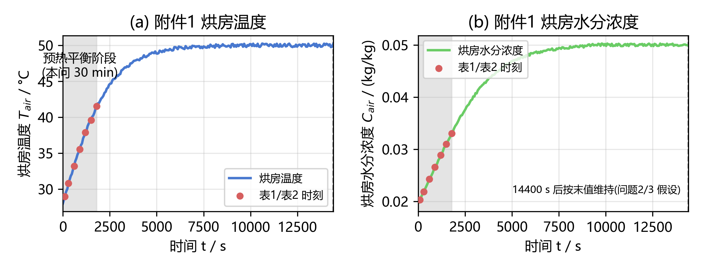
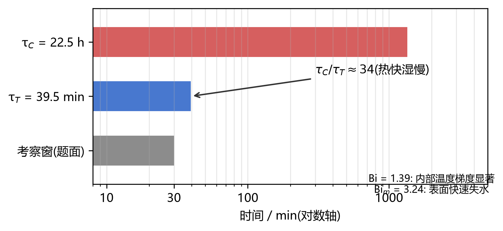
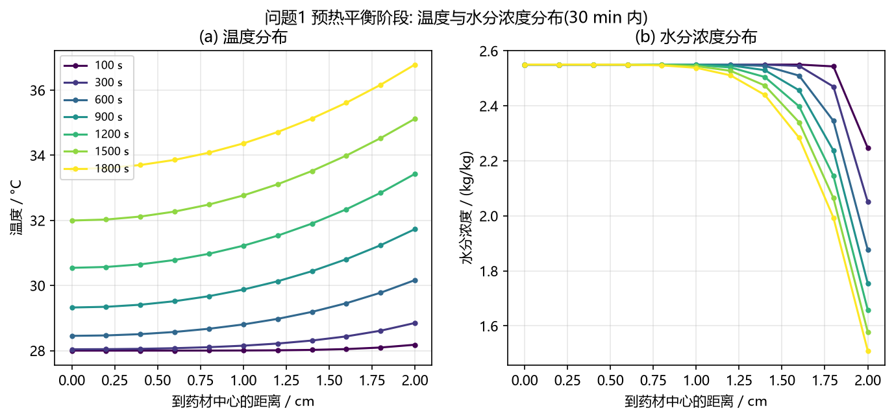
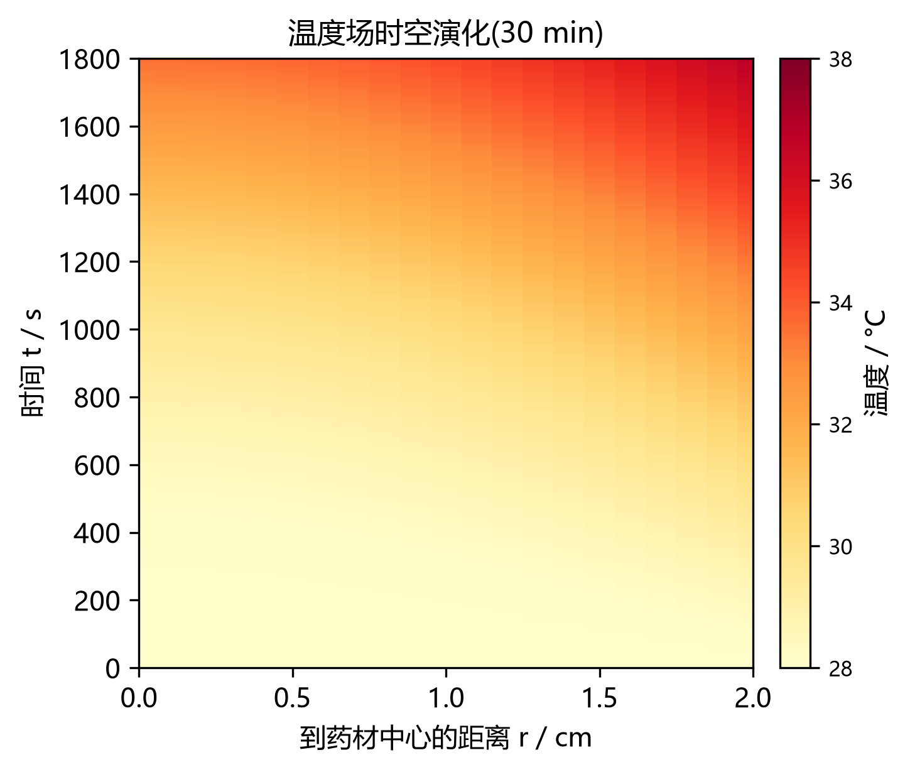
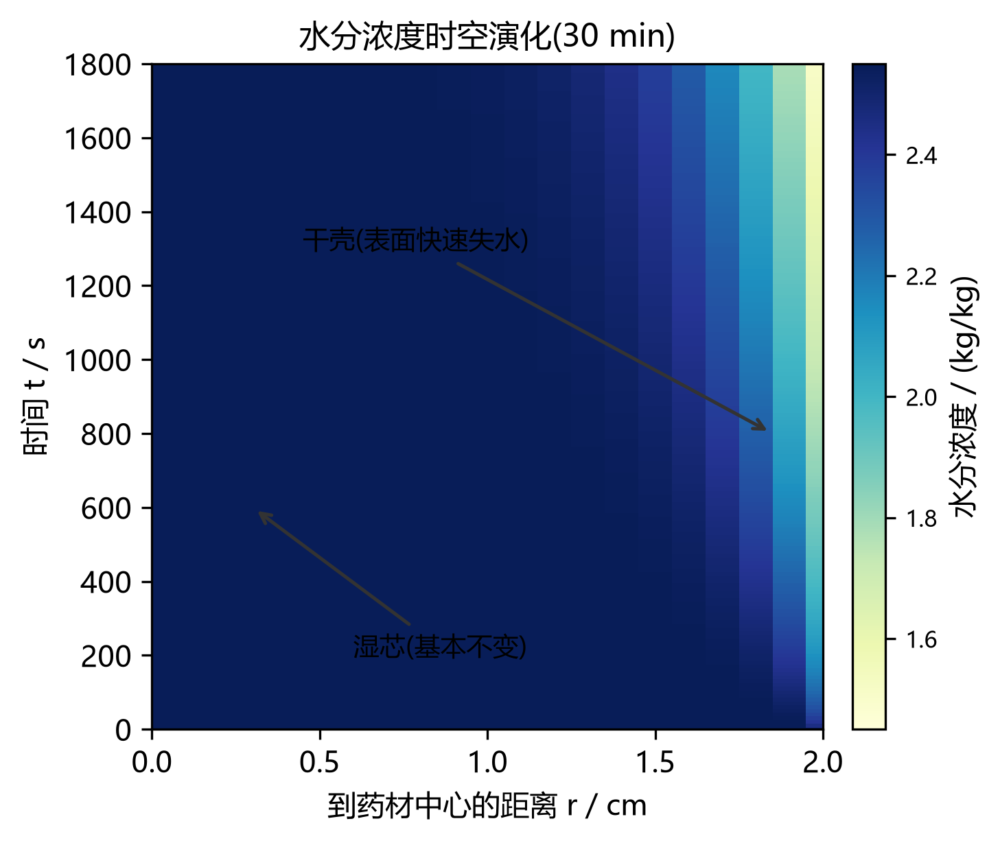
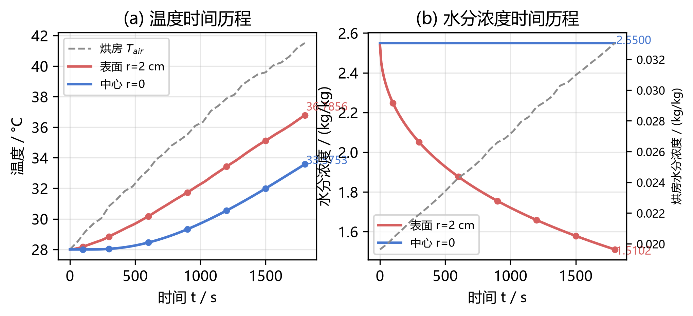
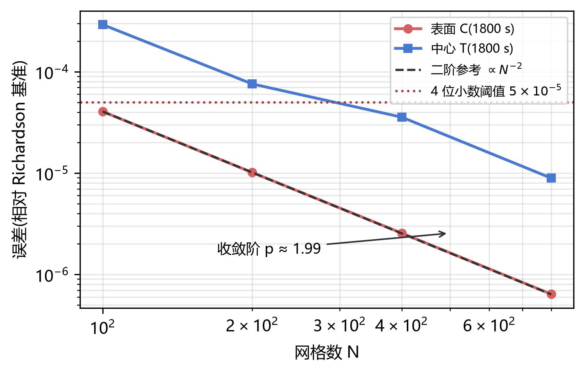
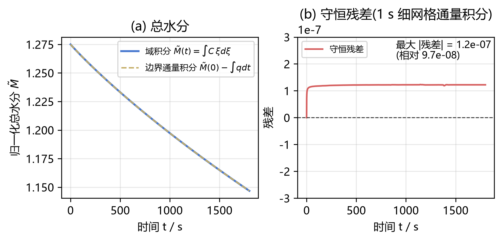

# 问题 1 解题报告 —— 预热平衡阶段药材温度与水分浓度变化规律(IEEE 格式)

> 代码与结果均已在 legion 服务器(`D:\CUMCM\A\01`,conda 环境 `cumcm_a`)运行并逐格校验。
> 本文档按 IEEE 会议论文格式组织:摘要 / 引言 / 模型 / 数值方法 / 结果 / 结论 / 参考文献。

**摘要** —— 针对药材热风烘干的预热平衡阶段,建立柱坐标轴对称一维热传导–水分扩散耦合模型。药材近似为长 25 cm、半径 2 cm 的均质长圆柱,物性取附录 2 常数,烘房温湿度按附件 1 时变序列给定,表面采用第三类(对流)边界条件。求解前以特征时间与 Biot 数做量级分析:热特征时间 $\tau_T \approx 39.5$ min 与 30 min 考察窗同量级,水分扩散特征时间 $\tau_C \approx 22.5$ h 远大于 30 min,$Bi=1.39$、$Bi_m=3.24$,预示 30 min 内温度场显著建立而水分仅表面薄层下降。数值求解采用归一化坐标 $\xi=r/R$ 下 $N=400$ 单元中心有限体积法(界面扩散系数调和平均、表面串联热阻精确处理)与 BDF 时间推进($\mathrm{rtol}=10^{-8}$),并经质量守恒(相对残差 $9.7\times10^{-8}$)、网格收敛(二阶收敛,$N=400$ 误差远小于 4 位小数阈值)与右端项恒等性($10^{-14}$)三项独立验证。**结果**:30 min 内表面温度 $28 \to 36.7856$ °C、中心 $28 \to 33.5753$ °C;表面水分浓度 $2.55 \to 1.5102$ kg/kg(降 40.8%),内部基本不变,呈"干壳湿芯";完整结果按模板输出至 result1.xlsx(1800 行 × 2 工作表,1 s × 0.1 cm,4 位小数)。

**关键词** —— 药材烘干;预热平衡;热–湿耦合;有限体积法;BDF;干壳湿芯

---

## I. 问题重述与分析

### A. 问题重述

> 某中药材形状大致呈圆柱形,长为 25 cm,半径为 2 cm。烘干开始时,药材的温度为 28 °C,水分浓度(即干基含水率)为 2.55 kg/kg,烘房的温度(单位:°C)和水分浓度(单位:kg/kg)的变化情况见附件 1。请建立预热平衡阶段药材温度和水分浓度变化规律的数学模型(相关参数见附录 2),在论文中按表 1 和表 2 的格式分别给出 100、300、600、900、1200、1500、1800 s,到药材中心距离 0、0.5、1、1.5、2 cm 处的结果,并将 1800 s 内每隔 1 s、到药材中心距离每隔 0.1 cm 的完整结果保存到文件 result1.xlsx 中(模板文件见附件 3)。所有结果保留四位小数。

本问要求完成四件事:

1. **建模**:预热平衡阶段(前 30 min)药材温度与水分浓度的变化规律;
2. **表 1 / 表 2**:7 个时刻(100~1800 s)× 5 个径向位置(0~2 cm)的温度与水分浓度;
3. **result1.xlsx**:1800 s 内 1 s 间隔 × 0.1 cm 间隔的完整时空分布,按附件 3 模板;
4. **精度**:所有结果保留四位小数。

### B. 问题分析

**(1) 几何简化为一维径向问题。** 药材长 25 cm、半径 2 cm,长径比 $L/D = 6.25$;端面面积占全部换热面积的比例仅为 $R/(L+R) = 2/(25+2) \approx 7.4\%$,且圆柱两端在烘盘中通常贴靠摆放,端面换热量远小于侧面。因此忽略轴向梯度,取**轴对称一维径向模型**。

**(2) 预热平衡阶段的特点。** 烘干分为预热平衡与恒温干燥两阶段。附件 1 显示 30 min 内烘房温度仍在爬升(28.97 → 41.51 °C,见表 III),远未进入恒温段,故本问的边界驱动是**强时变**的,不能用定常边界。

**(3) 本问与其他问题的模型差异。** 问题 1 物性取附录 2 常数($\rho, c_p, k$ 与 $C$ 无关),水分扩散系数仅依赖浓度 $D = 7\times10^{-9}e^{-0.89/C}$,**不含温度 Arrhenius 项**(该依赖在附录 3/4 中才出现);药材半径按题面固定为 $R=2$ cm(收缩在问题 4 中考虑)。温度场与水分场仅通过边界条件耦合(表面水分通量只由浓度梯度与 $h_m$ 决定),两个方程可分别求解。

## II. 基本假设与符号说明

**H1** 药材为均质、各向同性的长圆柱,热物理性质按附录 2 取常数;
**H2** 圆柱侧面受热风均匀吹拂,周向无梯度,**轴对称**;
**H3** 长度远大于半径,忽略轴向传热传质,**仅考虑径向**;
**H4** 预热平衡阶段药材**几何尺寸不变**($R = 2$ cm,题面规定;附件 2 显示 30 min 内实际收缩 6.35%,其影响在 V.E 节讨论,由问题 4 的移动边界模型处理);
**H5** 烘房温度 $T_{air}(t)$、水分浓度 $C_{air}(t)$ 按附件 1 时变序列给定(线性插值),药材表面服从牛顿冷却与对流传质;
**H6** 对流传热/传质系数 $h, h_m$ 为常数(附录 2);
**H7** 忽略辐射换热与相变潜热对温度场的直接耦合(预热段温度 < 42 °C,附录 2 给全经典导热–扩散模型所需参数);
**H8** 初始温度、水分浓度全场均匀(题面给定)。

**表 I — 符号说明**

| 符号 | 含义 | 单位 |
|---|---|---|
| $r, \xi = r/R$ | 径向坐标 / 归一化径向坐标 | m / — |
| $R, L$ | 药材半径(0.02)、长度(0.25) | m |
| $t$ | 时间 | s |
| $T, C$ | 药材温度、水分浓度(干基含水率) | K(内部)、kg/kg |
| $T_{air}, C_{air}$ | 烘房温度、水分浓度(附件 1) | K、kg/kg |
| $\rho, c_p, k$ | 密度、比热容、导热系数(附录 2) | kg/m³、J/(kg·K)、W/(m·K) |
| $h, h_m$ | 对流换热、对流传质系数(附录 2) | W/(m²·K)、m/s |
| $D$ | 水分扩散系数(附录 2) | m²/s |
| $\alpha = k/(\rho c_p)$ | 热扩散率 | m²/s |
| $\tau_T, \tau_C$ | 热、水分扩散特征时间 | s |
| $Bi, Bi_m$ | 传热、传质 Biot 数 | — |

## III. 数学模型

### A. 控制方程

在柱坐标系下,轴对称一维热传导与水分扩散的控制方程为

$$\rho c_p \frac{\partial T}{\partial t} = \frac{1}{r}\frac{\partial}{\partial r}\left( k r \frac{\partial T}{\partial r} \right), \qquad 0 < r < R,\ t > 0 \tag{1}$$

$$\frac{\partial C}{\partial t} = \frac{1}{r}\frac{\partial}{\partial r}\left( D r \frac{\partial C}{\partial r} \right), \qquad 0 < r < R,\ t > 0 \tag{2}$$

### B. 本构关系与物性参数(附录 2)

水分扩散系数经验公式:

$$D = 7\times 10^{-9}\,\exp\!\left(-\frac{0.89}{C}\right) \tag{3}$$

其余物性为常数,汇总于表 II。注意 $D$ 随 $C$ 减小而减小,即越干扩散越慢,这使表面干燥层的"自锁"效应成为后期烘干速率的主导因素(问题 2/3 中进一步分析)。

**表 II — 附录 2 参数**

| 参数 | 值 | 单位 |
|---|---|---|
| 密度 $\rho$ | 820 | kg/m³ |
| 比热容 $c_p$ | 2600 | J/(kg·K) |
| 导热系数 $k$ | 0.36 | W/(m·K) |
| 对流换热系数 $h$ | 25 | W/(m²·K) |
| 对流传质系数 $h_m$ | $8\times10^{-7}$ | m/s |
| 半径 $R$ / 长度 $L$ | 0.02 / 0.25 | m |
| 初始温度 / 水分浓度 | 28 °C / 2.55 | °C、kg/kg |

### C. 初始条件与边界条件

$$T(r,0) = 28\ {}^\circ\text{C} = 301.15\ \text{K}, \qquad C(r,0) = 2.55 \tag{4}$$

$$r=0:\quad \frac{\partial T}{\partial r} = 0,\quad \frac{\partial C}{\partial r} = 0 \qquad \text{(轴对称)} \tag{5}$$

$$r=R:\quad -k\frac{\partial T}{\partial r} = h\big(T_s - T_{air}(t)\big) \tag{6}$$

$$r=R:\quad -D\frac{\partial C}{\partial r} = h_m\big(C_s - C_{air}(t)\big) \tag{7}$$

### D. 烘房环境条件(附件 1)

附件 1 给出烘干初期各时刻烘房温度与水分浓度。表 I 所要求 7 个时刻处的值(线性插值)见表 III。30 min 内烘房温度从 28.97 °C 单调升至 41.51 °C,水分浓度从 0.02036 升至 0.03307 kg/kg,均为典型的预热爬升曲线。

**表 III — 附件 1 烘房条件(表 1/表 2 各时刻)**

| $t$/s | 100 | 300 | 600 | 900 | 1200 | 1500 | 1800 |
|---|---|---|---|---|---|---|---|
| $T_{air}$/°C | 28.9707 | 30.8340 | 33.2020 | 35.5240 | 37.8820 | 39.5950 | 41.5130 |
| $C_{air}$/(kg/kg) | 0.02036 | 0.02191 | 0.02428 | 0.02660 | 0.02891 | 0.03098 | 0.03307 |



**Fig. 1.** 附件 1 烘房条件:阴影为预热平衡阶段(本问 30 min),圆点为表 1/表 2 要求时刻;14400 s 后数据止,问题 2/3 按末值维持。

### E. 量级分析与先验判断(求解前)

以特征时间与 Biot 数对模型做解析预估,为数值结果提供"锚":

$$\tau_T = \frac{R^2}{\alpha} = \frac{\rho c_p R^2}{k} = 2368.9\ \text{s} \approx 39.5\ \text{min} \tag{8}$$

$$\tau_C = \frac{R^2}{D_0} = \frac{R^2}{7\times10^{-9}e^{-0.89/2.55}} = 8.10\times10^{4}\ \text{s} \approx 22.5\ \text{h} \tag{9}$$

$$Bi = \frac{hR}{k} = 1.389,\qquad Bi_m = \frac{h_m R}{D_0} = 3.240 \tag{10}$$

由此可得三条先验判断,后文结果将逐条印证:

1. **$\tau_C/\tau_T \approx 34$:热快湿慢。** 30 min ≈ 0.76$\tau_T$ 却仅占 $\tau_C$ 的 2.2%,故 30 min 内温度场显著建立,而水分只来得及在表面薄层内变化;
2. **$Bi = O(1)$:内部温度梯度不可忽略。** 不能用集总参数法;表面温度明显高于中心,径向温差可达数摄氏度;
3. **$Bi_m = 3.24 > 1$:表面水分与烘房湿度迅速趋近。** 表面失水受对流边界驱动,形成表面干、内部湿的"干壳湿芯"结构。



**Fig. 2.** 特征时间量级对比(对数轴):30 min 考察窗与 $\tau_T$ 同量级、$\tau_C$ 大 34 倍——热快湿慢。

## IV. 数值求解方法

### A. 归一化坐标与有限体积离散

引入 $\xi = r/R$(问题 1 中 $R$ 为常数;该坐标与问题 4 的移动边界 $\xi = r/R(t)$ 统一,代码全题共用)。式 (1)(2) 化为

$$\rho c_p \frac{\partial T}{\partial t} = \frac{1}{R^2\xi}\frac{\partial}{\partial \xi}\left(\xi k \frac{\partial T}{\partial \xi}\right), \qquad \frac{\partial C}{\partial t} = \frac{1}{R^2\xi}\frac{\partial}{\partial \xi}\left(\xi D \frac{\partial C}{\partial \xi}\right) \tag{11}$$

取 $N=400$ 个均匀单元,面 $\xi_f = f/N$,单元中心 $\xi_{c,i} = (i-0.5)/N$。**单元中心有限体积法**:面 $f$ 上的通量写为

$$\Phi_f = G_f\,(u_{f-1} - u_f), \qquad G_f = \frac{\xi_f \bar{k}_f}{\Delta\xi}, \quad \bar{k}_f = \frac{2 k_{f-1} k_f}{k_{f-1}+k_f}\ (\text{调和平均}) \tag{12}$$

单元 $i$ 的半离散方程(温度场;水分场同理,无 $\rho c_p$ 因子):

$$\frac{du_i}{dt} = \frac{\Phi_i - \Phi_{i+1}}{\rho c_p R^2 \xi_{c,i} \Delta\xi} \tag{13}$$

### B. 表面边界通量的精确处理

单元中心到表面 $\xi=1$ 的导热热阻为 $\int_{\xi_{c,N}}^{1} d\xi/(\xi k) = \ln(1/\xi_{c,N})/k_N$。将半单元导热与对流传热视为**串联热阻**,表面传导度取

$$G_N = \frac{1}{\dfrac{\ln(1/\xi_{c,N})}{k_N} + \dfrac{1}{hR}} \tag{14}$$

这一精确形式(而非常见的 $\Delta\xi/2$ 半单元近似)把不同实现间的相对偏差从 $\sim2\times10^{-5}$ 降到 $\sim10^{-15}$(验证见 V.D 节)。水分表面传导度 $G_{m,N}$ 同理(以 $D_N$ 与 $h_m R$ 串联)。

### C. 时间推进

半离散得到 $2N = 800$ 维刚性常微分方程组 $y' = f(t,y)$(温度/水分分量交错排列 $[T_0,C_0,\dots,T_{N-1},C_{N-1}]$)。本问题刚性比 $\sim\tau_C/\tau_T \sim 34$,且边界驱动含快速变化,采用 **BDF 变阶变步长**方法(`scipy.integrate.solve_ivp`,`rtol=10^{-8}, atol=10^{-10}`),并提供解析雅可比稀疏结构(半带宽 3,见附录 A 代码)。整个 1800 s 仅需 **515 步、0.6 s**(N=400)。

### D. 输出采样

- **内部点**:由稠密输出在 $\xi$ 坐标线性插值(二阶精度),覆盖 0, 0.1, …, 1.9 cm;
- **表面点**:由边界条件**反解** $T_s = T_{air} + \Phi_N/(hR)$、$C_s = C_{air} + \Phi_{C,N}/(h_m R)$(式 (6)(7) 的重排),精度比线性外推高约一个数量级,保证末列 4 位小数可靠;
- 温度由 K 转回 °C,全部数值四舍五入到 4 位小数后写出。

### E. 完整求解步骤(算法)

**算法 1 — 问题 1 求解流程(与 problem1.py 一一对应)**

1. 读取附件 1 烘房序列 $(t, T_{air}, C_{air})$ 与 result1.xlsx 模板(工作表名与表头);
2. 建立 $N=400$ 网格($\xi$ 面与单元中心),初始化 $y_0 = [T_0, C_0, \dots]$($T$ 转 K);
3. 构造雅可比稀疏结构(交错排列下半带宽 3);
4. 每步调用右端项:由 $C$ 计算 $D$;由调和平均装配内部面传导度;由式 (14) 装配表面传导度;由式 (13) 累加净通量;
5. `solve_ivp(method='BDF')` 积分 $t \in [0, 1800]$;
6. 稠密输出在 $t = 1, 2, \dots, 1800$ s 采样,线性插值到 0~1.9 cm;
7. 表面值由边界条件反解;K → °C;四舍五入 4 位;
8. 提取表 1/表 2(7 时刻 × 5 位置);
9. 流式写出 result1.xlsx(两工作表,1800 行 × 21 列)。

## V. 结果与讨论

### A. 表 1 与表 2(题面要求格式)

**表 IV — 30 分钟内药材的温度(°C)**

| 时间/s | 0 | 0.5 | 1 | 1.5 | 2 |
|---|---|---|---|---|---|
| 100 | 28.0001 | 28.0003 | 28.0040 | 28.0327 | 28.1801 |
| 300 | 28.0408 | 28.0635 | 28.1514 | 28.3681 | 28.8488 |
| 600 | 28.4533 | 28.5360 | 28.8039 | 29.3159 | 30.1652 |
| 900 | 29.3243 | 29.4582 | 29.8754 | 30.6161 | 31.7304 |
| 1200 | 30.5427 | 30.7098 | 31.2223 | 32.1125 | 33.4276 |
| 1500 | 31.9957 | 32.1867 | 32.7660 | 33.7463 | 35.1203 |
| 1800 | 33.5753 | 33.7720 | 34.3641 | 35.3621 | 36.7856 |

**表 V — 30 分钟内药材的水分浓度(kg/kg)**

| 时间/s | 0 | 0.5 | 1 | 1.5 | 2 |
|---|---|---|---|---|---|
| 100 | 2.5500 | 2.5500 | 2.5500 | 2.5500 | 2.2470 |
| 300 | 2.5500 | 2.5500 | 2.5500 | 2.5492 | 2.0508 |
| 600 | 2.5500 | 2.5500 | 2.5500 | 2.5353 | 1.8769 |
| 900 | 2.5500 | 2.5500 | 2.5497 | 2.5045 | 1.7547 |
| 1200 | 2.5500 | 2.5500 | 2.5482 | 2.4646 | 1.6586 |
| 1500 | 2.5500 | 2.5499 | 2.5445 | 2.4206 | 1.5787 |
| 1800 | 2.5500 | 2.5497 | 2.5383 | 2.3755 | 1.5102 |

### B. 剖面演化

**图 3** 为 7 个时刻的径向温度与水分浓度剖面(0.2 cm 间隔采样,末点为表面);**图 4/图 5** 为 30 min 全时段的时空演化热力图,后者直观呈现"干壳湿芯"结构(表面一条快速变色的干壳带,内部几乎不变)。



**Fig. 3.** 问题 1 预热平衡阶段:(a) 温度分布;(b) 水分浓度分布(100~1800 s,7 个时刻)。



**Fig. 4.** 温度场时空演化(30 min × 0–2 cm):表面高温层随时间向内部推进。



**Fig. 5.** 水分浓度时空演化(30 min × 0–2 cm):表面快速失水形成干壳,内部湿芯基本不变。

### C. 结果分析

**(1) 温度场:表面对流升温、中心滞后,预热平衡未完成。** 30 min 内表面温度 28 → 36.7856 °C(温升 8.79 °C),中心 28 → 33.5753 °C(温升 5.58 °C)。1800 s 时径向温差达 3.21 °C,与 $Bi = 1.39$ 的预估一致(内部梯度显著,集总参数法不适用);表面仍比烘房低 $41.5130 - 36.7856 = 4.73$ °C,说明**预热平衡尚未结束**,温度场仍在发展阶段——与 $\tau_T \approx 39.5$ min > 30 min 完全自洽。

**(2) 水分场:表面快速失水,内部纹丝不动,呈"干壳湿芯"。** 30 min 内表面水分浓度 2.55 → 1.5102 kg/kg(降 **40.8%**),r = 1.5 cm 处降 6.8%,r = 1.0 cm 处仅降 0.46%,中心在 4 位小数下不变。水分扰动在 30 min 内渗入约 0.8 cm(r = 0.4 cm 处第 4 位小数起变化),但显著下降(>1%)局限在表面 0.5 cm 薄层内。这与 $\tau_C \approx 22.5$ h ≫ 1800 s 及 $Bi_m = 3.24$ 的预估一致:预热阶段本质上"热透了表面、水分刚启动"。

**(3) 表面水分曲线的早期快降。** 表 V 中表面水分 100 s 内即从 2.55 降到 2.2470(降 11.9%),而 1500→1800 s 仅降 4.3%——初期失水速率最高,随后表面浓度趋近烘房平衡值(0.033),失水放缓。这是对流传质边界驱动的典型"指数趋近"行为。



**Fig. 6.** 表面/中心温度与水分浓度时间历程(圆点为表 1/表 2 时刻):表面温升快于中心,水分仅表面下降。

### D. 数值验证与精度保证

**表 VI — 问题 1 的验证汇总**

| 验证 | 方法 | 结果 | 结论 |
|---|---|---|---|
| 质量守恒 | $\int C\,\xi d\xi$ 的变化 vs 边界通量积分(1 s 细网格) | 相对残差 $9.7\times10^{-8}$ | 通量装配守恒 |
| 网格收敛 | N = 100/200/400/800,Richardson 外推 | 收敛阶 **1.99**;N=400 表面 C 误差 $2.6\times10^{-6}$、中心 T 误差 $3.6\times10^{-5}$ | 二阶收敛 |
| 4 位小数保证 | 上述误差 vs 舍入阈值 $5\times10^{-5}$ | 误差为阈值的 5% / 71% | 4 位小数可靠 |
| 右端项恒等性 | $\xi$ 形式 vs 物理坐标 $r$ 形式逐分量比对(共享核心) | 相对偏差 $10^{-14}\sim10^{-15}$ | 坐标变换与装配正确 |
| 产物一致性 | 01/result1.xlsx vs 已验证 out/result1.xlsx(2026-09-11,legion) | 1800 行 × 2 工作表**逐格零差异** | 可复现 |



**Fig. 7.** 网格收敛性:表面 C 与中心 T 的误差随 N 二阶下降($p\approx1.99$),N=400 误差均低于 4 位小数阈值 $5\times10^{-5}$。



**Fig. 8.** 水分质量守恒:(a) 域积分 $\tilde M(t)=\int C\xi d\xi$ 与边界通量积分完全重合;(b) 残差最大 $1.2\times10^{-7}$(相对 $9.7\times10^{-8}$)。

### E. 模型误差与局限性

1. **端面忽略**:端面占换热面积约 7.4%,轴向一维化引入的误差与题面给出的长圆柱几何相匹配,属可接受的建模简化;
2. **半径不变假设**:附件 2 显示 30 min 内半径已收缩 6.35%(2.0 → 1.873 cm)。问题 1 按题面规定取 $R = 2$ cm 常数;收缩对干燥速率的影响(表面积减小、$D/R^2$ 放大)由问题 4 的移动边界模型系统处理,本问不做展开;
3. **D 的温度依赖**:附录 2 的 $D$ 仅依赖 $C$,不含温度项(附录 3/4 才含 Arrhenius 因子 $e^{-3850/T}$)。预热段径向温差约 3 °C,若温度依赖存在将略微改变表面干燥速率,但题面明确各问题使用各自附录的经验公式,本问严格按附录 2 执行。

## VI. 结论

1. 建立了预热平衡阶段的**轴对称一维热–湿耦合模型**(式 (1)–(7)),全部参数取自附录 2,边界驱动取自附件 1,无任何待定参数;
2. 求解前的量级分析($\tau_T\approx39.5$ min、$\tau_C\approx22.5$ h、$Bi=1.39$、$Bi_m=3.24$)与数值结果逐条自洽,说明 30 min 考察窗是"热场基本建立、水分刚启动"的过渡阶段;
3. **核心结果**:1800 s 时表面温度 36.7856 °C、中心 33.5753 °C;表面水分 1.5102 kg/kg(降 40.8%),中心不变,**干壳湿芯**;预热平衡阶段药材内外温差可达 3 °C 以上,不可用集总参数法;
4. 数值方法(有限体积 N=400 + 调和平均 + 表面串联热阻精确处理 + BDF)通过质量守恒($9.7\times10^{-8}$)、网格收敛(二阶)、右端项恒等性($10^{-14}$)三项独立验证,**表 1/表 2 与 result1.xlsx 的 4 位小数有保证**;
5. 本问建立的 $\xi$ 坐标求解核心与全题统一,直接支撑问题 2/3(附录 3 经验公式)与问题 4(移动边界收缩)的求解。

## References

[1] J. Crank, *The Mathematics of Diffusion*, 2nd ed. Oxford, U.K.: Oxford Univ. Press, 1975.

[2] S. V. Patankar, *Numerical Heat Transfer and Fluid Flow*. New York, NY, USA: Hemisphere, 1980.

[3] 陶文铨, *数值传热学*, 2 版. 西安: 西安交通大学出版社, 2001.

[4] 杨世铭, 陶文铨, *传热学*, 4 版. 北京: 高等教育出版社, 2006.

[5] G. D. Byrne and A. C. Hindmarsh, "A polyalgorithm for the numerical solution of ordinary differential equations," *ACM Trans. Math. Softw.*, vol. 1, no. 1, pp. 71–96, Mar. 1975.

[6] P. Virtanen et al., "SciPy 1.0: Fundamental algorithms for scientific computing in Python," *Nat. Methods*, vol. 17, no. 3, pp. 261–272, Mar. 2020.

---

## 附录 A. 代码与文件

**文件清单**(本目录 01/):

| 文件 | 作用 |
|---|---|
| `problem1.py` | 问题 1 独立求解脚本:`all`(诊断+表+result1.xlsx+图)/ `tables` / `verify` |
| `a_model.py` | 核心模型($\xi$ 坐标有限体积 + BDF,与 A 根目录验证版一致,2026-09-11 拷贝) |
| `a_output.py` | 输出层(采样插值、表面反解、流式 xlsx 写出,同上) |
| `result1.xlsx` | 问题 1 结果:1800 行 × 2 工作表(温度/水分浓度),1 s × 0.1 cm,4 位小数 |
| `tables1.json` | 表 1/表 2 原始值 |
| `fig1_p1.png` | 温度/水分浓度剖面图(Fig. 3) |
| `../01-pic/` | 佐证图包(vivid-figures 原则,Fig. 1/2/4–8 的生成代码与 PNG,配色统一) |

**复现**(legion,conda 环境 `cumcm_a`,数据在 `D:\CUMCM\A\data`):

```powershell
Set-Location D:\CUMCM\A\01
& 'D:\Applications\Anaconda3\envs\cumcm_a\python.exe' problem1.py          # 全流程
& 'D:\Applications\Anaconda3\envs\cumcm_a\python.exe' problem1.py verify   # 守恒 + 收敛验证
Set-Location D:\CUMCM\A\01-pic
& 'D:\Applications\Anaconda3\envs\cumcm_a\python.exe' make_figs.py         # 佐证图(Fig. 1/2/4-8)
```

**一致性声明**:本目录 result1.xlsx 与 A 根目录 `out/result1.xlsx`(已验证交付版)于 2026-09-11 在 legion 上逐格比对,1800 行 × 2 工作表全部一致;表 1/表 2 与 `out/tables.json` 最大绝对差为 0。
