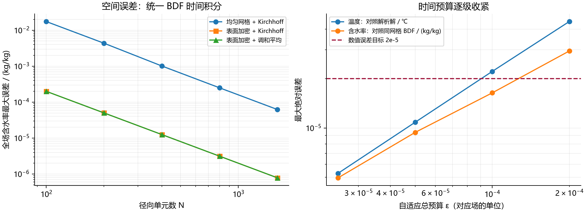
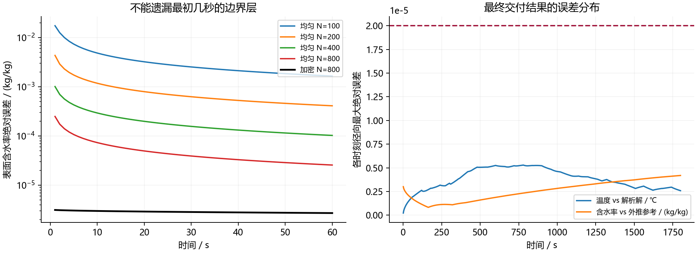
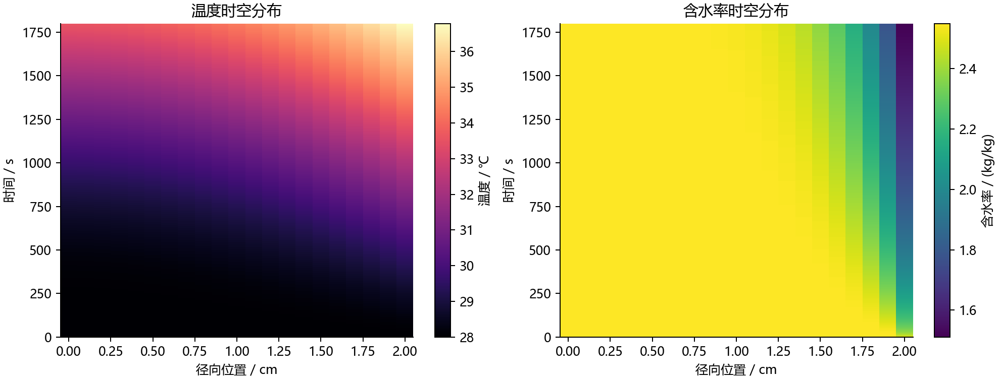
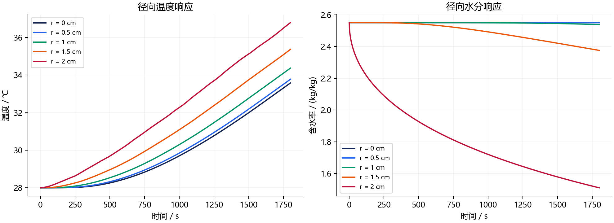
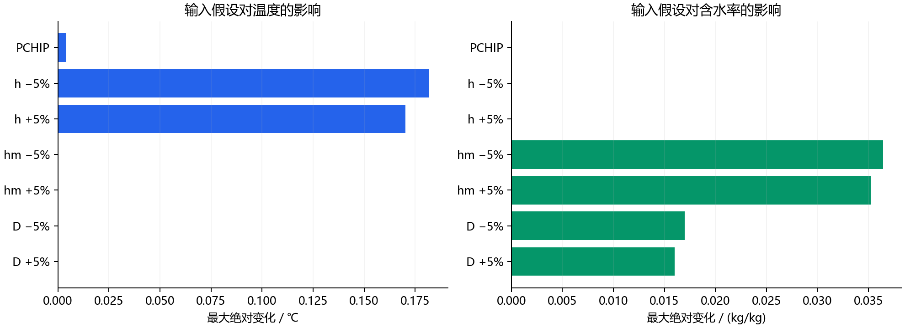

# A题第一问：基于非线性守恒通量与误差预算的药材预热模型

## 摘要

针对长 25 cm、半径 2 cm 的圆柱形药材，建立预热阶段的一维径向导热与非线性水分扩散模型。题给热参数为常数，扩散系数仅依赖含水率，因此第一问的温度场与水分场分别求解，不额外加入无法由附件辨识的耦合参数。数值上采用 Kirchhoff 积分通量、表面加密有限体积、全隐式时间积分及步长加倍误差控制，并以解析解、独立 BDF 实现、网格加密和守恒收支进行交叉验证。

最终采用 800 个表面加密径向单元，热、质各自的时间误差预算均取 2.5×10⁻⁵（分别以 ℃、kg/kg 计）。全部 1800×21 个输出点的温度与含水率估计数值误差分别不超过 **5.336e-06 ℃、8.105e-06 kg/kg**，均低于 2×10⁻⁵。这些是给定模型、给定输入下的数值误差估计，不是实验预测误差或严格的区间包络。

1800 s 时，圆心与表面温度分别为 **33.5753 ℃、36.7856 ℃**，圆心与表面含水率分别为 **2.5500、1.5102 kg/kg**。结果表现为表面先升温、表面先失水，而圆心水分在半小时内几乎没有变化。

## 1. 题意、数据与参数核对

第一问只研究 0–1800 s。附件1共含 241 条环境记录，时间从 0 到 14400 s，间隔 60 s；主计算仅使用覆盖本问时间范围的环境驱动，不涉及 4 h 以后的外推。默认在相邻观测点间作分段线性插值，保留观测值本身，不平滑、不拟合内部实测值。附件2的半径变化属于第四问，本问不使用。

| 符号 | 含义 | 取值及单位 |
|---|---|---|
| R、L | 半径、长度 | 0.02 m、0.25 m |
| ρ | 有效密度 | 820 kg/m³ |
| cp | 有效比热容 | 2600 J/(kg·K) |
| k | 导热系数 | 0.36 W/(m·K) |
| h | 对流换热系数 | 25 W/(m²·K) |
| hm | 对流传质系数 | 8×10⁻⁷ m/s |
| T₀、C₀ | 初始温度、干基含水率 | 28 ℃、2.55 kg/kg |
| D(C) | 有效水分扩散系数 | 7×10⁻⁹ exp(−0.89/C) m²/s |
| Ta(t)、Ca(t) | 烘房温度、水分浓度 | 附件1 |

特别核对：指数为 **−0.89/C**，不是 −0.89C。C 是每单位干物质质量对应的水质量；指数中的 0.89 与 C 采用一致的数值单位。第一问没有涉及绝对温度指数，摄氏温标可直接用于导热方程及温差边界。

原题、附件和输出模板的 SHA-256 校验值存于 `data/source_sha256.json`，原始附件保持不变。

## 2. 建模假设及其适用范围

1. 药材均匀、轴对称、半径不变，第一问的“到中心距离”解释为**轴向中截面上的径向距离**。主模型忽略轴向变化，另以有限长圆柱传热解检验中截面的端部影响；不能据此声称整个药材端部附近也满足一维模型。
2. 初始温度和干基含水率均匀；水分通过题给有效扩散系数迁移，忽略内部对流、毛细压力的独立方程。
3. ρcp 作为题给的恒定有效体积热容，热方程计算显热，不额外引入潜热、辐射、化学反应热或水分携热项。因此导热与水分扩散在本问中解耦。
4. 表面水分平衡值取 Ce(t)=Ca(t)。气相与固相的 kg/kg 通常具有不同的参照质量，本等式是为使用题给 hm 所作的**有效边界闭合假设**，不是严格的吸附平衡定律。题目没有给出吸附等温线，不能由附件反演该关系。
5. 水分收支采用固定参考干密度 ρd₀。若将初始有效密度解释为初始湿物料密度，则可取 ρd₀=ρ/(1+C₀)。该常数在水分扩散方程与边界通量中约去；绝对失水质量依赖这一额外解释，温度与含水率结果不依赖其取值。不强制把恒定热学有效密度当作随失水变化的瞬时混合物密度。

第3、4条属于结构性假设。没有药材内部实测数据时，不能把本模型的高数值精度解释为真实干燥过程同等精度。

## 3. 控制方程的推导

### 3.1 从圆柱薄壳守恒到偏微分方程

对长度为 ℓ、半径 r 到 r+dr 的薄壳，体积为 2πrℓdr。令向外热流密度 qT=−k∂rT，向外水分质量通量 jC=−ρd₀D(C)∂rC。储存量的变化等于流入减去流出：

$$
\rho c_p\partial_tT=-\frac1r\partial_r(rq_T)
=\frac1r\partial_r(rk\partial_rT),
$$

$$
\rho_{d0}\partial_tC=-\frac1r\partial_r(rj_C)
\quad\Longrightarrow\quad
\partial_tC=\frac1r\partial_r\left[rD(C)\partial_rC\right].
$$

这里必须保留 D 在散度之内；展开后为 D(C)(Crr+Cr/r)+D′(C)Cr²，简单写成 D(C)ΔC 会漏掉非线性项。

### 3.2 初始条件与边界条件

$$
T(r,0)=28,\qquad C(r,0)=2.55,\qquad0\le r\le R.
$$

$$
\partial_rT(0,t)=\partial_rC(0,t)=0,
$$

$$
-k\partial_rT(R,t)=h[T(R,t)-T_a(t)],
$$

$$
-D(C_s)\partial_rC(R,t)=h_m[C_s-C_a(t)].
$$

温度边界在 Ta>Ts 时右端为负，表示热量流入；水分在 Cs>Ca 时向外流出，符号与储存量变化一致。中心的 1/r 不直接数值代入；积分形式在 r=0 处的面面积为零，自动实现零通量。

初始含水率均匀，但 C₀不等于 Ca(0)，初始时刻并不满足传质 Robin 条件的经典兼容性。这不妨碍 t>0 的扩散解，却会造成快速发展的表面边界层。t=0 行作为初始状态单独保留，Excel 按模板从 t=1 s 开始输出。

## 4. 数值方法与创新设计

### 4.1 Kirchhoff 积分通量

定义 U(C)=∫D(C)dC，则 ∂rU=D(C)∂rC，从而 C_t=(1/r)∂r(r∂rU)。本题的一种原函数为

$$
U(C)=7\times10^{-9}\{C e^{-a/C}+a\operatorname{Ei}(-a/C)\},\quad a=0.89.
$$

主求解器直接以三点 Gauss–Legendre 求积计算 ∫Cb^Ca D(s)ds，避免两个接近的原函数相减引起消减误差。独立核验代码则使用上述 Ei 原函数，因此两套实现的通量计算路径不同。代表性局部区间的求积与自适应积分相对差异最大为 2.238e-15。

在无量纲坐标 x=r/R 中，Vᵢ=(x²ᵢ₊½−x²ᵢ₋½)/2，定义 Ũ=U/R²。内部面通量为

$$
Q_{i+1/2}=\frac{x_{i+1/2}}{x_{i+1}-x_i}
\left[\widetilde U(C_i)-\widetilde U(C_{i+1})\right].
$$

其等效扩散系数是两相邻状态之间的积分平均，保持 D′ 项的作用。通量在相邻单元中以相反符号出现，逐项抵消。

### 4.2 针对表面边界层的网格与边界闭合

网格面取

$$
x_{j+1/2}=1-(1-j/N)^2,\quad j=0,\ldots,N.
$$

其在表面附近加密，在圆心附近较疏；计算仍使用精确环形体积权重。对最终 N=800，最外单元宽度为 R/N²=3.125×10⁻⁸ m。这是数值解析边界层所需的网格尺度，并不代表实测空间分辨率。

设最后一个单元中心至真实表面的距离为 δ，则真实表面含水率由唯一的单调标量方程求得：

$$
\frac{U(C_N)-U(C_s)}{\delta}=h_m(C_s-C_a).
$$

热边界相应为 k(TN−Ts)/δ=h(Ts−Ta)。这是一致的半单元边界近似，不把最后一个单元中心直接视为表面。圆心输出用关于 r² 的二次重构，内部目标位置用局部三点二次插值；不以数值截断或裁剪掩盖负值。

### 4.3 全隐式积分、阻尼 Newton 与时间误差预算

后向 Euler 方程为

$$
V_i(C_i^{n+1}-C_i^n)+\Delta t(Q_{i+1/2}^{n+1}-Q_{i-1/2}^{n+1})=0.
$$

Newton 系统为三对角结构，使用追赶法求解，并通过阻尼确保含水率为正及残差下降。对角缩放后的非线性残差阈值为 3×10⁻¹³；缩放避免极薄表面单元导致不合理的舍入误差放大。

每个候选大步分别计算一次整步和两次半步，比较全部单元及输出点的最大差异 e。接受时保留**两次半步的解**，其边界通量也按这两次半步积分，不将整步通量用于守恒检查。下一步按误差比调整。

针对初始快速边界层，将局部允许误差设为

$$
e\le\max\left\{\varepsilon\left[\sqrt{(t+\Delta t)/1800}-\sqrt{t/1800}\right],5\times10^{-13}\right\}.
$$

平方根权重分配较多的初始局部预算；忽略浮点下限时，各接受区间预算之和为 ε。它是步长控制指标，不自动等于严格的全局误差界。时间精度最终通过预算收紧、解析解与独立求解器验证。上限步长为 1 s，在每个整秒输出点及输入分段节点前截短步长以准确到达该节点，不跨越插值斜率突变点。

### 4.4 创新的实际收益与边界

创新是对本题的针对性组合：**积分通量维持非线性守恒、表面网格处理初始薄层、时间预算控制局部误差、独立基准校核全场精度**。有限体积、Kirchhoff 变换和步长加倍各自都是已有方法，不宣称发明新的数学理论。

为隔离通量与网格的效果，下表各方案均用独立实现的同一 BDF 时间积分器、同样的容差、同样的 1800×21 输出点。含水率误差对照 800/1600 加密网格的二阶外推参考。单位为 kg/kg；耗时是本机测量，不含主求解器首次 JIT 编译，不能跨硬件比较。

| N | 均匀网格误差 | 加密 Kirchhoff 误差 | 加密调和平均误差 | Kirchhoff / 调和平均耗时(s) |
|---|---|---|---|---|
| 100 | 1.751e-02 | 2.002e-04 | 2.002e-04 | 0.58 / 0.45 |
| 200 | 4.357e-03 | 5.013e-05 | 5.013e-05 | 0.72 / 0.55 |
| 400 | 1.014e-03 | 1.254e-05 | 1.254e-05 | 0.97 / 0.78 |
| 800 | 2.500e-04 | 3.135e-06 | 3.135e-06 | 1.54 / 1.22 |
| 1600 | 6.230e-05 | 7.837e-07 | 7.837e-07 | 2.63 / 1.99 |

结果表明：**表面加密是本题最显著的精度改进；积分通量相对调和平均的单独收益较小，且有额外计算成本**。高阶 BDF 在本算例也比一阶步长加倍更快。保留后向 Euler 主求解器的价值在于通量、单步收支和误差控制过程直观可审计，而不是宣称计算速度最优。

## 5. 可行性与数值验证

### 5.1 量纲、尺度与数学可行性

热扩散率 α=k/(ρcp)=1.6886×10⁻⁷ m²/s，初始水分扩散系数 D(C₀)=4.9377×10⁻⁹ m²/s。以 R 为特征长度：

| 指标 | 数值 | 解释 |
|---|---|---|
| BiT=hR/k | 1.3889 | 存在明显径向热阻 |
| BiC=hmR/D(C₀) | 3.2404 | 存在明显径向水分梯度 |
| R²/α | 2368.89 s | 热扩散时间约 39.48 min |
| R²/D(C₀) | 81010 s | 初始水分扩散时间约 22.50 h |
| D(C₀)/α | 0.02924 | 水分响应远慢于温度响应 |

因此不采用空间均匀的集总参数模型。30 min 内热量能影响圆心，但水分仍主要在外层变化，符合尺度分析。

当 C>0 时 D(C)>0 且连续光滑。在本问正初值、正环境值下，扩散方程的比较原理提供含水率上下界。离散积分通量随左状态增加、随右状态减少；Newton Jacobian 的非对角元非正，并有正的储存项。适当正对角变量缩放后具有 M 矩阵结构，支持唯一离散隐式解及离散极值性质。二次输出重构本身不普遍保证保界，因此另外对全部实际输出进行上下界检查。

后向 Euler 不受显式扩散稳定性时间步上限约束，但仍需满足误差容差。这一稳定性结论不代表任意步长均足够准确。

### 5.2 守恒和物理界检查

无量纲储存量 S=∑VᵢCᵢ，边界交换量 F=∑ΔtQ表面，则闭合残差为 S(t)−S(0)+F(t)。热量也按同样口径核算，恢复量纲后乘以相应公共常数；相对残差取全时段最大绝对闭合残差除以最终交换量绝对值。

| 检验 | 最终结果 |
|---|---|
| 显热收支相对残差 | 2.020e-14 |
| 水分收支相对残差 | 5.821e-13 |
| 输出温度范围 | 28.000000–36.785563 ℃ |
| 输出含水率范围 | 1.510238–2.550000 kg/kg |
| NaN、无穷、负含水率 | 均未出现 |

这些残差验证离散方程的收支一致性，不验证未建模的蒸发潜热。按参考干密度解释，1800 s 的截面平均含水率为 2.293558 kg/kg，失水约 18.6090 g；这是辅助量，不替代题目要求的点值。

### 5.3 独立解析基准与实现交叉核验

对恒定环境、常扩散系数圆柱问题，使用

$$
\frac{u(r,t)-u_a}{u_0-u_a}
=\sum_{m=1}^{\infty}A_mJ_0(\lambda_mr/R)e^{-\lambda_m^2\alpha t/R^2},
$$

$$
\lambda_mJ_1(\lambda_m)=Bi\,J_0(\lambda_m),\quad
A_m=\frac{2J_1(\lambda_m)}{\lambda_m[J_0(\lambda_m)^2+J_1(\lambda_m)^2]}.
$$

热问题中 α=k/(ρcp)，常系数传质问题中 α=D(C₀)。恒定环境测试为温度从 28 ℃面向 50 ℃、含水率从 2.55 面向 0.02 kg/kg；其阶跃温度边界比本题温度缓升条件更苛刻。

| 基准测试 | 全场最大绝对差 |
|---|---|
| 恒定环境导热，N=800、ε=10⁻⁴ | 3.397e-05 ℃ |
| 恒定环境常系数传质，N=800、ε=10⁻⁴ | 1.526e-05 kg/kg |
| 题给时变环境导热：最终解 vs 模态解析解 | 5.291e-06 ℃ |
| 导热解析解 180 项 vs 360 项 | 4.508e-08 ℃ |
| 同网格独立 BDF 水分解容差收紧十倍 | 4.819e-09 kg/kg |

本题温度参数为常数，对分段线性 Ta(t)可逐段精确更新模态变量：z′m=Ta′−λm²αzm/R²，T=Ta−∑AmJ₀zm。因此温度的实际工况也能独立验证，不限于简化的恒定边界。

含水率另采用 SciPy BDF、稀疏有限差分 Jacobian、Ei 原函数与独立边界求根；不调用主求解器的 Gauss 通量或三对角积分代码。其同网格差异用于估计时间误差，并包含独立二次输出重构带来的细微差别，细网格差异用于空间误差。BDF 自身的容差收紧结果也被计入误差预算。

### 5.4 空间与时间收敛

表面加密网格固定后向 Euler 步长 0.05 s，相邻网格的全部输出点最大差异为：

| N → 2N | 温度差 / ℃ | 含水率差 / (kg/kg) |
|---|---|---|
| 50 → 100 | 6.158e-04 | 5.956e-04 |
| 100 → 200 | 1.560e-04 | 1.501e-04 |
| 200 → 400 | 3.926e-05 | 3.760e-05 |
| 400 → 800 | 9.848e-06 | 9.404e-06 |
| 800 → 1600 | 2.466e-06 | 2.351e-06 |

用独立 BDF 时间积分减少时间误差污染后，含水率 400/800/1600 网格的观测空间阶为 **1.9998**，接近二阶。只有在这一收敛阶已获得数值支持后才采用 Richardson 估计。800 网格空间误差估计为 (4/3)‖C₈₀₀−C₁₆₀₀‖∞=3.135e-06 kg/kg，系数 4/3 对应较粗解，不误用细网格的 1/3 系数。

时间预算逐级收紧结果如下。含水率列与同一 N=800 网格独立 BDF 解比较，避免将空间误差当成时间误差。

| 预算 ε | 温度误差 / ℃ | 含水率时间误差 / (kg/kg) | 热/质接受大步数 |
|---|---|---|---|
| 2.000e-04 | 4.459e-05 | 2.948e-05 | 78430 / 25358 |
| 1.000e-04 | 2.212e-05 | 1.637e-05 | 155210 / 48965 |
| 5.000e-05 | 1.084e-05 | 9.397e-06 | 308473 / 89616 |
| 2.500e-05 | 5.291e-06 | 4.965e-06 | 612438 / 159242 |

固定时间步 0.2、0.1、0.05、0.025 s 的附加测试保存在 `verification/spatial_convergence.csv`。后向 Euler 的时间收敛整体为一阶，初始非兼容条件会影响粗时间步的渐近表现，不对所有粗步序列强行指定理论阶。

最终温度误差估计取“解析解差异 + 模态截断差异”；含水率取“同网格时间差异 + 空间外推误差 + BDF 容差差异”。结果分别为 **5.336e-06 ℃、8.105e-06 kg/kg**。这是有交叉证据的工程误差估计，不是数学上经过区间运算证明的严格上界。

## 6. 第一问结果

### 表1：30分钟内药材的温度，单位 ℃

| 时间 / s | 0 cm | 0.5 cm | 1 cm | 1.5 cm | 2 cm |
|---|---|---|---|---|---|
| 100 | 28.0001 | 28.0003 | 28.0040 | 28.0327 | 28.1801 |
| 300 | 28.0408 | 28.0635 | 28.1514 | 28.3681 | 28.8489 |
| 600 | 28.4533 | 28.5360 | 28.8039 | 29.3159 | 30.1652 |
| 900 | 29.3243 | 29.4583 | 29.8755 | 30.6161 | 31.7304 |
| 1200 | 30.5427 | 30.7098 | 31.2224 | 32.1126 | 33.4276 |
| 1500 | 31.9957 | 32.1867 | 32.7660 | 33.7463 | 35.1203 |
| 1800 | 33.5753 | 33.7720 | 34.3642 | 35.3621 | 36.7856 |

### 表2：30分钟内药材的水分浓度，单位 kg/kg

| 时间 / s | 0 cm | 0.5 cm | 1 cm | 1.5 cm | 2 cm |
|---|---|---|---|---|---|
| 100 | 2.5500 | 2.5500 | 2.5500 | 2.5500 | 2.2470 |
| 300 | 2.5500 | 2.5500 | 2.5500 | 2.5492 | 2.0508 |
| 600 | 2.5500 | 2.5500 | 2.5500 | 2.5353 | 1.8770 |
| 900 | 2.5500 | 2.5500 | 2.5497 | 2.5045 | 1.7547 |
| 1200 | 2.5500 | 2.5500 | 2.5482 | 2.4646 | 1.6586 |
| 1500 | 2.5500 | 2.5499 | 2.5445 | 2.4206 | 1.5787 |
| 1800 | 2.5500 | 2.5497 | 2.5383 | 2.3755 | 1.5102 |

表中所有数值由最终主求解器输出，保留四位小数；不以独立解析解或 Richardson 外推替换主模型结果。Excel 包含两张工作表，各有 1800 个时间点、21 个径向位置、37800 个结果数值。完整精度 NPZ/CSV 另含 t=0 初始行，便于复算。

四位小数是题目要求的输出格式。即使误差小于 2×10⁻⁵，恰好邻近舍入分界点的数值也可能有末位差异，不能将格式位数视作实验有效数字。

## 7. 输入敏感性与模型结构误差

### 7.1 确定性扰动情景

以 N=400、固定时间步 0.025 s 的同网格结果为对照，分别改变 h、hm、D 的整体尺度 ±5%，其余设置保持一致；再比较环境分段线性与保形三次 PCHIP 插值。所有差异均取全部输出点最大值，并同时列出终点表面变化。

| 情景 | 温度全场最大变化 / ℃ | 含水率全场最大变化 / (kg/kg) | 1800 s 表面温度变化 / ℃ | 1800 s 表面含水率变化 |
|---|---|---|---|---|
| PCHIP | 4.202e-03 | 1.869e-06 | +0.000223 | +0.00000012 |
| h_factor_0.95 | 1.820e-01 | 0.000e+00 | -0.182002 | +0.00000000 |
| h_factor_1.05 | 1.704e-01 | 0.000e+00 | +0.170356 | +0.00000000 |
| hm_factor_0.95 | 0.000e+00 | 3.643e-02 | +0.000000 | +0.03643473 |
| hm_factor_1.05 | 0.000e+00 | 3.524e-02 | +0.000000 | -0.03524327 |
| d_factor_0.95 | 0.000e+00 | 1.697e-02 | +0.000000 | -0.01697241 |
| d_factor_1.05 | 0.000e+00 | 1.599e-02 | +0.000000 | +0.01598643 |

±5% 是人为设定的敏感性试验幅度，**不是测量误差标准差或95%置信区间**。h 只影响温度，hm 和 D 只影响含水率，这一结果也验证了第一问的解耦实现。较大的 hm 使表面含水率降低；较大的 D 增强内部补水，在本时段内提高表面含水率。

PCHIP 与线性插值的最大温度差约为 0.0042 ℃，明显大于最终温度数值误差；h 的 ±5% 扰动引起最高约 0.18 ℃的温度变化。这说明在数值精度已经充分后，进一步提高真实预测可信度需要改善输入和物理闭合，而非无限加密计算网格。

### 7.2 忽略端部的适用性

设两端面也以相同 h 与同一 Ta(t) 换热，有限长圆柱的阶跃响应可分离为径向 Bessel 响应与轴向平板响应的乘积。轴向半长为 L/2=0.125 m，其特征根满足 μtanμ=h(L/2)/k。通过 Duhamel 积分计算同样时变环境下有限圆柱与径向模型在**中截面**的温度差。

计算得到 1800 s 内中截面最大差约 6.346e-08 ℃；模态数与积分步长同时加密后的变化约 2.847e-08 ℃。由于两者接近浮点消减与截断误差的量级，只据此作保守判断：在这一端面对流情景下，端部对中截面温度的影响小于 10⁻⁶ ℃量级，远低于本问的其他不确定性，不强调该极小数值的末位。

该试验只验证所设端部换热条件下的中截面温度，不直接验证端部附近的点值或非线性水分场。其合理性还受到端部工况、摆放方式和真实形状的限制。

### 7.3 无法由附件定量辨识的结构误差

- **表面平衡关系**：Ce=Ca 缺少吸附等温线支撑。±5% 的 hm 试验不能替代对 Ce(Ca,T) 的辨识；必须取得吸附平衡数据或表面含水率观测，才能评估该结构误差。
- **蒸发潜热及其他热机制**：显热模型未描述蒸发吸热、辐射及水分携热。守恒检验只针对所建方程，不能证明这些机制不存在或影响很小。
- **材料差异**：均质扩散系数与固定几何是有效近似，药材组织各向异性、初始不均匀性及实际收缩可能影响结果。本问遵循题给固定半径，不借用第四问数据修正。
- **实测验证缺失**：附件1是环境边界数据，不是药材内部响应。不能以其拟合优度、R²、残差或自造内部观测来宣称模型已通过实验验证。

若未来取得多个径向位置的内部温度、含水率数据，应先固定训练/验证划分，校准可辨识参数，再报告独立验证集的 MAE、RMSE、最大偏差及覆盖率。目前不编造这些指标。

## 8. 结论与文件说明

本模型在第一问的有效物性、径向中截面及显热假设下，完成了规定时间和位置的数值预测。离散收支、正性、解析基准、独立实现及逐级加密共同支持其数值可行性。空间创新的主要价值在于捕捉初始表面薄层；对积分通量本身的改进幅度保持客观。

`result1.xlsx` 是四位小数的题目交付表；`data/full_precision.npz` 和两个 CSV 保留完整精度；`verification/summary.json`、各误差 CSV/JSON/NPZ 保存检验依据；`code/` 提供独立实现和复算脚本，入口见 `README.md`。Excel 导出后的逐格检查另存 `verification/workbook_check.json`。

## 参考资料

1. 本地《2026年高教社杯全国大学生数学建模竞赛 A题：药材的烘干问题》，问题1、附录1–2；附件1与附件3 result1 模板。题给参数与输入均来源于此。
2. Droniou, J. (2014). *Finite volume schemes for diffusion equations: introduction to and review of modern methods*. M3AS, 24(8), 1575–1619. [作者公开论文](https://arxiv.org/abs/1407.1567)。用于有限体积守恒、稳定性与极值性质的背景；不把本文专用实现归为该文现成算法。
3. NIST Digital Library of Mathematical Functions, Chapter 10, [Bessel functions](https://dlmf.nist.gov/10.2) 与 [Zeros](https://dlmf.nist.gov/10.21)。用于圆柱解析基准的特殊函数背景；本文的 Robin 特征方程与系数由分离变量及加权正交投影得到。
4. SciPy 官方文档，[solve_ivp](https://docs.scipy.org/doc/scipy/reference/generated/scipy.integrate.solve_ivp.html)。用于独立 BDF 实现的接口与容差说明；实际运行版本见 summary.json。
