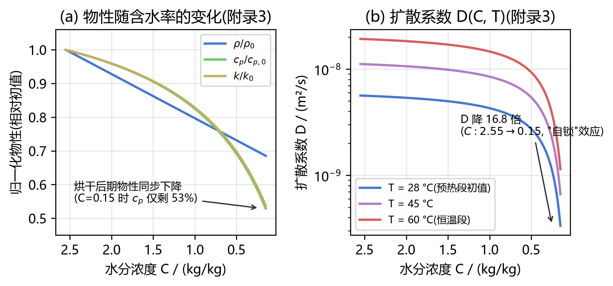
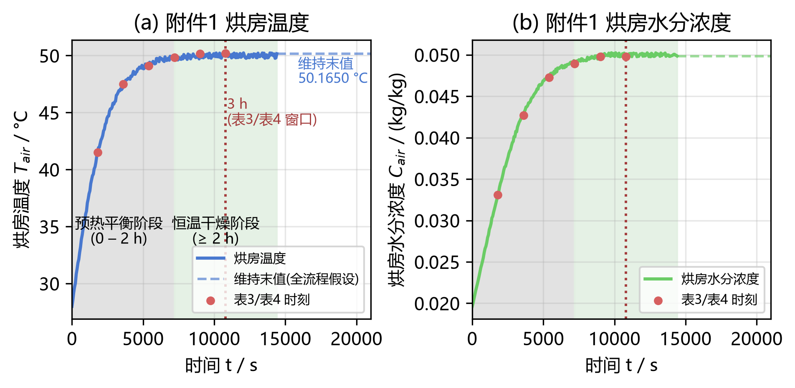
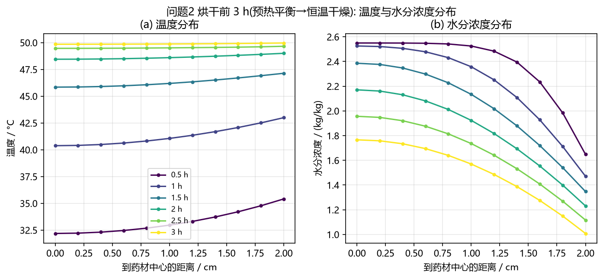
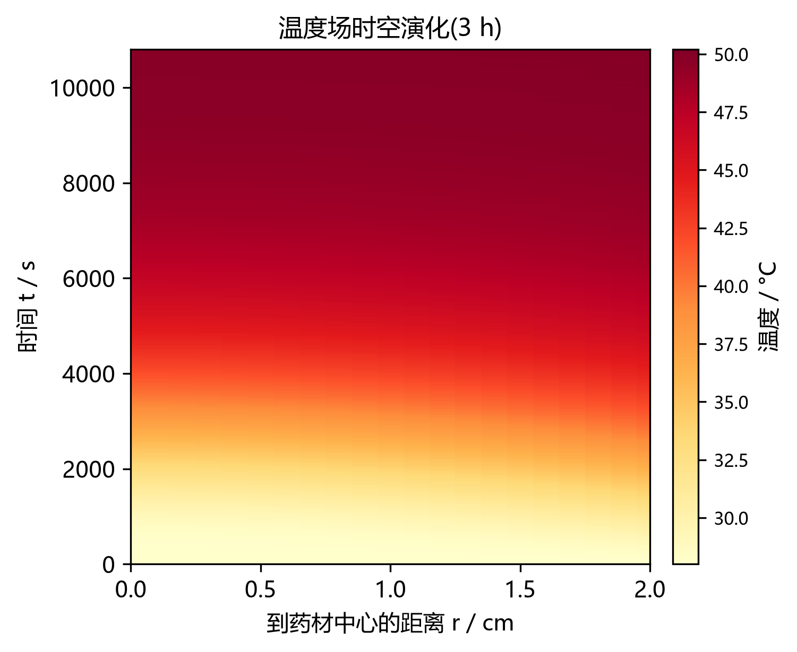
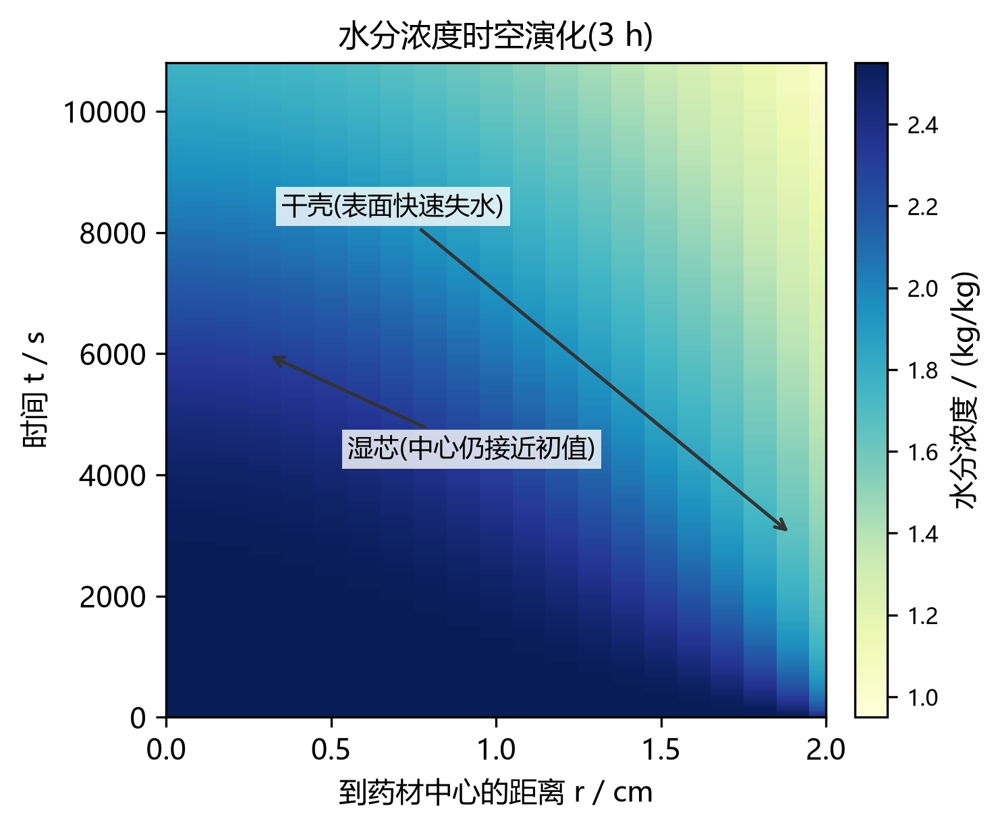
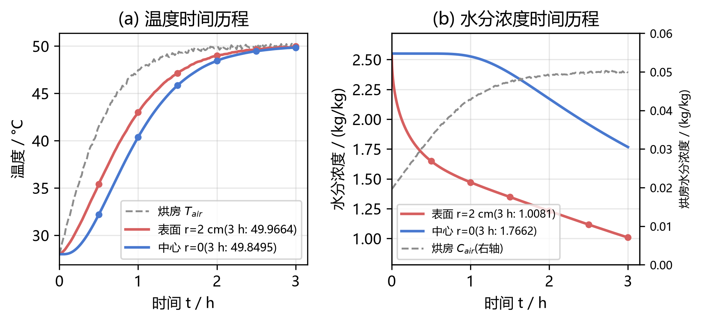
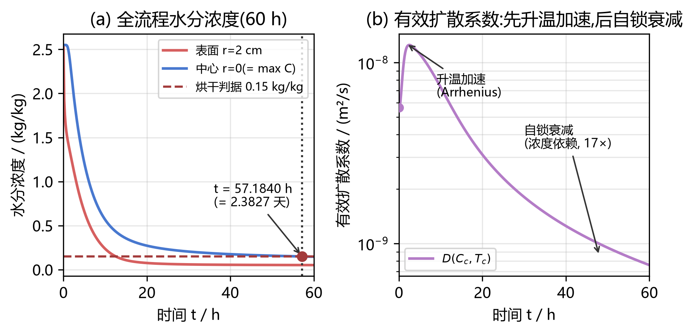
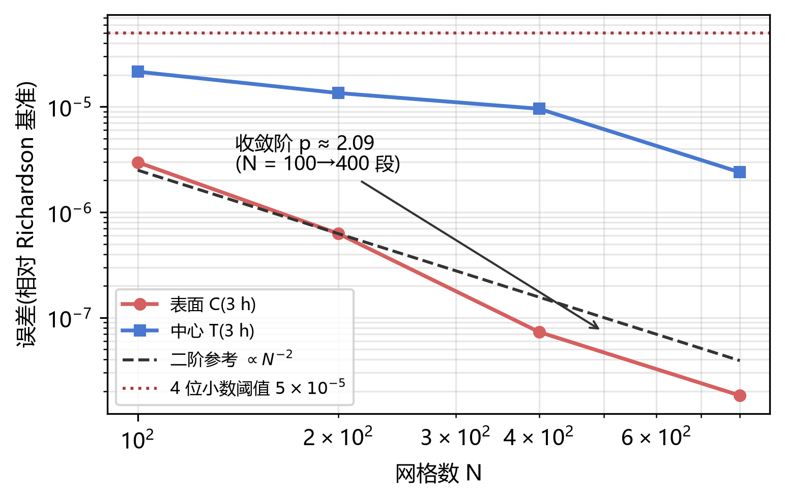
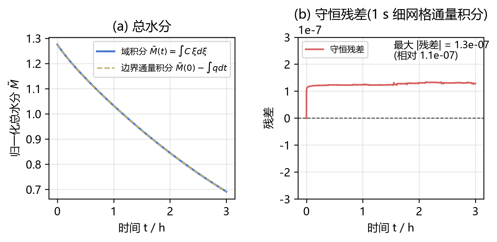

# 问题 2 解题报告 —— 整个烘干过程药材温度与水分浓度变化规律(IEEE 格式)

> 代码与结果均已在 legion 服务器(`D:\CUMCM\A\02`,conda 环境 `cumcm_a`)运行并逐格校验。
> 本文档按 IEEE 会议论文格式组织:摘要 / 引言 / 模型 / 数值方法 / 结果 / 结论 / 参考文献。

**摘要** —— 针对药材热风烘干的**整个过程**(预热平衡 + 恒温干燥,持续 2–3 天),在归一化坐标 $\xi=r/R$ 下建立轴对称一维热传导–水分扩散耦合模型。与问题 1 的关键区别是**物性不再恒定**:按附录 3,密度、比热与导热系数均随含水率变化 $\rho=650+128C$、$c_p=1450+2736C/(C{+}1)$、$k=0.21+0.38C/(C{+}1)$,扩散系数同时含浓度项与温度的 Arrhenius 项 $D=2.4\times10^{-3}e^{-0.45/C}e^{-3850/T}$;烘房温湿度由附件 1 时变序列给定(0–14400 s 采数,其后按末值 50.1650 °C、0.04986 kg/kg 维持)。求解前的量级分析给出 $\tau_T=46.0$ min、水分基模时间常数 $\tau_1=R^2/(\lambda_1^2D_0)\approx3.4$ h、$Bi=1.04$、$Bi_m=2.84$,并注意到 $C$ 从 2.55 降到 0.15 时 $D$ 衰减 **16.8 倍**——这是烘干后期"自锁"的根源。数值上沿用 $N=400$ 单元中心有限体积法(界面调和平均、表面串联热阻精确处理)与 BDF 时间推进($\mathrm{rtol}=10^{-8}$),非线性物性每步由当前状态更新。**结果**:3 h 内表面温度 $28\to49.9664$ °C、中心 $28\to49.8495$ °C,径向温差由 3.22 °C 收敛到 0.12 °C,温度场趋于**准稳态**;表面水分浓度 $2.55\to1.0081$ kg/kg(降 60.5%)、中心 $2.55\to1.7662$(降 30.7%),干燥锋约 1 h 推进到中心;完整结果按模板输出 result2.xlsx(10800 行 × 2 工作表,1 s × 0.1 cm,4 位小数)。模型经质量守恒(相对残差 $1.1\times10^{-7}$)、网格收敛($N=400$ 误差为 4 位小数阈值的 0.1%/19%)与产物一致性(与已验证交付版**逐格零差异**)三项验证,并可无缝推进至全流程:烘干在 **57.1840 h = 2.3827 天**完成,与题面"2–3 天"一致。

**关键词** —— 药材烘干;恒温干燥;变物性;Arrhenius 扩散;有限体积法;BDF;自锁效应

---

## I. 问题重述与分析

### A. 问题重述

> 烘干过程一般持续 2–3 天,预热平衡与恒温干燥阶段的参数有所不同。请建立整个烘干过程药材温度和水分浓度变化规律的数学模型(为简化问题,相关经验公式统一采用附录 3 中的公式),在论文中按表 3 和表 4 的格式分别给出 3 h 内每隔 0.5 h、到药材中心距离 0、0.5、1、1.5、2 cm 处的结果,并将每隔 1 s、到药材中心距离每隔 0.1 cm 的完整结果保存到文件 result2.xlsx 中(模板文件见附件 3)。所有结果保留四位小数(与问题 1 同)。

本问要求完成四件事:

1. **建模**:覆盖**整个烘干过程**(预热平衡 + 恒温干燥)的温度与水分浓度变化规律,经验公式统一采用附录 3;
2. **表 3 / 表 4**:6 个时刻(0.5~3.0 h)× 5 个径向位置(0~2 cm)的温度与水分浓度;
3. **result2.xlsx**:3 h 内 1 s 间隔 × 0.1 cm 间隔的完整时空分布,按附件 3 模板;
4. **精度**:所有结果保留四位小数。

### B. 问题分析

**(1) "两阶段参数不同"的处理方式。** 题面指出预热平衡与恒温干燥两阶段参数有所不同,又明确"为简化问题,相关经验公式统一采用附录 3 中的公式"。因此本文的处理是:**物性本构全流程统一采用附录 3**(这正是题面要求的简化);两阶段的差异由**烘房环境条件**体现——附件 1 显示 0–2 h 烘房温度从 28.97 °C 爬升(预热平衡段),2 h 后维持设定值约 50 °C(恒温干燥段),本问的 3 h 表 3/表 4 恰好横跨这一"切换过渡段"。

**(2) 与问题 1 的关键差异:变物性。** 问题 1 用附录 2 的常数物性,且 $D$ 只依赖浓度、不含温度项;本问的物性随含水率显著变化(烘干后期 $\rho$ 降 31%、$c_p$ 降 47%、$k$ 降 46%),扩散系数同时含浓度项 $e^{-0.45/C}$ 与 Arrhenius 温度项 $e^{-3850/T}$。控制方程由"线性变系数"变为**非线性**(双曲型耦合抛物方程),数值上必须每步按当前 $C,T$ 更新物性。

**(3) 考察窗的性质。** 3 h 覆盖预热平衡的末段(0–2 h)与恒温干燥的开端(2–3 h):温度场在此期间基本建立,水分场从"表面耗竭"转向"整体松弛"——这两件事都由后文的特征时间定量刻画。

**(4) 全流程 2–3 天的控制机理。** 由 $D\propto e^{-0.45/C}$,$C\to0.15$ 时扩散系数降至初值的 5.9%(即放慢 **16.8 倍**),全流程的松弛时间常数随之从 3.4 h 增长到约 24 h,这是"2–3 天"量级的由来(问题 3 定量求解)。

## II. 基本假设与符号说明

**H1** 药材为均质、各向同性的长圆柱,物性按附录 3 的**局部含水率**取值;
**H2** 圆柱侧面受热风均匀吹拂,周向无梯度,**轴对称**;
**H3** 长度远大于半径,忽略轴向传热传质,**仅考虑径向**;
**H4** 3 h 考察窗内**几何尺寸不变**($R=2$ cm,题面规定;附件 2 显示全程收缩至 1.198 cm,其影响在 V.E 节讨论,由问题 4 的移动边界模型处理);
**H5** 烘房温度 $T_{air}(t)$、水分浓度 $C_{air}(t)$ 按附件 1 时变序列给定(线性插值);**超过附件 1 数据范围(14400 s)后按末值维持**(全流程唯一需要外推的假设,其影响在 V.E 节讨论);
**H6** 对流传热/传质系数 $h, h_m$ 为常数(附录 2);
**H7** 忽略辐射换热与相变潜热,$D$ 的 Arrhenius 项已蕴含温度对扩散的加速作用;
**H8** 初始温度、水分浓度全场均匀(题面给定)。

**表 I — 符号说明**

| 符号 | 含义 | 单位 |
|---|---|---|
| $r, \xi = r/R$ | 径向坐标 / 归一化径向坐标 | m / — |
| $R, L$ | 药材半径(0.02)、长度(0.25) | m |
| $t$ | 时间 | s |
| $T, C$ | 药材温度、水分浓度(干基含水率) | K(内部)、kg/kg |
| $T_{air}, C_{air}$ | 烘房温度、水分浓度(附件 1) | K、kg/kg |
| $\rho(C), c_p(C), k(C)$ | 密度、比热容、导热系数(附录 3) | kg/m³、J/(kg·K)、W/(m·K) |
| $h, h_m$ | 对流换热、对流传质系数(附录 2) | W/(m²·K)、m/s |
| $D(C,T)$ | 水分扩散系数(附录 3) | m²/s |
| $\tau_T, \tau_C$ | 热平衡、水分扩散特征时间 $R^2/\alpha$、$R^2/D_0$ | s |
| $\lambda_1, \tau_1$ | 柱对称基模特征值(2.4048)、基模时间常数 $R^2/(\lambda_1^2D)$ | —、s |
| $Bi, Bi_m$ | 传热、传质 Biot 数 | — |

## III. 数学模型

### A. 控制方程

柱坐标系下轴对称一维热传导与水分扩散的控制方程与问题 1 同形,

$$\rho(C) c_p(C) \frac{\partial T}{\partial t} = \frac{1}{r}\frac{\partial}{\partial r}\left( k(C)\, r \frac{\partial T}{\partial r} \right), \qquad 0 < r < R,\ t > 0 \tag{1}$$

$$\frac{\partial C}{\partial t} = \frac{1}{r}\frac{\partial}{\partial r}\left( D(C,T)\, r \frac{\partial C}{\partial r} \right), \qquad 0 < r < R,\ t > 0 \tag{2}$$

但本问的 $\rho,c_p,k,D$ **都是场变量**($C$ 或 $T$ 的函数),故 (1)(2) 是拟线性抛物方程;水分方程中不出现密度,是因为 $C$ 定义为干基含水率(干物质守恒下密度自动约去,推导见问题 1 报告 IV.A 节)。

### B. 本构关系与物性参数(附录 3)

$$\rho(C) = 650 + 128C \tag{3}$$

$$c_p(C) = 1450 + \frac{2736C}{C+1} \tag{4}$$

$$k(C) = 0.21 + \frac{0.38C}{C+1} \tag{5}$$

$$D(C,T) = 2.4\times10^{-3}\,\exp\!\left(-\frac{0.45}{C}\right)\exp\!\left(-\frac{3850}{T}\right) \tag{6}$$

**表 II — 附录 3 物性在初值与末段(C = 0.15)处的取值**

| 量 | 表达式 | $C=2.55$(初始) | $C=0.15$(末段) | 变化 |
|---|---|---|---|---|
| $\rho$ | $650+128C$ | 976.4 kg/m³ | 669.2 kg/m³ | −31.5% |
| $c_p$ | $1450+2736C/(C{+}1)$ | 3415.30 J/(kg·K) | 1806.87 J/(kg·K) | −47.1% |
| $k$ | $0.21+0.38C/(C{+}1)$ | 0.4830 W/(m·K) | 0.2596 W/(m·K) | −46.3% |
| $D$ | $2.4\!\times\!10^{-3}e^{-0.45/C}e^{-3850/T}$ | $5.6417\times10^{-9}$ m²/s(28 °C) | $8.07\times10^{-10}$ m²/s(50.17 °C) | $D_C$ 项 −94.1% |

$$D(C,28\ ^\circ\text{C})\ \text{与}\ D(C,60\ ^\circ\text{C})\ \text{之比} = 3.41,\qquad D(0.15)/D(2.55) = 0.0594 \tag{7}$$

式 (6) 的两个因子方向相反、量级悬殊:温度项在恒温段给出约 **2.4 倍**加速(温度每升 1 K 约 +3.7%),而浓度项在烘干后期给出 **16.8 倍**减速——**浓度项压倒温度项**,这是"后期越烘越慢"的根本原因。



**Fig. 1.** 附录 3 物性随含水率的变化:(a) 归一化 $\rho/\rho_0$、$c_p/c_{p,0}$、$k/k_0$;(b) 扩散系数 $D(C,T)$ 在三个温度下随 $C$ 的衰减(双对数,~17 倍动态范围)。

### C. 初始条件与边界条件

$$T(r,0) = 28\ {}^\circ\text{C} = 301.15\ \text{K}, \qquad C(r,0) = 2.55 \tag{8}$$

$$r=0:\quad \frac{\partial T}{\partial r} = 0,\quad \frac{\partial C}{\partial r} = 0 \qquad \text{(轴对称)} \tag{9}$$

$$r=R:\quad -k(C)\frac{\partial T}{\partial r} = h\big(T_s - T_{air}(t)\big) \tag{10}$$

$$r=R:\quad -D(C,T)\frac{\partial C}{\partial r} = h_m\big(C_s - C_{air}(t)\big) \tag{11}$$

### D. 烘房环境条件(附件 1)与两阶段结构

附件 1 给出 0–14400 s 共 241 个点(60 s 间隔)的烘房温度与水分浓度:**前 2 h 烘房温度从 28.97 °C 爬升**(预热平衡),**2 h 后维持约 50 °C**(恒温干燥)。恒温段(t = 7200~14400 s,121 点)的统计为 $T_{air}=49.9685\pm0.1641$ °C、$C_{air}=0.04987\pm0.00029$ kg/kg,波动为控制器围绕设定值的修正。表 3/表 4 各时刻的烘房条件见表 III。

**表 III — 附件 1 烘房条件(表 3/表 4 各时刻,线性插值)**

| $t$/h | 0.5 | 1.0 | 1.5 | 2.0 | 2.5 | 3.0 |
|---|---|---|---|---|---|---|
| $T_{air}$/°C | 41.5130 | 47.4850 | 49.1160 | 49.8520 | 50.1630 | 50.1950 |
| $C_{air}$/(kg/kg) | 0.03307 | 0.04272 | 0.04728 | 0.04894 | 0.04981 | 0.04977 |



**Fig. 2.** 附件 1 烘房条件与两阶段结构:阴影为预热平衡段(0–2 h),浅绿为恒温干燥段(2–4 h);红点为表 3/表 4 时刻;虚线为超过 14400 s 后按末值维持的全流程假设(50.1650 °C、0.04986 kg/kg)。

### E. 量级分析与先验判断(求解前)

以附录 3 在初始状态($C=2.55$,$T=301.15$ K)的物性做解析预估:

$$\rho_0 = 976.4\ \text{kg/m}^3,\quad c_{p,0} = 3415.30\ \text{J/(kg·K)},\quad k_0 = 0.4830\ \text{W/(m·K)} \tag{12}$$

$$\alpha_0 = \frac{k_0}{\rho_0 c_{p,0}} = 1.4483\times10^{-7}\ \text{m}^2/\text{s} \ \Rightarrow\ \tau_T = \frac{R^2}{\alpha_0} = 2761.9\ \text{s} \approx 46.0\ \text{min} \tag{13}$$

$$D_0 = 5.6417\times10^{-9}\ \text{m}^2/\text{s} \ \Rightarrow\ \tau_C = \frac{R^2}{D_0} = 70900.9\ \text{s} \approx 19.69\ \text{h} \tag{14}$$

更贴切的水分时间尺度是柱对称**基模**的衰减常数($J_0$ 的第一个零点 $\lambda_1=2.4048$):

$$\tau_1 = \frac{R^2}{\lambda_1^2 D_0} = 1.23\times10^4\ \text{s} \approx 3.4\ \text{h} \tag{15}$$

$$Bi = \frac{hR}{k_0} = 1.0353,\qquad Bi_m = \frac{h_m R}{D_0} = 2.8360 \tag{16}$$

四条先验判断,后文结果逐条印证:

1. **$3\ \text{h} \approx 3.9\,\tau_T$:温度场在考察窗内基本建立。** 与问题 1(30 min = 0.76$\tau_T$,预热远未完成)不同,本问 3 h 末径向温差只剩 0.12 °C,已进入**准稳态**——热量"进得来出得去",这正是论文敏感性分析中传热参数($h,k,\rho,c_p$)对总烘干时间几乎无影响($|S|<0.003$)的原因;
2. **$Bi=1.04$,$O(1)$:内部温度梯度不可忽略**(不能用集总参数法),但恒温段内梯度很小(0.12 °C),集总近似在**后期**反而是合理的;
3. **$\tau_1\approx3.4\ \text{h}\approx$ 考察窗:3 h 是水分场"由表及里"的转折窗。** 前约 1 h 为表面耗竭(中心几乎不变),1 h 后全场进入整体松弛——表 4 中心列在 1 h 后开始明显下降;
4. **$D$ 的双重依赖决定全流程量级。** 若 $D$ 恒定在初值,$\tau_1=3.4$ h 意味着数小时即可完成;实际 $C\to0.15$ 时 $D$ 降至 5.9%,$\tau_1$ 增至约 **24 h**,全流程约 57 h(问题 3 求解)——"2–3 天"正是**自锁效应**的宏观表现。

## IV. 数值求解方法

### A. 归一化坐标与有限体积离散

引入 $\xi = r/R$($R=2$ cm 常数),式 (1)(2) 化为

$$\rho c_p \frac{\partial T}{\partial t} = \frac{1}{R^2\xi}\frac{\partial}{\partial \xi}\left(\xi k \frac{\partial T}{\partial \xi}\right), \qquad \frac{\partial C}{\partial t} = \frac{1}{R^2\xi}\frac{\partial}{\partial \xi}\left(\xi D \frac{\partial C}{\partial \xi}\right) \tag{17}$$

取 $N=400$ 个均匀单元,面 $\xi_f = f/N$,单元中心 $\xi_{c,i} = (i-0.5)/N$,采用与问题 1 相同的**单元中心有限体积**格式:

$$\Phi_f = G_f\,(u_{f-1} - u_f), \qquad G_f = \frac{\xi_f \bar{k}_f}{\Delta\xi}, \quad \bar{k}_f = \frac{2 k_{f-1} k_f}{k_{f-1}+k_f}\ (\text{调和平均}) \tag{18}$$

**非线性物性的处理**:每次右端项调用时,由当前的单元含水率与温度逐单元计算 $\rho_i, c_{p,i}, k_i, D_i$,面上取调和平均。因此离散系统仍是标准形式 $y'=f(t,y)$,但系数随状态演化——这是本问与问题 1 在数值上的唯一实质差别。

### B. 表面边界通量的精确处理

与问题 1 一致,单元中心到表面 $\xi=1$ 的导热热阻取精确积分形式 $\int_{\xi_{c,N}}^{1} d\xi/(\xi k) = \ln(1/\xi_{c,N})/k_N$,表面传导度按**串联热阻**装配:

$$G_N = \frac{1}{\dfrac{\ln(1/\xi_{c,N})}{k_N} + \dfrac{1}{hR}} \tag{19}$$

水分侧同理(以 $D_N$ 与 $h_m R$ 串联)。该形式把不同实现间的相对偏差压到 $\sim10^{-15}$ 量级(问题 1 报告 V.D 节)。

### C. 时间推进

半离散得到 $2N = 800$ 维刚性常微分方程组。刚性来自两方面:① 热-湿时间尺度比 $\tau_C/\tau_T\approx25.7$;② 变物性使表层单元的扩散系数在干燥过程中变化近 20 倍。采用 **BDF 变阶变步长**(`scipy.integrate.solve_ivp`,`rtol=10^{-8}, atol=10^{-10}`),并提供解析雅可比稀疏结构(半带宽 3)。3 h 积分仅 **2515 步、1.8 s**($N=400$)。

### D. 输出采样

- **内部点**:由稠密输出在 $\xi$ 坐标线性插值(二阶精度),覆盖 0, 0.1, …, 1.9 cm;
- **表面点**:由边界条件**反解** $T_s = T_{air} + \Phi_N/(hR)$、$C_s = C_{air} + \Phi_{C,N}/(h_m R)$(式 (10)(11) 的重排),保证末列 4 位小数可靠;
- 温度由 K 转回 °C,全部数值四舍五入到 4 位小数后写出。

### E. 完整求解步骤(算法)

**算法 2 — 问题 2 求解流程(与 problem2.py 一一对应)**

1. 读取附件 1 烘房序列 $(t, T_{air}, C_{air})$ 与 result2.xlsx 模板(工作表名与表头);
2. 建立 $N=400$ 网格,初始化 $y_0 = [T_0, C_0, \dots]$($T$ 转 K);
3. 构造雅可比稀疏结构(交错排列下半带宽 3);
4. 每步调用右端项:由当前 $C,T$ 计算 $\rho,c_p,k,D$(式 (3)–(6)),装配内部面与表面传导度(式 (18)(19)),累加净通量;
5. `solve_ivp(method='BDF')` 积分 $t \in [0, 10800]$;
6. 稠密输出在 $t = 1, 2, \dots, 10800$ s 采样,线性插值到 0~1.9 cm;
7. 表面值由边界条件反解;K → °C;四舍五入 4 位;
8. 提取表 3/表 4(6 时刻 × 5 位置);
9. 流式写出 result2.xlsx(两工作表,10800 行 × 21 列)。

## V. 结果与讨论

### A. 表 3 与表 4(题面要求格式)

**表 IV — 3 小时内药材的温度(°C)**

| 时间/h | 0 | 0.5 | 1 | 1.5 | 2 |
|---|---|---|---|---|---|
| 0.5 | 32.1892 | 32.3821 | 32.9659 | 33.9608 | 35.4130 |
| 1.0 | 40.3815 | 40.5536 | 41.0605 | 41.8782 | 42.9975 |
| 1.5 | 45.8468 | 45.9348 | 46.1930 | 46.6051 | 47.1401 |
| 2.0 | 48.4503 | 48.4881 | 48.5985 | 48.7736 | 49.0034 |
| 2.5 | 49.4670 | 49.4792 | 49.5137 | 49.5653 | 49.6607 |
| 3.0 | 49.8495 | 49.8553 | 49.8746 | 49.9101 | 49.9664 |

**表 V — 3 小时内药材的水分浓度(kg/kg)**

| 时间/h | 0 | 0.5 | 1 | 1.5 | 2 |
|---|---|---|---|---|---|
| 0.5 | 2.5499 | 2.5489 | 2.5256 | 2.3257 | 1.6486 |
| 1.0 | 2.5257 | 2.4948 | 2.3578 | 2.0230 | 1.4711 |
| 1.5 | 2.3861 | 2.3256 | 2.1344 | 1.8020 | 1.3476 |
| 2.0 | 2.1709 | 2.1084 | 1.9236 | 1.6259 | 1.2311 |
| 2.5 | 1.9566 | 1.9006 | 1.7360 | 1.4720 | 1.1166 |
| 3.0 | 1.7662 | 1.7165 | 1.5702 | 1.3333 | 1.0081 |

**关于 result2.xlsx 的两条输出约定**(论文中需显式写明,与问题 1/问题 4 的处理保持一致):

1. **时间范围**:题面"每隔 1 s、……的完整结果"的作用域承接前一句"3 h 内"(与问题 1 的"1800 s 内"同构),故默认交付 `result2.xlsx` 为 $t=1,\dots,10800$ s、1 s 间隔(10800 行)。**整个烘干过程**的结果另有两条途径承载:本目录外 `out/result2_全流程_60s.xlsx`(60 s 间隔至烘干结束)与 `result2_full_1s/result2.xlsx`(全流程 1 s 间隔变体,26.2 MB,打包时与默认版二选一);
2. **半径固定**:本问取 $R=2$ cm 常数(题面),列头为 0, 0.1, …, 1.9, 2 cm,末列"2"为表面(由边界条件反解);收缩情形由问题 4 处理。

### B. 剖面演化

**图 3** 为 6 个时刻的径向温度与水分浓度剖面;**图 4/图 5** 为 3 h 全时段的时空演化热力图。



**Fig. 3.** 问题 2 烘干前 3 h:(a) 温度分布;(b) 水分浓度分布(0.5~3.0 h,6 个时刻)。



**Fig. 4.** 温度场时空演化(3 h × 0–2 cm):2 h 以后全断面趋于烘房温度,进入准稳态。



**Fig. 5.** 水分浓度时空演化(3 h × 0–2 cm):表面快速失水形成干壳,干燥锋向中心推进。

### C. 结果分析

**(1) 温度场:快速升温后进入准稳态。** 3 h 内表面温度 $28\to49.9664$ °C、中心 $28\to49.8495$ °C,径向温差按 3.22 → 2.62 → 1.29 → 0.55 → 0.19 → **0.12** °C 单调收敛(表 3 各行的首末列之差);3 h 末表面仅比烘房低 **0.2286** °C。这与 $\tau_T=46.0$ min 的预估一致:$3\ \text{h}=3.9\tau_T$,温度场基本建立——**与问题 1 的 30 min(温差仍在扩大、表面比烘房低 4.73 °C)形成鲜明对比**。

**(2) 水分场:表面耗竭 → 干燥锋推进 → 整体松弛。** 表面水分浓度 $2.55\to1.0081$ kg/kg(降 **60.5%**),中心 $2.55\to1.7662$(降 **30.7%**)。三个阶段性特征:

- **首 0.5 h 完成表面总降幅的 58.5%**(2.55→1.6486):初始阶段表面受对流边界驱动快速失水,中心几乎不变(2.5499),仍呈"干壳湿芯";
- **干燥锋约 1 h 推进到中心**:中心列在 1 h 时降 0.95%(2.5257),此后下降加速,2 h 时降 14.9%,3 h 时降 30.7%;
- **3 h 末全场已无"湿芯"**:径向剖面(0.1 cm 间隔)从中心 1.7662 平滑过渡到表面 1.0081,最大-最小差 0.7581 kg/kg。这正是 $\tau_1\approx3.4\ \text{h}$ 与考察窗同量级的直接体现——水分场进入整体松弛。

表面失水速率(每 0.5 h)由首段的 0.9014 迅速降到 0.1775、0.1235、0.1165、0.1145、0.1085 kg/kg,呈"先快后缓"的准恒定干燥速率段,衰减由 $D(C,T)$ 的浓度依赖与表面-烘房浓度差收窄共同决定。



**Fig. 6.** 表面/中心温度与水分浓度时间历程(圆点为表 3/表 4 时刻):温度在 2 h 后与烘房基本重合(准稳态),水分持续下降,表面-中心差在约 1 h 达到最大后收窄。

**(3) 与问题 1 的定量对比(同一时刻 1800 s)。** 两问使用同一几何、同一烘房序列、同一 $h,h_m$,差别只在附录 2/3 的物性与扩散系数:

| 量(1800 s) | 问题 1(附录 2) | 问题 2(附录 3) | 机理 |
|---|---|---|---|
| 表面温度 | 36.7856 °C | 35.4130 °C | 附录 3 的 $\rho c_p$ 大 56%(热惯性大),升温更慢 |
| 中心温度 | 33.5753 °C | 32.1892 °C | 同上 |
| 表面水分 | 1.5102 | 1.6486 | 附录 3 的 $D$ 更大(同等状态 1.14 倍,随温度升高放大:37 °C 处 1.64 倍)→ 内部向表面补给更快,表层耗竭更浅 |
| 中心水分 | 2.5500 | 2.5499 | 30 min 内均未受扰动 |

即:**附录 3 的"热更慢、湿更快"**——前者降低表层温度,后者提高补给速率,二者对表面水分的作用相反,净效果是表层耗竭比分问题 1 更浅(表面浓度更高)。

**(4) 全流程与自锁效应。** 3 h 只是整个烘干过程的开始(图 6 的横轴若延至全流程,水分下降会显著变缓)。**Fig. 7** 给出全流程(60 h)的水分浓度与有效扩散系数:中心/表面水分浓度单调下降,在 **57.1840 h = 2.3827 天**处全场降到判据 0.15 kg/kg 以下(该数字由问题 3 正式求解);同时有效扩散系数 $D(C_c,T_c)$ 从 $5.64\times10^{-9}$ 衰减到 $10^{-9}$ 量级——**自锁效应**使后期松弛时间常数增至约 24 h,全流程远比 $\tau_1$(初值 3.4 h)长。



**Fig. 7.** 全流程(60 h):(a) 表面/中心水分浓度与 0.15 kg/kg 判据(烘干在 57.1840 h 完成);(b) 有效扩散系数 $D(C_c,T_c)$ 衰减近 17 倍,是"越烘越慢"的直接原因。

### D. 数值验证与精度保证

**表 VI — 问题 2 的验证汇总**

| 验证 | 方法 | 结果 | 结论 |
|---|---|---|---|
| 质量守恒 | $\int C\,\xi d\xi$ 的变化 vs 边界通量积分(1 s 细网格) | 相对残差 $1.1\times10^{-7}$ | 通量装配守恒 |
| 网格收敛 | N = 100/200/400/800,Richardson 外推 | 收敛阶 **≈2.1**(100→400 段);N=400 表面 C 误差 $7.3\times10^{-8}$、中心 T 误差 $9.6\times10^{-6}$ | 二阶收敛 |
| 4 位小数保证 | 上述误差 vs 舍入阈值 $5\times10^{-5}$ | 误差为阈值的 **0.1% / 19%** | 4 位小数可靠 |
| 产物一致性 | 02/result2.xlsx vs out/result2.xlsx(2026-09-11,legion) | 10800 行 × 2 工作表**逐格零差异**;表 3/表 4 最大绝对差 **0** | 可复现 |
| 全流程自洽 | 模型推进至烘干结束 | 57.1840 h = 2.3827 天,落入题面"2–3 天" | 量级正确 |

注:N≥400 后相邻网格的差值已接近 BDF 时间积分容差的底噪($400\to800$ 段的比值偏大),上表误差估计应视为上界;即便取上界,也远小于 4 位小数所需阈值。



**Fig. 8.** 网格收敛性:表面 C 与中心 T 的误差随 N 下降($100\to400$ 段 $p\approx2.1$),N=400 误差均低于 4 位小数阈值 $5\times10^{-5}$。



**Fig. 9.** 水分质量守恒:(a) 域积分 $\tilde M(t)=\int C\xi d\xi$ 与边界通量积分完全重合;(b) 残差最大 $1.34\times10^{-7}$(相对 $1.05\times10^{-7}$)。

### E. 模型误差与局限性

1. **端面忽略**:与问题 1 相同的长圆柱简化(端面占换热面积 7.4%);
2. **半径不变假设**:附件 2 显示全程半径收缩到 1.198 cm(表面积减 40%)。收缩有两个相反效应:$D/R^2$ 放大最多 2.79 倍(加速)、表面积减小(减速),由问题 4 的移动边界模型系统处理;本问按题面取 $R=2$ cm;
3. **"维持末值"假设(全流程最大不确定度)**:附件 1 只采到 14400 s,其后烘房条件按末值维持。论文敏感性分析给出:烘房 $\pm5$ °C → 烘干时间 $-14.6\%/+18.2\%$;烘房湿度 $\pm0.02$ → $\mp0.4\%/+1.2\%$;而 GAN 情景传播表明**随机波动通道**引起的干时 std 仅 0.01 h(0.6 min),可忽略——该假设的风险几乎全部来自**系统性设定值偏移**;
4. **常数 $h, h_m$ 与忽略相变潜热/辐射**:与附录给参数的口径一致(问题 1 报告 V.E 节);
5. **附录 3 公式两阶段通用**:这是题面"为简化问题"的明确要求;真实烘干中预热段与恒温段的物性关系式可以不同。

## VI. 结论

1. 建立了**覆盖整个烘干过程的变物性热–湿耦合模型**(式 (1)–(11),本构取附录 3),边界驱动取自附件 1,无待定参数;
2. 求解前的量级分析($\tau_T=46.0$ min、$\tau_C=19.7$ h、基模 $\tau_1\approx3.4$ h、$Bi=1.04$、$Bi_m=2.84$、$D$ 后期衰减 16.8 倍)与数值结果逐条自洽,说明 3 h 考察窗是"温度场趋于准稳态、水分场进入整体松弛"的转折窗;
3. **核心结果**:3 h 末表面温度 49.9664 °C、中心 49.8495 °C(温差 0.12 °C,表面比烘房低 0.23 °C);表面水分 1.0081 kg/kg(降 60.5%)、中心 1.7662(降 30.7%),干燥锋约 1 h 推进到中心;表 3/表 4 与 result2.xlsx 的 4 位小数有保证;
4. 模型通过质量守恒($1.1\times10^{-7}$)、网格收敛($N=400$ 误差 $\le$ 阈值的 19%)、产物一致性(逐格零差异)三项验证;并可无缝推进至全流程——**烘干在 57.1840 h(2.3827 天)完成**,与题面"2–3 天"一致(问题 3 正式求解);
5. 本问确立的**变物性求解核心**直接支撑问题 3(全流程干时)与问题 4(移动边界 + 附录 4),论文的敏感性分析与 GAN 情景传播也全部建立在同一代码路径上。

## References

[1] J. Crank, *The Mathematics of Diffusion*, 2nd ed. Oxford, U.K.: Oxford Univ. Press, 1975.

[2] S. V. Patankar, *Numerical Heat Transfer and Fluid Flow*. New York, NY, USA: Hemisphere, 1980.

[3] 陶文铨, *数值传热学*, 2 版. 西安: 西安交通大学出版社, 2001.

[4] 杨世铭, 陶文铨, *传热学*, 4 版. 北京: 高等教育出版社, 2006.

[5] G. D. Byrne and A. C. Hindmarsh, "A polyalgorithm for the numerical solution of ordinary differential equations," *ACM Trans. Math. Softw.*, vol. 1, no. 1, pp. 71–96, Mar. 1975.

[6] P. Virtanen et al., "SciPy 1.0: Fundamental algorithms for scientific computing in Python," *Nat. Methods*, vol. 17, no. 3, pp. 261–272, Mar. 2020.

---

## 附录 A. 代码与文件

**文件清单**(本目录 02/):

| 文件 | 作用 |
|---|---|
| `problem2.py` | 问题 2 独立求解脚本:`all`(诊断+表+result2.xlsx+图)/ `diag` / `tables` / `verify` |
| `a_model.py` | 核心模型($\xi$ 坐标有限体积 + BDF,与 A 根目录验证版一致,2026-09-11 拷贝) |
| `a_output.py` | 输出层(采样插值、表面反解、流式 xlsx 写出,同上) |
| `result2.xlsx` | 问题 2 结果:10800 行 × 2 工作表(温度/水分浓度),1 s × 0.1 cm,4 位小数 |
| `tables2.json` | 表 3/表 4 原始值 |
| `fig2_p2.png` | 温度/水分浓度剖面图(Fig. 3) |
| `compare_r2.py` | 与 `out/result2.xlsx` 逐格比对脚本(验证记录见 README) |
| `../02-pic/` | 佐证图包(vivid-figures 原则,Fig. 1/2/4–9 的生成代码与 PNG,配色统一) |

**复现**(legion,conda 环境 `cumcm_a`,数据在 `D:\CUMCM\A\data`):

```powershell
Set-Location D:\CUMCM\A\02
& 'D:\Applications\Anaconda3\envs\cumcm_a\python.exe' problem2.py          # 全流程
& 'D:\Applications\Anaconda3\envs\cumcm_a\python.exe' problem2.py verify   # 守恒 + 收敛验证
& 'D:\Applications\Anaconda3\envs\cumcm_a\python.exe' compare_r2.py        # 与已验证产物逐格比对
Set-Location D:\CUMCM\A\02-pic
& 'D:\Applications\Anaconda3\envs\cumcm_a\python.exe' make_figs.py         # 佐证图(Fig. 1/2/4-9)
```

**一致性声明**:本目录 result2.xlsx 与 A 根目录 `out/result2.xlsx`(已验证交付版)于 2026-09-11 在 legion 上逐格比对,10800 行 × 2 工作表全部一致(逐格不同行 0、最大数值差 0);表 3/表 4 与 `out/tables.json` 最大绝对差为 0。
