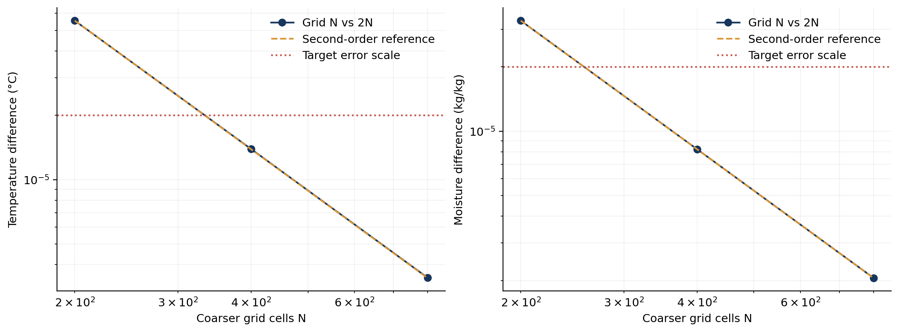
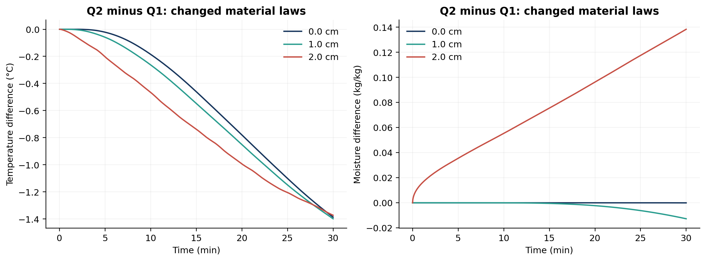
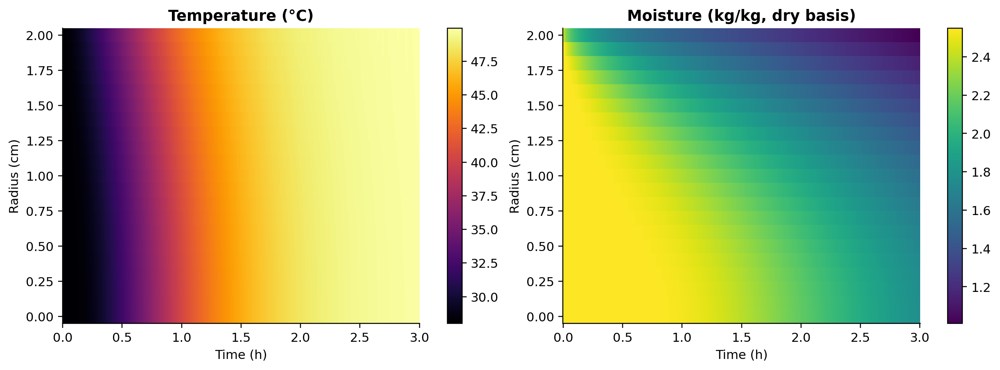
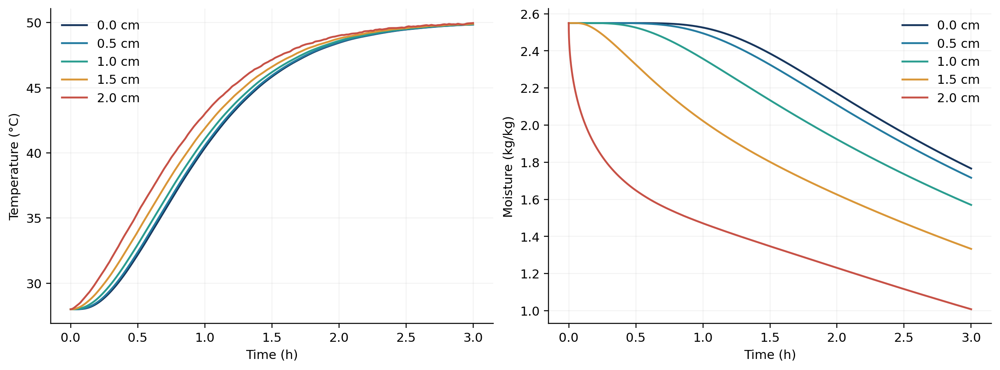
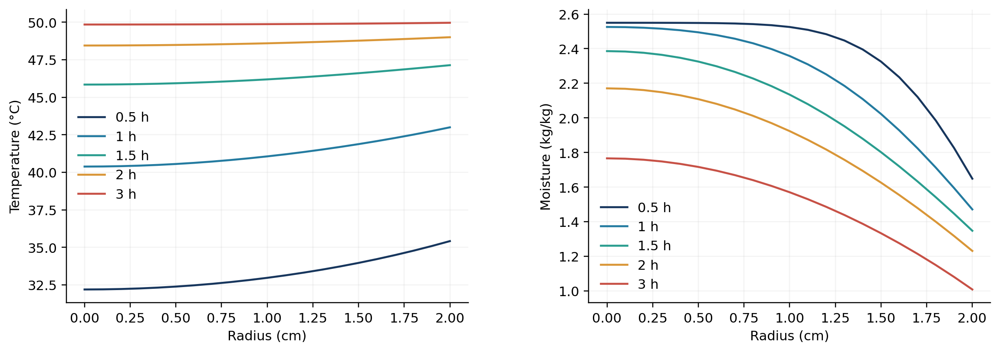
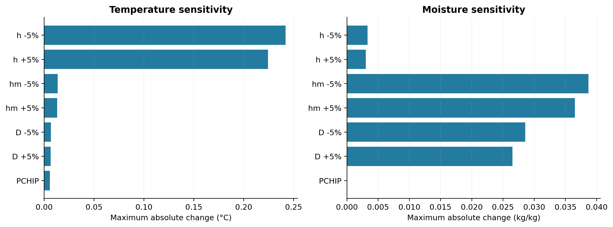

# 第二问：变物性与温湿双向耦合的药材干燥模型

## 摘要

对半径2 cm、长度25 cm的圆柱药材，从初始状态开始统一采用附录3的经验公式，建立固定几何下的径向导热—水分扩散耦合模型。模型可描述预热向近恒温环境的连续演化；本次严格使用附件1提供的环境数据，计算0—10800 s，不另设1800 s物性切换，也不对4小时之后的环境作外推。

最终采用800单元表面加密有限体积与BDF积分。3小时末中心与表面温度为 **49.8495℃、49.9664℃**，含水率为 **1.7662、1.0081 kg/kg**。所有10800×21个输出点的温度和含水率数值误差估计分别为 **4.806094e-06℃、2.749998e-06 kg/kg**，均低于2×10⁻⁵。此为所建模型的工程数值误差估计，不是药材实测预测误差，也不是严格数学误差上界。

## 1. 数据、研究对象与假设

初值为均匀的28℃和干基含水率2.55 kg/kg。附件1含241个环境观测，0—14400 s、间隔60 s。相邻点间线性插值，严格使用每个观测，不平滑替换。结果取轴向中截面的径向分布；假设均质、轴对称，忽略轴向梯度，第二问半径固定。第一问的中截面端部检验只覆盖30分钟，不能直接作为本问3小时端部误差的定量证明。

附录3未另给界面系数，因此沿用附录2的 h=25 W/(m²·K)、h_m=8×10⁻⁷ m/s。固体表面有效平衡含水率设为 C_e=C_a；气相与固相的 kg/kg 参照质量通常不同，此处是使用题给传质系数的有效闭合，不是已经由实验验证的吸附等温线。

主模型采用显热近似；不额外加入潜热、辐射、内部流动和收缩。ρ(C)作为有效热物性使用，不将其与固定体积下严格守恒的干物质量强行等同。因此本模型描述的是题给经验条件下的有效场演化，不是完整多相质量与能量模型。全文引用编号对应《参考文献.md》。

## 2. 经验公式与耦合机制

题给公式[1]为

$$
\rho(C)=650+128C,\quad c_p(C)=1450+2736\frac{C}{1+C},
$$
$$
k(C)=0.21+0.38\frac{C}{1+C},\quad
D(C,T)=2.4\times10^{-3}\exp\left(-\frac{0.45}{C}\right)
\exp\left(-\frac{3850}{T+273.15}\right).
$$

这里代码状态变量T以℃计，只有最后一个指数使用K；C以干基kg/kg计。所有常数来自题目，不将它们归给外部论文。初始状态下有效体积热容为 3334694.794 J/(m³·K)，k=0.482958 W/(m·K)，D=5.641680e-09 m²/s。

热质双向耦合具体表现为：温度改变D，从而改变失水速度；C改变ρ、c_p、k，从而改变温度分布。[2]给出变物性热质传递建模实例，[3]提供农产品耦合干燥研究背景，[4]展示温度波动相关的扩散建模。它们支持方法选择，但各自材料参数不能直接移植。

局部温度扩散系数 α=k/(ρc_p) 与水分扩散系数不同；不能把温度和含水率看作同一时间尺度的均匀状态，也不能用纯时间经验拟合代替题目要求的空间分布。

## 3. 控制方程及边界

令A(C)=ρ(C)c_p(C)，取向外为正的通量。圆柱薄壳积分后得到

$$
A(C)\partial_tT=\frac1r\partial_r\big(rk(C)\partial_rT\big),\qquad
\partial_tC=\frac1r\partial_r\big(rD(C,T)\partial_rC\big).
$$

初值为T(r,0)=28、C(r,0)=2.55。中心对称条件为T_r(0,t)=C_r(0,t)=0；真实表面的Robin条件为

$$
-k(C_s)T_r(R,t)=h(T_s-T_a(t)),\qquad
-D(C_s,T_s)C_r(R,t)=h_m(C_s-C_a(t)).
$$

当环境较热时热通量为负，表示热流入；C_s>C_a时水分向外输运。中心用零面积通量处理，不直接计算1/r。

必须保留k、D在散度内。水分方程展开后包含 D_C(C_r)²+D_T T_r C_r，热方程含 k_C C_r T_r；简单把D或k乘在常系数拉普拉斯算子外会漏掉这些项。附录3从t=0就使用，阶段变化通过边界驱动与局部物性自然体现。

## 4. 数值离散与实现

### 4.1 径向网格与通量

取网格面r_j=R[1-(1-j/N)²]，单元中心取相邻面的中点；环形体积权重（略去公共2πL）为 V_i=(r_{i+1/2}²-r_{i-1/2}²)/2。采用点值型单元中心有限体积近似，并用网格收敛验证其精度。

内部界面上定义线性状态路径(T(ξ),C(ξ))=(T_i,C_i)+ξ[(T_{i+1},C_{i+1})-(T_i,C_i)]，ξ∈[0,1]。用三点Gauss积分求平均系数 k̄、D̄，两侧共享同一个通量：

$$
Q^T_{i+1/2}=\frac{r_{i+1/2}\bar k_{i+1/2}}{r_{i+1}-r_i}(T_i-T_{i+1}),\quad
Q^C_{i+1/2}=\frac{r_{i+1/2}\bar D_{i+1/2}}{r_{i+1}-r_i}(C_i-C_{i+1}).
$$

同一个界面通量在相邻单元内一正一负，保证内部通量抵消。与第一问不同，D同时依赖T、C，此处不声称存在单变量的全局Kirchhoff变换；它是沿局部状态路径的界面求积。有限体积的理论背景见[5]。

### 4.2 表面值重构

最后一个单元中心到表面的距离为δ，耦合解

$$
\bar k(T_N-T_s)/\delta=h(T_s-T_a),\quad
\bar D(C_N-C_s)/\delta=h_m(C_s-C_a).
$$

采用固定点迭代，同时更新T_s、C_s和路径系数；更新差必须小于2×10⁻¹³，否则显式报错。该重构是半单元边界近似，不能把最外单元中心当作真实表面。最终状态的边界残差另经独立代回检查。

中心按r²对称重构，内部目标半径用局部三点二次插值，输出表面采用上述Robin重构。t=0单独保留均匀初值；初始含水率与Robin边界不兼容，时间推进负责解析初始表面薄层。结果不进行负值裁剪。

### 4.3 耦合积分

离散方程是 V_i A(C_i)Ṫ_i=Q^T_{i-1/2}-Q^T_{i+1/2}、V_i Ċ_i=Q^C_{i-1/2}-Q^C_{i+1/2}。T、C交错存储并同时推进，避免热、质先后单次更新产生的分裂误差。

采用SciPy BDF[6]，提供块三对角稀疏结构，每60秒数据节点重启，避免跨越线性插值斜率突变。最终rtol=10⁻¹¹，温度atol=10⁻¹²℃、含水率atol=10⁻¹³ kg/kg，最大内部步长10 s；通过积分器稠密输出在每个整秒采样，整秒采样不等于采用1 s时间步。800单元主计算实际接受18820个步；运行耗时受机器与编译缓存影响，以保存日志为准。

## 5. 数值验证与误差估计

### 5.1 全场空间、时间与积分方法验证

| 网格对照 | 温度最大差/℃ | 含水率最大差/(kg/kg) |
|---|---:|---:|
| 200→400 | 5.544131e-05 | 3.288324e-05 |
| 400→800 | 1.389765e-05 | 8.226301e-06 |
| 800→1600 | 3.476837e-06 | 2.056499e-06 |

以上差异覆盖全部10800×21个输出点。200/400/800序列观测阶为温度 1.9961、含水率 1.9990。800/1600比较采用收紧后的容差，避免时间误差主导。

800单元BDF容差从10⁻⁹收紧至10⁻¹¹的最大差为温度 1.675639e-07℃、含水率 7.767349e-09 kg/kg。同网格同容差Radau与BDF最大差为温度 2.747385e-09℃、含水率 2.324358e-10 kg/kg。Radau更换的是时间积分算法，使用相同的空间离散，不能据此宣称两套完全独立的PDE实现。

采用有数值二阶证据支持的保守组合估计

$$
E_u=\frac43\|u_{800}-u_{1600}\|_\infty
+\|u_{800,10^{-9}}-u_{800,10^{-11}}\|_\infty
+\|u_{800,\mathrm{BDF}}-u_{800,\mathrm{Radau}}\|_\infty.
$$

4/3对应保留的800单元较粗解；不误用细网格的1/3系数。温度E_T=4.806094e-06℃，含水率E_C=2.749998e-06 kg/kg。交付采用800单元BDF实际结果，不用Richardson外推替换。此估计包括输出重构的网格差异，但不是区间证明；四位小数附近的舍入边界仍可能出现末位差别。

### 5.2 方程收支与基本检查

水分检验为 ΣV_i C_i(t)-ΣV_i C_i(0)+∫Q^C_Rdt。热方程不能直接验证ΣV_i A(C_i)T_i的变化等于边界热量，因为A随C变化。利用链式法则验证

$$
\sum_iV_i[A(C_i)T_i]_0^t+\int_0^tQ^T_R\,ds
-\int_0^t\sum_iV_i A'(C_i)T_i\dot C_i\,ds=0.
$$

积分在每个接受时间步的稠密轨迹上用三点Gauss重新求积，检查值在每60秒节点保存。水分相对残差为 1.062543e-11，热方程积分恒等式相对残差为 6.846106e-11；分别以最终边界水分交换量、热交换量的绝对值归一化。这些是所建方程的收支检验，不是潜热、多相总能量或变密度下绝对失水质量的证明。

均匀平衡态右端、物性解析导数、开尔文换算、界面求积对照以及表面通量代回均通过。所有逐秒内部状态和输出值有限，未出现负含水率；机器舍入可在28℃或2.55附近产生10⁻¹⁴量级偏差，不以裁剪掩盖。

### 5.3 A1回归与物理口径差异

将同一套求解器退化为附录2物性，在0—1800 s与A1完整精度数据比较，全场最大差为温度 5.746950e-06℃、含水率 4.966707e-06 kg/kg，均小于2×10⁻⁵。计算代码不导入A1求解模块，A1数据只作为核验基准。

实际第二问采用不同的物性公式，因此它与A1前30分钟结果不应完全相同。0—1800 s最大温度差为 1.401976℃，最大含水率差为 0.138379 kg/kg；这是模型变化，不是把A1“纠正”为另一组结果。第二问初始有效体积热容较大，表面与内部升温表现随之改变，同时温度与含水率对扩散的反馈改变失水分布。

## 6. 第二问结果

### 表3：3小时内药材的温度，单位℃

| 时间/h | 0 cm | 0.5 cm | 1 cm | 1.5 cm | 2 cm |
|---|---:|---:|---:|---:|---:|
| 0.5 | 32.1892 | 32.3821 | 32.9659 | 33.9608 | 35.4130 |
| 1.0 | 40.3816 | 40.5536 | 41.0605 | 41.8782 | 42.9976 |
| 1.5 | 45.8468 | 45.9348 | 46.1930 | 46.6051 | 47.1400 |
| 2.0 | 48.4502 | 48.4881 | 48.5984 | 48.7735 | 49.0033 |
| 2.5 | 49.4670 | 49.4792 | 49.5136 | 49.5653 | 49.6609 |
| 3.0 | 49.8495 | 49.8553 | 49.8746 | 49.9101 | 49.9664 |

### 表4：3小时内药材的水分浓度，单位kg/kg（干基）

| 时间/h | 0 cm | 0.5 cm | 1 cm | 1.5 cm | 2 cm |
|---|---:|---:|---:|---:|---:|
| 0.5 | 2.5499 | 2.5489 | 2.5256 | 2.3257 | 1.6486 |
| 1.0 | 2.5257 | 2.4948 | 2.3578 | 2.0230 | 1.4711 |
| 1.5 | 2.3861 | 2.3256 | 2.1344 | 1.8020 | 1.3476 |
| 2.0 | 2.1709 | 2.1084 | 1.9236 | 1.6259 | 1.2311 |
| 2.5 | 1.9566 | 1.9006 | 1.7360 | 1.4720 | 1.1166 |
| 3.0 | 1.7662 | 1.7165 | 1.5702 | 1.3333 | 1.0081 |

前期表面先升温、先失水；3小时末温差降至约 0.1169℃，而中心到表面的含水率差仍约 0.7581 kg/kg，表明热均衡较快，水分均匀化仍需较长时间。不能把温度接近烘房温度视作干燥已经完成。

体积平均含水率定义为 C̄=2/R²∫₀ᴿrCdr，用实际环形体积权重计算；末值为 1.38252753 kg/kg。它不同于21个输出点的简单算术平均，也不直接给出真实失水克数。第一问已有审核文本中的平均量结论不直接移植，本问平均量始终由本问网格计算。

## 7. 敏感性与适用范围

同为400单元、rtol=10⁻⁹的对照实验，仅改变单个参数或插值方式，其余保持一致。

| 情景 | 全场最大温度变化/℃ | 全场最大含水率变化 | 末期表面温度变化/℃ | 末期表面含水率变化 |
|---|---:|---:|---:|---:|
| h -5% | 0.242018 | 0.003296 | -0.017897 | +0.000378 |
| h +5% | 0.224263 | 0.003007 | +0.014790 | -0.000368 |
| hm -5% | 0.013551 | 0.038664 | -0.002371 | +0.038664 |
| hm +5% | 0.013093 | 0.036510 | +0.002247 | -0.036499 |
| D -5% | 0.006709 | 0.028552 | -0.000860 | -0.007221 |
| D +5% | 0.006425 | 0.026506 | +0.000806 | +0.006514 |
| PCHIP | 0.005715 | 0.000016 | +0.000233 | -0.000002 |

±5%是人为设置的确定性情景，不是参数误差标准差或置信区间。与第一问的解耦结构不同，此处h扰动也影响水分，h_m和D扰动也会反过来影响温度；这是双向耦合的可检查结果。

局限包括：有效表面平衡关系未由吸附数据辨识；显热近似没有验证蒸发潜热可忽略；固定几何与径向中截面近似不描述端部和收缩；经验参数只在题给建模口径下使用。附件1是环境输入，不是药材内部温湿测量，故没有实验RMSE、R²或统计置信区间。文献内的实验验证结果不属于本模型。

方程在提供完整环境边界且经验公式仍适用时可继续描述更长干燥过程；本次输出严格止于3小时，不推算第三问干燥终点，也不假定后续72小时保持某个环境值。

## 8. 交付与复算

`result2.xlsx`含“温度”“水分浓度”两张工作表，各10800行时间记录、21个径向值，数值保留四位小数；`data/full_precision.npz`与CSV另含t=0初始行。报告表3、表4从同一完整精度结果生成。

`code/`提供数据读取、求解、复算、分析、作图和工作簿生成程序；`verification/`保存每个工况、误差和逐格检查；`参考文献.md`给出规范题录、实际可用链接和访问失败记录。所有新增文件位于A2/A2-gpt，原题、附件及A1基准的哈希复核保持一致。具体环境、命令和输出字段见README。
