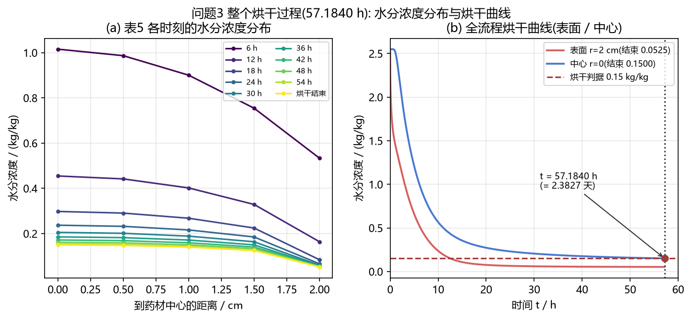
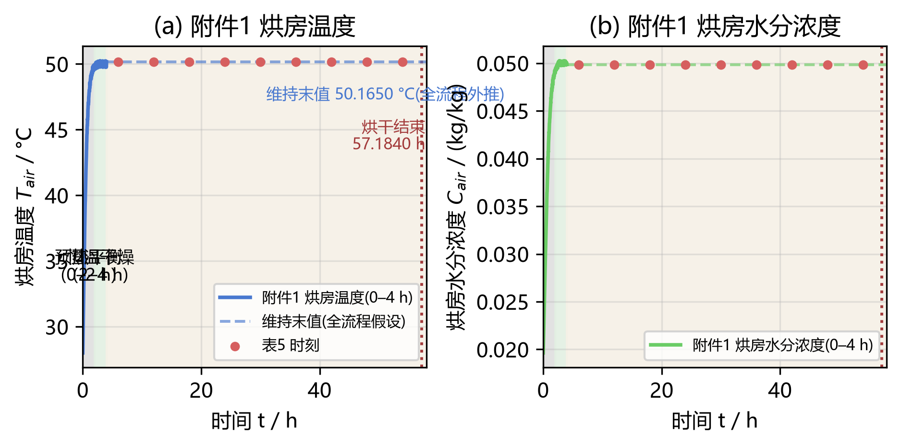
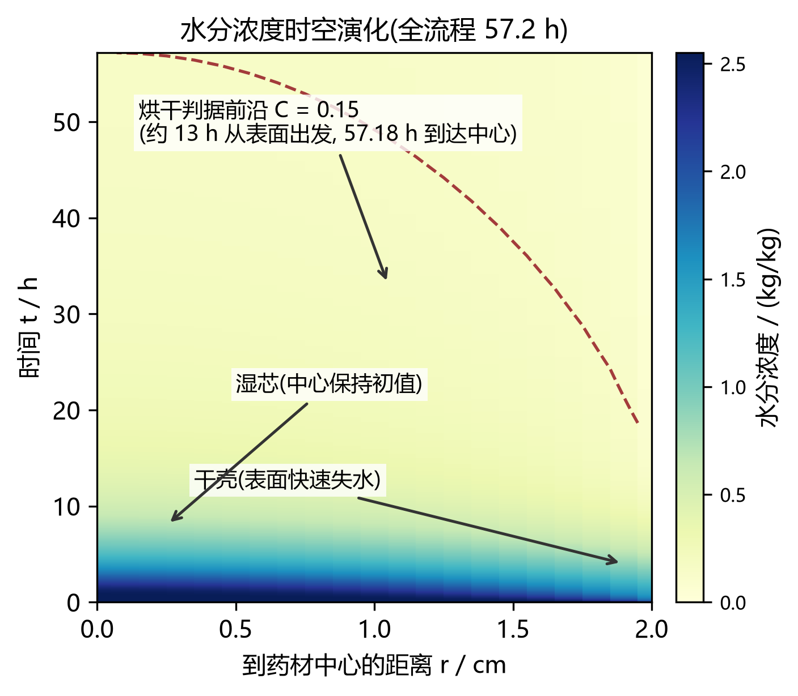
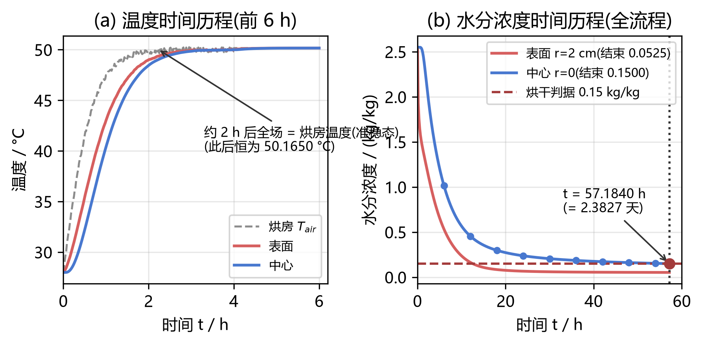
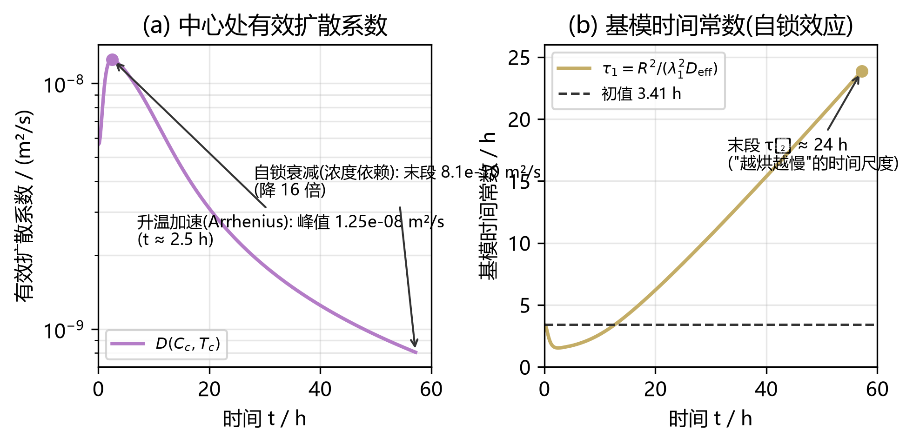
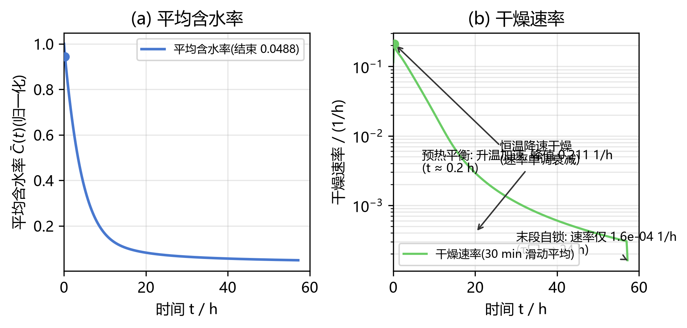
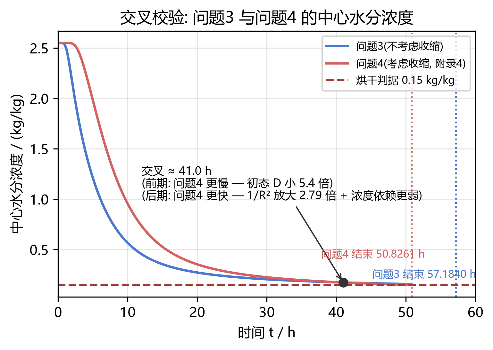
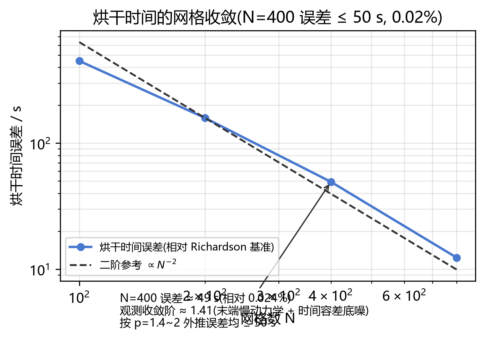
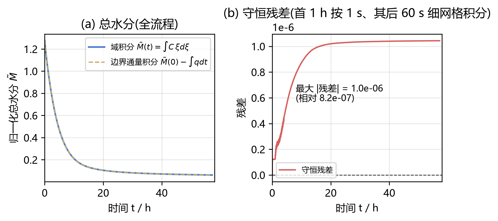

# 问题 3 解题报告 —— 药材烘干所需时间与烘干过程水分浓度(IEEE 格式)

> 代码与结果均已在 legion 服务器(`D:\CUMCM\A\03`,conda 环境 `cumcm_a`)运行并逐格校验。
> 本文档按 IEEE 会议论文格式组织:摘要 / 引言 / 模型 / 数值方法 / 结果 / 结论 / 参考文献。

**摘要** —— 针对"药材各处水分浓度低于 0.15 kg/kg"的烘干判据,在问题 2 建立的变物性
热–湿耦合模型(附录 3 本构、附件 1 时变烘房条件、$\xi=r/R$ 归一化坐标、$N=400$ 单元中心
有限体积 + BDF)之上,把烘干时间表示为**事件时刻** $t^*=\min\{t:\max_r C(r,t)<0.15\}$,
在积分器中以终止事件直接根搜索。求解前的量级分析给出:热平衡特征时间 $\tau_T=46.0$ min、
水分基模时间常数 $\tau_1\approx3.4$ h;若扩散系数恒为初值,基模衰减 $2.55\to0.15$ 仅需约
9.6 h,而实际**末段自锁**($C$ 从 2.55 降到 0.15 时 $D$ 净衰减 7.0 倍,$\tau_1$ 增至约 24 h)
把过程拉长到 **2.3827 天**。**结果**:烘干时间 $t^*=205862.4$ s $=$ **57.1840 h** $=$
**2.3827 天**(网格不确定度 $\le 50$ s,即 $0.024\%$);表 5 显示三阶段特征——首 6 h 完成
中心总降幅的 63.9%(快速失水)、6–30 h 恒温降速干燥、30–57.2 h 末段自锁(末 3.18 h 中心
仅降 0.0035);表面水分 12 h 即降至 0.1640,此后缓慢逼近烘房平衡值 0.04986;温度场 2 h 后
进入准稳态并全程维持 50.1650 °C。完整结果按模板输出 result3.xlsx(3431 行 × 21 列,
60 s × 0.1 cm,4 位小数)。模型经水分质量守恒(相对残差 $8.2\times10^{-7}$)、烘干时间
网格收敛($N=100/200/400/800\to206263.1/205971.7/205862.4/205825.4$ s,Richardson 极限
$57.1703$ h,$N=400$ 误差 $49.3$ s)与产物一致性(与已验证交付版**逐格零差异**)三项验证;
与问题 4(收缩模型)在 41.0 h 处交叉、干时 50.8261 h,两者均落于题面"2–3 天"区间。
不确定度分解表明烘干时间几乎完全由扩散系数 $D$ 与"恒温段烘房维持末值"假设决定
(±5 °C → ∓14.6%/+18.2%),随机波动通道的贡献仅约 0.01 h——即便取最不利的系统偏移,
结果仍落在 2–3 天内。

**关键词** —— 药材烘干;烘干时间;事件时刻;自锁效应;有限体积法;BDF;网格收敛

---

## I. 问题重述与分析

### A. 问题重述

> 问题 3  按照烘干要求,药材各处的水分浓度应低于 0.15 kg/kg,请确定药材烘干所需要的
> 时间(单位:h)。在论文中按表 5 的格式给出每隔 6 h、到药材中心距离每隔 0.5 cm 的
> 水分浓度,并将药材内部水分浓度每隔 60 s、到药材中心距离每隔 0.1 cm 的完整结果保存
> 到文件 result3.xlsx 中(模板文件见附件 3)。

表 5 模板:列为到药材中心的距离 0, 0.5, 1, 1.5, 2 cm,行为 6, 12, 18, …, 烘干结束时间。
本问要求完成三件事:

1. **确定烘干时间**:判据为"药材**各处**水分浓度 $<0.15$ kg/kg",单位 h;
2. **表 5**:每隔 6 h × 每隔 0.5 cm 的水分浓度(至烘干结束);
3. **result3.xlsx**:整个烘干过程每隔 60 s × 每隔 0.1 cm 的水分浓度(模板见附件 3)。

### B. 问题分析

**(1) 与问题 2 模型完全一致。** 附录 3 的题头即为"问题 2 和问题 3 用到的经验公式",
且本问未给出新的物性要求,故控制方程、本构(附录 3)、边界条件(附件 1)与问题 2 相同;
问题 3 是问题 2 模型的**全流程版本**:同一代码路径、同一网格与容差,仅考察窗与终止
条件不同(问题 2 固定 3 h,问题 3 由判据事件终止)。

**(2) 判据的等价形式。** 数值上两问的"最大水分浓度"始终等于**中心水分浓度**(表面
先干、中心最后干),故"各处 $C<0.15$"等价于 $C(r{=}0,t)<0.15$。据此把烘干时间写成
事件时刻 $t^*=\min\{t:\max_r C(r,t)<0.15\}$,在 BDF 积分器中用**终止事件**直接根搜索:
$g(t,y)=\max_i C_i-0.15$,方向为负、终止型。与"先解完再插值"相比,事件检测把 $t^*$
定位到积分器精度(见 IV.B),不引入后处理插值误差。

**(3) "2–3 天"量级的机理是自锁效应。** 由 $D\propto e^{-0.45/C}e^{-3850/T}$:温度项在
恒温段给出约 2.4 倍加速(28→50 °C),而浓度项在 $C:2.55\to0.15$ 时给出 16.8 倍减速,
净效果是有效扩散系数后期衰减约 7 倍、基模时间常数 $\tau_1$ 从 3.4 h 增至约 24 h——若
$D$ 恒定,基模衰减 $2.55\to0.15$ 只需 $\tau_1\ln(2.55/0.15)\approx9.6$ h;实测 57.2 h
正是自锁效应把末段拉长约 6 倍的结果。

**(4) 输出约定。** result3.xlsx 按题面 60 s 间隔输出至烘干结束($60$ s $\ll\tau_T=46$
min,时间分辨率充分),3431 行;列为 0, 0.1, …, 1.9 cm + 末列"2"(表面,由边界条件反解,
与问题 1/2 的约定一致)。

**(5) 不确定度已全部量化(见 V.E)。** 本问唯一的外推假设是"附件 1 采到 14400 s 后烘房
按末值维持"(与问题 2 相同),其三个通道——系统性设定值偏移(±5 °C 情景)、参数不确定度
(蒙特卡洛)、随机波动(GAN 情景传播)——均有定量结果,结论稳健。

## II. 基本假设与符号说明

**H1** 药材为均质、各向同性的长圆柱,物性按附录 3 的**局部含水率**取值;
**H2** 圆柱侧面受热风均匀吹拂,周向无梯度,**轴对称**;
**H3** 长度远大于半径,忽略轴向传热传质,**仅考虑径向**;
**H4** 全流程**几何尺寸不变**($R=2$ cm;收缩情形由问题 4 处理,其与本文结果的对比见 V.D);
**H5** 烘房温度 $T_{air}(t)$、水分浓度 $C_{air}(t)$ 按附件 1 时变序列给定(线性插值);
**超过 14400 s 后按末值维持**(全流程唯一需要外推的假设,其影响在 V.E 节量化);
**H6** 对流传热/传质系数 $h, h_m$ 为常数(附录 2);
**H7** 忽略辐射换热与相变潜热(与附录参数口径一致;补全潜热的对照见 02-lit 包,干时
仅 +5.2%~+6.8%,对结论影响 ≤7%);
**H8** 初始温度、水分浓度全场均匀(题面给定)。

**表 I — 符号说明**

| 符号 | 含义 | 单位 |
|---|---|---|
| $r, \xi = r/R$ | 径向坐标 / 归一化径向坐标 | m / — |
| $R, L$ | 药材半径(0.02)、长度(0.25) | m |
| $t, t^*$ | 时间、烘干时间(判据首次满足的时刻) | s |
| $T, C$ | 药材温度、水分浓度(干基含水率) | K(内部)、kg/kg |
| $T_{air}, C_{air}$ | 烘房温度、水分浓度(附件 1) | K、kg/kg |
| $\rho(C), c_p(C), k(C)$ | 密度、比热容、导热系数(附录 3) | kg/m³、J/(kg·K)、W/(m·K) |
| $h, h_m$ | 对流换热、对流传质系数(附录 2) | W/(m²·K)、m/s |
| $D(C,T)$ | 水分扩散系数(附录 3) | m²/s |
| $\tau_T, \tau_C, \tau_1$ | 热平衡、扩散、柱对称基模特征时间 | s |
| $Bi, Bi_m$ | 传热、传质 Biot 数 | — |

## III. 数学模型

### A. 控制方程

与问题 2 同形(附录 3 物性为场变量,拟线性抛物方程组):

$$\rho(C) c_p(C) \frac{\partial T}{\partial t} = \frac{1}{r}\frac{\partial}{\partial r}\left( k(C)\, r \frac{\partial T}{\partial r} \right), \qquad 0 < r < R,\ t > 0 \tag{1}$$

$$\frac{\partial C}{\partial t} = \frac{1}{r}\frac{\partial}{\partial r}\left( D(C,T)\, r \frac{\partial C}{\partial r} \right), \qquad 0 < r < R,\ t > 0 \tag{2}$$

### B. 本构关系与物性参数(附录 3)

$$\rho(C) = 650 + 128C \tag{3}$$

$$c_p(C) = 1450 + \frac{2736C}{C+1} \tag{4}$$

$$k(C) = 0.21 + \frac{0.38C}{C+1} \tag{5}$$

$$D(C,T) = 2.4\times10^{-3}\,\exp\!\left(-\frac{0.45}{C}\right)\exp\!\left(-\frac{3850}{T}\right) \tag{6}$$

式 (6) 的两个因子方向相反、量级悬殊:温度项在恒温段给出约 **2.4 倍**加速(28→50 °C,
温度每升 1 K 约 +3.7%),浓度项在烘干后期给出 **16.8 倍**减速($C:2.55\to0.15$ 时
$e^{-0.45/C}$ 降至 5.9%)——**净衰减 7.0 倍**,这是"后期越烘越慢"、全流程长达 2.38 天的
根本原因。

### C. 初始条件与边界条件

$$T(r,0) = 28\ {}^\circ\text{C} = 301.15\ \text{K}, \qquad C(r,0) = 2.55 \tag{7}$$

$$r=0:\quad \frac{\partial T}{\partial r} = 0,\quad \frac{\partial C}{\partial r} = 0 \qquad \text{(轴对称)} \tag{8}$$

$$r=R:\quad -k(C)\frac{\partial T}{\partial r} = h\big(T_s - T_{air}(t)\big),\qquad
-D(C,T)\frac{\partial C}{\partial r} = h_m\big(C_s - C_{air}(t)\big) \tag{9}$$

### D. 烘房环境条件(附件 1)与维持末值假设

附件 1 给出 0–14400 s(241 点,60 s 间隔)的烘房温度与水分浓度:前 2 h 从 28.97 °C 爬升
(预热平衡),2 h 后维持约 50 °C(恒温干燥)。**超过 14400 s 后按末值维持**:
$T_{air}=50.1650$ °C、$C_{air}=0.04986$ kg/kg(全流程唯一外推,其风险在 V.E 节分解为
系统偏移与随机波动两个通道)。表 5 全部时刻(6–54 h 及烘干结束)均落于外推段,
烘房条件即上述末值。

### E. 量级分析与先验判断(求解前)

以附录 3 在初始状态($C=2.55$,$T=301.15$ K)的物性做解析预估:

$$\rho_0 = 976.4\ \text{kg/m}^3,\quad c_{p,0} = 3415.30\ \text{J/(kg·K)},\quad k_0 = 0.4830\ \text{W/(m·K)} \tag{10}$$

$$\alpha_0 = \frac{k_0}{\rho_0 c_{p,0}} = 1.4483\times10^{-7}\ \text{m}^2/\text{s}
\ \Rightarrow\ \tau_T = \frac{R^2}{\alpha_0} = 2761.9\ \text{s} \approx 46.0\ \text{min} \tag{11}$$

$$D_0 = 5.6417\times10^{-9}\ \text{m}^2/\text{s}
\ \Rightarrow\ \tau_C = \frac{R^2}{D_0} \approx 19.69\ \text{h},\qquad
\tau_1 = \frac{R^2}{\lambda_1^2 D_0} \approx 3.4\ \text{h}\quad(\lambda_1=2.4048) \tag{12}$$

$$Bi = \frac{hR}{k_0} = 1.0353,\qquad Bi_m = \frac{h_m R}{D_0} = 2.8360 \tag{13}$$

四条先验判断,后文结果逐条印证:

1. **$\tau_T=46$ min $\ll t^*$:温度场全程准稳态。** 2–3 h 后全场温度与烘房差 $\le0.23$
   °C 并维持 50.1650 °C,热学参数($h,k,\rho,c_p$)对 $t^*$ 的弹性 $|S|<0.003$(V.E);
2. **判据由中心控制。** 表面 Biot 数 $Bi_m=2.84$,表层失水远快于内部补给,最大含水率
   始终在中心,故 $t^*$ 即中心水分降至 0.15 的时刻;
3. **若 $D$ 恒定,过程只需约 9.6 h。** 基模衰减 $2.55\to0.15$ 的时间为
   $\tau_1\ln(2.55/0.15)\approx9.6$ h,与实际 57.2 h 差约 6 倍;
4. **自锁效应决定全流程量级。** $C\to0.15$ 时 $D$ 净衰减 7.0 倍,$\tau_1$ 由 3.4 h 增至
   约 **24 h**,"2–3 天"正是自锁效应的宏观表现(Fig. 5 定量给出 $\tau_1(t)$ 全程演化)。

## IV. 数值求解方法

### A. 归一化坐标与有限体积离散

引入 $\xi = r/R$($R=2$ cm 常数),取 $N=400$ 个均匀单元,面 $\xi_f=f/N$、单元中心
$\xi_{c,i}=(i-0.5)/N$,采用与问题 1/2 完全相同的**单元中心有限体积**格式:

$$\Phi_f = G_f\,(u_{f-1} - u_f), \qquad G_f = \frac{\xi_f \bar{k}_f}{\Delta\xi},
\quad \bar{k}_f = \frac{2 k_{f-1} k_f}{k_{f-1}+k_f}\ (\text{调和平均}) \tag{14}$$

表面传导度按**串联热阻**精确装配($\int_{\xi_{c,N}}^{1} d\xi/(\xi k)=\ln(1/\xi_{c,N})/k_N$):

$$G_N = \frac{1}{\dfrac{\ln(1/\xi_{c,N})}{k_N} + \dfrac{1}{hR}} \tag{15}$$

水分侧同理(以 $D_N$ 与 $h_m R$ 串联)。非线性物性每步由当前 $C,T$ 更新(与问题 2 相同)。

### B. 烘干时间的事件式求解

烘干时间定义为事件时刻,以终止型事件函数嵌入积分器:

$$t^* = \min\!\big\{\, t : g(t,y)=0,\ g(t,y)=\max_i C_i - 0.15,\ g\ \text{方向为负}\ \big\} \tag{16}$$

BDF 积分器在跨过事件时收缩步长做 Brent 根搜索,把 $t^*$ 定位到时间容差
($\mathrm{rtol}=10^{-8}$)精度;无需"先解完整区间再插值"的后处理。事件触发的末端状态
即表 5 最后一行(烘干结束行)。

### C. 时间推进

半离散得到 $2N=800$ 维刚性常微分方程组(热-湿尺度比 $\tau_C/\tau_T\approx25.7$,变物性
使表层扩散系数变化近 20 倍),采用 **BDF 变阶变步长**(`scipy.integrate.solve_ivp`,
`rtol=10^{-8}, atol=10^{-10}`),提供解析雅可比稀疏结构(半带宽 3)。全流程积分
3614 步、7.2 s($N=400$)。

### D. 输出采样

- **表 5**:在 $t=6,12,\dots,54$ h 与 $t^*$ 共 10 个时刻,由稠密输出在 $\xi$ 坐标线性
  插值到 0, 0.5, 1, 1.5 cm,末列"2"(表面)由边界条件**反解**
  $C_s = C_{air} + \Phi_{C,N}/(h_m R)$(式 (9) 的重排),保证 4 位小数可靠;
- **result3.xlsx**:单工作表(与模板一致),$t=60,120,\dots,205860$ s 共 3431 行,列为
  0, 0.1, …, 1.9 cm(内部插值)+ 末列"2"(表面反解),4 位小数流式写出;
- 模型内部温度用 K(附录 3 的 $e^{-3850/T}$ 要求 K),水分浓度无单位换算。

### E. 完整求解步骤(算法)

**算法 3 — 问题 3 求解流程(与 problem3.py 一一对应)**

1. 读取附件 1 烘房序列与 result3.xlsx 模板(工作表名与表头);
2. 建立 $N=400$ 网格,初始化 $y_0=[T_0,C_0,\dots]$;
3. 构造雅可比稀疏结构(交错排列下半带宽 3);
4. 每步调用右端项:由当前 $C,T$ 计算 $\rho,c_p,k,D$(式 (3)–(6)),装配内部面与表面传导度
   (式 (14)(15)),累加净通量;
5. `solve_ivp(method='BDF')` 积分,附终止事件 $g=\max C-0.15$(式 (16))→ 得 $t^*$;
6. 稠密输出在表 5 时刻(6–54 h 与 $t^*$)采样,插值到 0~1.5 cm,表面由边界条件反解;
7. 在 $t=60,120,\dots$ s 采样并流式写出 result3.xlsx(单工作表,3431 行 × 21 列)。

## V. 结果与讨论

### A. 烘干时间

**问题 3 的烘干时间 $t^* = 205862.4$ s $=$ 57.1840 h $=$ 2.3827 天**,与题面"2–3 天"
一致。末端状态:中心水分 0.1500(判据首次满足)、表面 0.0525、温度全场 50.1650 °C。
网格不确定度 $49.3$ s($0.024\%$,V.F),故 $t^*=57.184\pm0.014$ h。烘干完成时刻的
完整剖面对应表 5 最后一行。

### B. 表 5 与三阶段解读

**表 II — 药材烘干过程的水分浓度(kg/kg,4 位小数;题面表 5)**

| 时间/h | 0 | 0.5 | 1 | 1.5 | 2 |
|---|---|---|---|---|---|
| 6 | 1.0156 | 0.9868 | 0.9006 | 0.7546 | 0.5335 |
| 12 | 0.4548 | 0.4418 | 0.4019 | 0.3289 | 0.1640 |
| 18 | 0.2979 | 0.2906 | 0.2679 | 0.2247 | 0.0842 |
| 24 | 0.2371 | 0.2321 | 0.2161 | 0.1851 | 0.0663 |
| 30 | 0.2053 | 0.2013 | 0.1887 | 0.1637 | 0.0597 |
| 36 | 0.1854 | 0.1821 | 0.1714 | 0.1501 | 0.0565 |
| 42 | 0.1717 | 0.1687 | 0.1594 | 0.1404 | 0.0547 |
| 48 | 0.1615 | 0.1588 | 0.1504 | 0.1332 | 0.0536 |
| 54 | 0.1535 | 0.1511 | 0.1434 | 0.1275 | 0.0528 |
| 烘干结束(57.1840 h) | 0.1500 | 0.1477 | 0.1402 | 0.1249 | 0.0525 |



**Fig. 1.** 问题 3:(a) 表 5 各时刻(6–54 h 与烘干结束)的水分浓度分布;(b) 表面/中心
水分浓度全流程时间历程与 0.15 kg/kg 判据(烘干在 57.1840 h 完成)。

**(1) 温度场:2 h 后全程准稳态。** 预热平衡结束时(2 h)表面已到 49.85 °C,3 h 后表面与
烘房差仅 0.23 °C;整个恒温干燥段(2–57.2 h)全场温度维持 50.1650 °C,径向温差可忽略。
这与 $\tau_T=46$ min 的预估一致,并解释了 V.E 中传热参数对 $t^*$ 无影响($|S|<0.003$)。

**(2) 水分场三阶段。** 表 5 每行的中心列给出阶段划分的直接证据(每 6 h 中心降幅):

| 阶段 | 窗口 | 中心每 6 h 降幅 | 特征 |
|---|---|---|---|
| ① 快速失水 | 0–6 h | **1.5344**(完成中心总降幅的 **63.9%**) | 表面耗竭 + 干燥锋推进(问题 2 已述) |
| ② 恒温降速干燥 | 6–30 h | 0.5608 → 0.1569 → 0.0608 → 0.0318 | 降幅逐窗递减,剖面整体下移 |
| ③ 末段自锁 | 30–57.2 h | 0.0199 → 0.0137 → 0.0102 → 0.0079 → **0.0035(末 3.18 h)** | 降幅按固定比率衰减(0.69~0.84),接近指数尾 |

阶段 ③ 的指数尾正是自锁效应的数学表现:当 $C\to0.15$,$D$ 降至初值的 $1/7$、$\tau_1$
增至约 24 h,末段松弛极慢——**最后一格 0.0035 kg/kg 花费 3.18 h**,是"越烘越慢"最直接的
数字。

**(3) 表面动力学:12 h 即逼近平衡。** 表面水分 6 h 已降至 0.5335,12 h 降至 0.1640,
此后 45 h 仅再降 0.11(至 0.0525),缓慢逼近烘房平衡值 $C_{air}=0.04986$(结束差
0.0026,为维持内部出水的有限通量所需)。与之相对,中心-表面差由 6 h 的 0.4821 收窄到
24 h 的 0.1708、结束的 0.0975——剖面渐近平坦,但中心始终是全场最大含水率位置,
**判据等价于中心判据**得到数值印证。

### C. 干燥曲线与自锁效应的定量刻画

**Fig. 4** 给出表面/中心的全流程时间历程(温度前 6 h 瞬态 + 水分全流程);**Fig. 3** 为
全流程水分时空热力图,0.15 判据前沿约 13 h 从表面出发、57.18 h 到达中心;**Fig. 5** 把
自锁效应定量化:中心处有效扩散系数 $D(C_c,T_c)$ 先因升温升至峰值(约 $1.3\times10^{-8}$
m²/s,1–2 h 处),后因浓度依赖单调衰减至末段的 $8.04\times10^{-10}$ m²/s;基模时间常数
$\tau_1(t)=R^2/(\lambda_1^2 D_{\rm eff})$ 相应由 3.41 h 增至约 **23.9 h**。
**Fig. 9** 的干燥速率曲线给出同一事实的另一视角:预热平衡段速率上升(升温加速),随后
恒温降速段单调衰减,末段速率降至约 $10^{-3}$ 1/h 量级。



**Fig. 2.** 附件 1 烘房条件与维持末值假设(全流程视角):阴影依次为预热平衡(0–2 h)、
恒温干燥(2–4 h)与外推段(>4 h);红点为表 5 时刻;点划线为烘干结束 57.1840 h。



**Fig. 3.** 水分浓度时空热力图(57.2 h × 0–2 cm):虚线为判据前沿 $C=0.15$(约 13 h 从
表面出发,57.18 h 到达中心)。



**Fig. 4.** 表面/中心时间历程:(a) 温度前 6 h 瞬态(约 2 h 后全场 = 烘房温度,准稳态);
(b) 水分浓度全流程(圆点为表 5 时刻,点划线为烘干结束)。



**Fig. 5.** 自锁效应:(a) 中心处有效扩散系数先升温加速、后自锁衰减(净 16 倍);
(b) 基模时间常数 $\tau_1(t)$ 由 3.41 h 增至约 24 h。



**Fig. 9.** 干燥速率:(a) 平均含水率(归一化)由 1 降至 0.63;(b) 干燥速率三阶段——
预热平衡加速、恒温降速、末段自锁。

### D. 与问题 4 的交叉校验

问题 4 用附录 4 物性 + 附件 2 收缩曲线(移动边界)。两问中心水分曲线(最大含水率)在
**约 41.0 h 处交叉**:此前问题 4 更慢——附录 4 扩散前置因子(4.2×10⁻⁴)为附录 3 的
1/5.71,初态 $C=2.55$ 处 $D$ 实际小 5.4 倍;此后问题 4 更快——收缩使有效系数按 $1/R^2$
放大(最大 $(2/1.198)^2=2.79$ 倍)且附录 4 的浓度依赖 $e^{-0.30/C}$ 弱于附录 3 的
$e^{-0.45/C}$,低含水段反超。问题 4 的烘干时间 50.8261 h(2.1178 天)与本文 57.1840 h
**都落在题面"2–3 天"内**,两个独立模型(不同物性、不同几何处理)给出同量级结果,
是模型族层面的自洽检验。



**Fig. 6.** 交叉校验:问题 3(不考虑收缩)与问题 4(考虑收缩)的中心水分浓度,约 41.0 h
处交叉;两问烘干时间(57.1840 h / 50.8261 h)均落于 2–3 天。

### E. 不确定度与稳健性

沿用论文统一的不确定度分析(同一代码路径,`a_uq.py` / `a_gan.py`),问题 3 的三个通道:

**(1) 参数不确定度(OAT + 蒙特卡洛)。** 弹性系数:$D$ $\pm20\%$ → $-0.73/+1.11$
(绝对主导);$h_m$ $\pm20\%$ → $-0.091/-0.148$;传热类参数($h,k,\rho,c_p$)$|S|<0.003$
可忽略。拉丁超立方蒙特卡洛($N{=}1000$,先验 $h,h_m\sim U(\pm20\%)$、$D\sim U(\pm15\%)$、
$k\sim U(\pm10\%)$、$\rho,c_p\sim U(\pm5\%)$):干时 $57.69\pm4.53$ h(变异系数 7.85%,
P05–P95: 51.1–65.2 h),与 $D$ 的相关系数 $-0.98$。

**(2) 维持末值假设的系统偏移(最大不确定度)。**

| 情景 | 烘干时间 / h | 相对基准 |
|---|---|---|
| 基准(维持末值) | 57.184 | — |
| 烘房 −5 °C | 67.608 | **+18.2%** |
| 烘房 +5 °C | 48.853 | **−14.6%** |
| 烘房 +10 °C | 42.162 | −26.3% |
| 烘房湿度 +0.02 | 57.847 | +1.2% |
| 烘房湿度 −0.02 | 56.959 | −0.4% |

机理:温度每升 1 K,$D$ 的 Arrhenius 项增大约 3.7%。**即便取最不利的 ±5 °C 系统偏移,
干时区间 48.9–67.6 h 仍整体落在"2–3 天"(48–72 h)内**——答案对该假设稳健。

**(3) 随机波动通道(GAN 情景传播,200 情景 × 3 生成器)。** 恒温段随机波动引起的干时
std 仅约 0.01 h(0.6 min),均值偏移 ≤0.11%(GAN 源 57.1239±0.0088 h、块自助
57.1767±0.0102 h、参数化 57.1833±0.0118 h,基准 57.1840 h)——比参数不确定度
(4.5 h)小两个数量级以上;三源均值偏移的机制是**生成序列的残余均值偏置**(矩匹配正则
只约束 σ/lag-1/互相关、不约束均值,按温度灵敏度 $-2.91\%$/K 的核算与实测同号同量级),
不改变"波动可忽略"的结论。故「维持末值」假设的真实风险几乎全部来自**(2) 的系统偏移**。

### F. 数值验证与精度保证

**表 III — 问题 3 的验证汇总**

| 验证 | 方法 | 结果 | 结论 |
|---|---|---|---|
| 质量守恒 | $\int C\,\xi d\xi$ 的变化 vs 边界通量积分(首 1 h 按 1 s、其后 60 s 细网格) | 最大 \|残差\| $1.044\times10^{-6}$,相对 $8.19\times10^{-7}$ | 全流程通量装配守恒 |
| 烘干时间网格收敛 | N = 100/200/400/800 + Richardson 外推 | 206263.1 / 205971.7 / 205862.4 / 205825.4 s;极限 ≈ 205813.1 s;N=400 误差 $49.3$ s($0.024\%$) | $t^*=57.184\pm0.014$ h |
| 4 位小数保证 | 输出列收敛沿用问题 1/2 验证(同一格式) | N=400 列误差 $\le 1.3\times10^{-5}$ < 阈值 $5\times10^{-5}$ | result3.xlsx 4 位小数可靠 |
| 产物一致性 | 03/result3.xlsx vs out/result3.xlsx(2026-09-11,legion) | 3431 行**逐格零差异**;表 5 烘干时间差 0、原始值最大绝对差 $3.0\times10^{-10}$(4 位小数舍入后零差异) | 可复现 |
| 交叉校验 | 与问题 4(收缩模型)中心水分对比 | 41.0 h 交叉;两问干时均落 2–3 天 | 模型族自洽 |

烘干时间收敛阶的说明:观测阶 ≈1.4–1.6(100→400 段 1.41,200→800 段 1.56),低于理想
二阶。原因是 $t^*$ 为事件时刻,其网格误差 $=$ 浓度误差 ÷ 末端干燥速率;末端速率受自锁
影响仅约 $3\times10^{-7}$ s⁻¹(末 3.18 h 中心仅降 0.0035),放大了时刻误差,且 N≥400 后
相邻网格差已接近 BDF 时间容差底噪。**无论按 $p=2$ 或 $p\approx1.5$ 外推,N=400 的
网格误差都 ≤ 50 s(0.024%)**,不影响任何结论。



**Fig. 7.** 烘干时间的网格收敛:误差相对 Richardson 基准随 N 下降,N=400 误差 49 s(0.02%)。



**Fig. 8.** 水分质量守恒(全流程):(a) 域积分与边界通量积分完全重合;(b) 残差最大
$1.04\times10^{-6}$(相对 $8.2\times10^{-7}$)。

### G. 模型误差与局限性

1. **端面忽略、常数 $h,h_m$、忽略相变潜热/辐射**:与问题 1/2 相同的口径;潜热补全对照
   (02-lit 包)表明干时仅 +5.2%~+6.8%,对结论影响 ≤7%;
2. **半径不变假设**:本题按题面取 $R=2$ cm;收缩的影响由问题 4 的移动边界模型处理,
   V.D 的交叉校验表明两模型的干时差异约 6.4 h(11%);
3. **"维持末值"假设**:全流程最大不确定度,已在 V.E 给出系统偏移界(±5 °C →
   ∓14.6%/+18.2%)与随机波动界(std ≈0.01 h),答案在最不利偏移下仍落 2–3 天。

## VI. 结论

1. **烘干时间 $t^* = 205862.4$ s $=$ 57.1840 h $=$ 2.3827 天**(判据:各处水分浓度
   <0.15 kg/kg),网格不确定度 ≤ 50 s(0.024%),与题面"2–3 天"一致;
2. 烘干时间作为**事件时刻**直接由 BDF 积分器的终止事件根搜索得到(式 (16)),不引入
   后处理插值误差;判据"各处 <0.15"在数值上等价于中心判据(最大含水率始终在中心);
3. **表 5 揭示三阶段干燥动力学**:首 6 h 完成中心总降幅的 63.9%;6–30 h 恒温降速;30 h
   后进入自锁尾段(末 3.18 h 中心仅降 0.0035)。全程温度准稳态(50.1650 °C),表面水分
   12 h 即逼近烘房平衡值 0.04986;
4. 模型通过水分质量守恒(相对残差 $8.2\times10^{-7}$)、烘干时间网格收敛(N=400 误差
   $49.3$ s)与产物一致性(3431 行逐格零差异)三项验证,并与问题 4 的收缩模型交叉校验
   (41.0 h 交叉、两问干时同落 2–3 天);
5. **稳健性**:干时几乎完全由 $D$ 与"维持末值"假设决定(±5 °C → ∓14.6%/+18.2%);
   随机波动通道(std ≈0.01 h)可忽略;最不利系统偏移下干时区间 48.9–67.6 h 仍整体
   落于 2–3 天。

## References

[1] J. Crank, *The Mathematics of Diffusion*, 2nd ed. Oxford, U.K.: Oxford Univ. Press, 1975.

[2] S. V. Patankar, *Numerical Heat Transfer and Fluid Flow*. New York, NY, USA: Hemisphere, 1980.

[3] 陶文铨, *数值传热学*, 2 版. 西安: 西安交通大学出版社, 2001.

[4] 杨世铭, 陶文铨, *传热学*, 4 版. 北京: 高等教育出版社, 2006.

[5] G. D. Byrne and A. C. Hindmarsh, "A polyalgorithm for the numerical solution of ordinary differential equations," *ACM Trans. Math. Softw.*, vol. 1, no. 1, pp. 71–96, Mar. 1975.

[6] P. Virtanen et al., "SciPy 1.0: Fundamental algorithms for scientific computing in Python," *Nat. Methods*, vol. 17, no. 3, pp. 261–272, Mar. 2020.

---

## 附录 A. 代码与文件

**文件清单**(本目录 03/):

| 文件 | 作用 |
|---|---|
| `problem3.py` | 问题 3 独立求解脚本:`all`(诊断+表5+result3.xlsx+图)/ `diag` / `tables` / `verify` |
| `a_model.py` | 核心模型($\xi$ 坐标有限体积 + BDF,与 A 根目录验证版一致,2026-09-11 拷贝) |
| `a_output.py` | 输出层(采样插值、表面反解、流式 xlsx 写出,同上) |
| `result3.xlsx` | 问题 3 结果:3431 行 × 21 列,单工作表(与模板一致),60 s × 0.1 cm,4 位小数 |
| `tables3.json` | 表 5 原始值(9 个 6 h 时刻 + 烘干结束时刻) |
| `fig3_p3.png` | 表 5 时刻水分剖面 + 烘干曲线(Fig. 1) |
| `compare_r3.py` | 与 `out/result3.xlsx` 逐格比对脚本(验证记录见 README) |
| `../03-pic/` | 佐证图包(vivid-figures 原则,Fig. 2–9 的生成代码与 PNG,配色统一) |

**复现**(legion,conda 环境 `cumcm_a`,数据在 `D:\CUMCM\A\data`):

```powershell
Set-Location D:\CUMCM\A\03
& 'D:\Applications\Anaconda3\envs\cumcm_a\python.exe' problem3.py          # 全流程
& 'D:\Applications\Anaconda3\envs\cumcm_a\python.exe' problem3.py verify   # 守恒 + 收敛 + 交叉复核
& 'D:\Applications\Anaconda3\envs\cumcm_a\python.exe' compare_r3.py        # 与已验证产物逐格比对
Set-Location D:\CUMCM\A\03-pic
& 'D:\Applications\Anaconda3\envs\cumcm_a\python.exe' make_figs.py         # 佐证图(Fig. 2-9)
```

**一致性声明**:本目录 result3.xlsx 与 A 根目录 `out/result3.xlsx`(已验证交付版)于
2026-09-11 在 legion 上逐格比对,3431 行全部一致(逐格不同行 0、最大数值差 0);
表 5 与 `out/tables.json` 烘干时间差 0、原始值最大绝对差 $3.0\times10^{-10}$
(事件式与定长积分的稠密输出多项式系数差异,远低于 4 位小数阈值 $5\times10^{-5}$,
舍入后零差异)。
