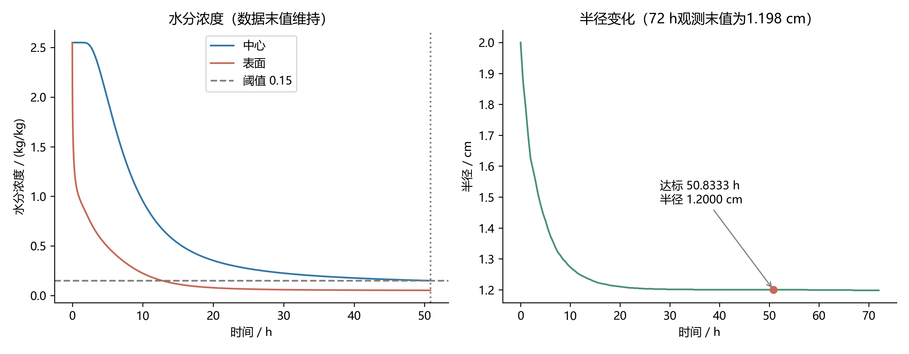

# 考虑尺寸收缩的药材烘干模型

## 与固定半径模型的衔接

前文固定半径模型确定含水率达标时间，本问进一步引入实测半径变化并采用本问给定物性。两者均从28°C、2.55 kg/kg、初始半径2 cm重新计算；本问不承接前文的干燥终态。初始条件、干基含水率定义、有效表面平衡闭合、4 h后环境末值外推和严格达标判据保持一致。令R(t)恒为2 cm并恢复前文物性，连续方程退化为前文模型；仅关闭收缩但保留本问物性，则是收缩单因素对照，不是前文模型。

当前选定组合采用独立实现：前文主网格3200单元，连续临界时间57.169383 h、首个严格整分钟205860 s；本问保留800单元主结果，连续临界时间50.8242826 h、首个严格整分钟183000 s。不同网格不影响模型递进关系，但不得声称生产代码相同或输出逐位一致。本问内部固定半径对照为57.169466 h，与前文主结果约差0.298 s；该对照仅说明终点接近，不是全场交叉验证。原联合实现的50.824204 h不用于替换本问结果。

两份正式结果统一采用显热近似。下文潜热计算只作为收缩工况的模型扩展，不能用于回改前文时长。已有跨模型曲线采用本问内置固定半径对照轨迹，不冒充前文3200单元主轨迹；引用时须注明“同方程固定半径对照”。

## 核验后的结论

不含潜热、4 h 后维持实测环境末值时，800 单元计算的连续临界时间为 **50.8243 h**；首个严格达标整分钟为 **50.8333 h（183000 s）**，此时半径 **1.2000 cm**。72 h 观测末值 1.198 cm 不是本方案的烘干终点半径。

将 4 h 后温度改为 50°C、湿度仍维持末值，连续临界时间为 51.0875 h，首个严格达标整分钟为 51.1000 h。两种外推均为模型假设，不应混用。

保留不含潜热模型作为基准，同时计算含潜热的替代模型。尚无证据表明潜热已被经验参数吸收，不能据此认定基准模型物理上完备。

## 假设与物性

药材视为轴对称长圆柱，忽略轴向变化、辐射和长度变化。半径由实测数据逐段线性插值，超过观测区间维持末值；收缩取仿射形式。初始温度 28°C，初始干基含水率 2.55 kg/kg，初始半径 0.02 m。

$$
\begin{aligned}
\rho_{\mathrm{eff}}(C)&=760+90C,\\
c_p(C)&=1850+\frac{2150C}{1+C},\\
k(C)&=0.12+\frac{0.20C}{1+C},\\
D(C,T)&=4.2\times10^{-4}\exp\left(-\frac{0.30}{C}-\frac{3850}{T+273.15}\right).
\end{aligned}
$$

这里 $T$ 以摄氏度表示，指数中的温度换算为开尔文。取 $h=25$ W/(m²·K)，$h_m=8.0\times10^{-7}$ m/s。4 h 后主方案维持 $T_a=50.165$°C、$C_a=0.04986$ kg/kg。外推缺乏后续实测验证，是独立于网格误差的模型不确定性。

## 移动边界方程

令 $\xi=r/R(t)$。仿射收缩时材料点的 $\xi$ 不变，材料导数可写为固定 $\xi$ 的时间偏导。基准模型为

$$
\begin{aligned}
C_t&=\frac{1}{R^2\xi}\frac{\partial}{\partial\xi}\left(\xi D C_\xi\right),\\
\rho_{\mathrm{eff}}c_pT_t&=\frac{1}{R^2\xi}\frac{\partial}{\partial\xi}\left(\xi k T_\xi\right).
\end{aligned}
$$

边界条件为

$$
\begin{aligned}
C_\xi(0,t)&=T_\xi(0,t)=0,\\
-\frac{D}{R}C_\xi(1,t)&=h_m(C_s-C_a),\\
-\frac{k}{R}T_\xi(1,t)&=h(T_s-T_a).
\end{aligned}
$$

收缩既改变内部方程的 $R^{-2}$ 因子，也改变边界条件、表面面积和固定物理距离的采样位置，不能表述为“全部影响仅为扩散系数放大”。

在干物质守恒且其密度空间均匀的闭合下，可取 $\rho_d(t)R(t)^2=\rho_{d0}R_0^2$，从水分衡算约去该密度。热方程经验有效密度 $\rho_{\mathrm{eff}}(C)$ 与 $\rho_d(t)$ 并非同一个量；目前没有额外数据证明二者在局部总质量关系上完全一致，这是物理闭合限制。

## 潜热模型与计算策略

采用初始湿密度换算干物质密度，并随仿射收缩更新：

$$
\begin{aligned}
\rho_{d0}&=\frac{760+90C_0}{1+C_0},\\
\rho_d(t)&=\rho_{d0}\left(\frac{R_0}{R(t)}\right)^2,\\
J_w&=\rho_d(t)h_m(C_s-C_a).
\end{aligned}
$$

表面蒸发模型仅将热边界改为

$$
-\frac{k}{R}T_\xi(1,t)=h(T_s-T_a)+L_vJ_w.
$$

对照取 $L_v=2.383\times10^6$ J/kg 为固定参数。体积型替代模型保留无潜热热边界，在热方程右侧增加 $L_v\rho_d C_t$。含水率下降时该项造成冷却；它将局部含水率变化视作相变耗能代理，不等于已验证内部蒸发机制。

表面项和体积项代表不同假设，不同时加入，以免重复计入。缺乏相变位置和参数标定证据时，应呈现不含潜热基准及含潜热对照，不能仅凭某组数值接近截图来选择模型。

## 数值方法与达标判据

采用表面加密单元中心有限体积法，网格面为 $\xi_j=1-(1-j/N)^2$。界面物性用三点 Gauss 平均，表面温度和浓度由耦合迭代求解；BDF 时间积分相对容差为 $10^{-11}$。

$$
\begin{aligned}
t_*&=\inf\{t:\max_r C(r,t)<0.15\},\\
\max_r C(r,t_*)&=0.15,\\
t_{60}&=\min\{60k:\max_r C(r,60k)<0.15,\ k\in\mathbb N\}.
\end{aligned}
$$

第二式适用于本次连续向下穿越阈值的数值解。定位 $t_*$ 后继续积分到下一整分钟，检验未舍入全场值，不使用终止事件后的插值多项式外推。事件同时检查中心重构、单元值和表面值；本次计算数值上满足径向含水率向外不增。

采样采用全局时间网格，避免分段重启造成 1–4 h 样本缺失。表面输出使用对应潜热模型的边界重构。固定距离列为 0–1.1 cm、间隔 0.1 cm，另列实际表面值。

## 结果与验证

| 环境外推 | 800单元连续时间/h | 首个严格整分钟/h | 终点半径/cm |
|---|---:|---:|---:|
| 数据末值 | 50.8242826 | 50.8333333 | 1.2000 |
| 50°C、湿度末值 | 51.0875463 | 51.1000000 | 1.2000 |

| 时间/h | 中心 | 0.5 cm | 1.0 cm | 表面 |
|---:|---:|---:|---:|---:|
| 6 | 1.7172 | 1.5357 | 1.0217 | 0.4217 |
| 12 | 0.7343 | 0.6518 | 0.4069 | 0.1667 |
| 18 | 0.4066 | 0.3668 | 0.2388 | 0.0889 |
| 24 | 0.2837 | 0.2599 | 0.1783 | 0.0671 |
| 30 | 0.2253 | 0.2085 | 0.1488 | 0.0593 |
| 36 | 0.1921 | 0.1790 | 0.1312 | 0.0558 |
| 42 | 0.1706 | 0.1598 | 0.1196 | 0.0539 |
| 48 | 0.1556 | 0.1463 | 0.1113 | 0.0529 |
| 50.8333 | 0.1500 | 0.1412 | 0.1081 | 0.0525 |

末行中心显示 0.1500 是舍入；未舍入值约为 0.14998317，满足严格小于阈值。

### 网格收敛

1600 单元加密网格结果为 50.8242226 h，与 800 单元相差约 0.216 s。二者分别舍入为 50.8242 h 和 50.8243 h，不能称四位小数逐位一致。两种网格使用共同的 1600 单元加密结果作参考，不绘制参考点零误差。

### 环境和潜热敏感性

七种环境外推在同一 400 单元网格下产生 50.824522–51.138994 h 的临界时间，相对数据末值方案最大增加 0.618741%，不是“±0.3%”。

| 模型（末值环境、400单元） | 连续临界时间/h |
|---|---:|
| 不含潜热 | 50.824522 |
| 表面潜热、初始干密度换算 | 56.164294 |
| 体积潜热、初始干密度换算 | 58.253124 |

表面潜热使该基准时间增加约 10.51%，体积潜热约增加 14.62%，不是可直接忽略的影响。单位系数试验仅是人工敏感性分析，不作为已标定的物理模型。

### 收缩单因素对照

第三组物性、固定半径的临界时间约为 57.1695 h。与第四组物性、收缩半径比较时，几何和物性同时改变，约 11.1% 的缩短不是收缩净效应。

新增同为第四组物性、400 单元、末值环境的控制试验：固定 2 cm 半径需 129.093760 h，采用观测收缩半径需 50.824522 h，条件性变化 −60.630%。这是特定模型下只改变半径规律的反事实对照，不是实验因果测量。

### 验证范围

离散恒等式、积分残差、径向单调性和网格加密检验验证实现的一致性及数值稳定性，不能单独证明完整物理质量及能量守恒。环境外推、相变位置、密度闭合及经验参数仍需额外验证。

截图来源与计算设置未经确认，不能称为已核实标准答案。50°C 外推的第三、四问复算时间与截图相差约 11–25 s，尚不能唯一确定原因；前两问温度不在本目录的独立复算范围内。
