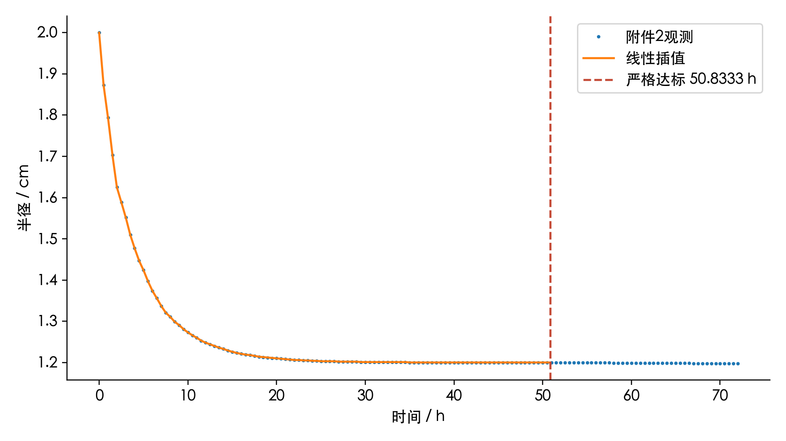
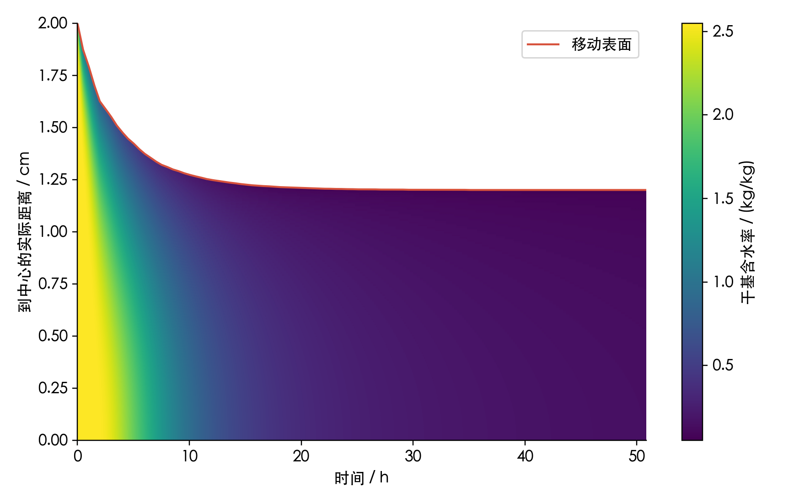
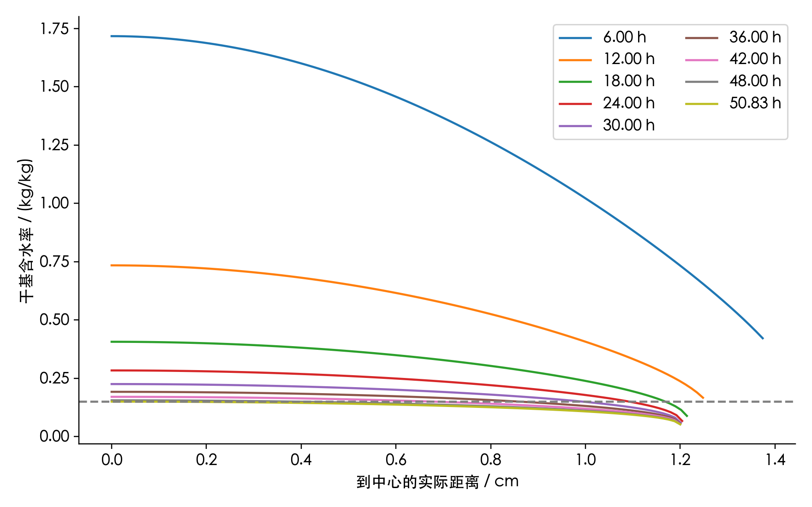
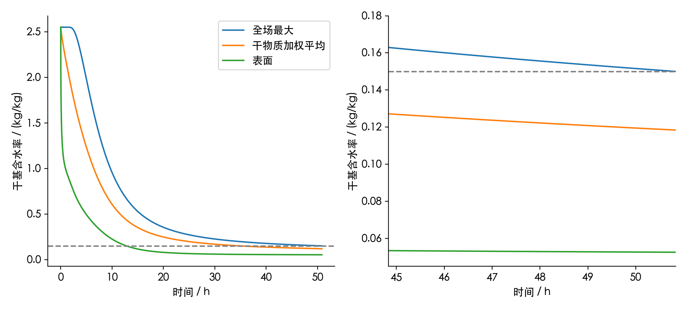
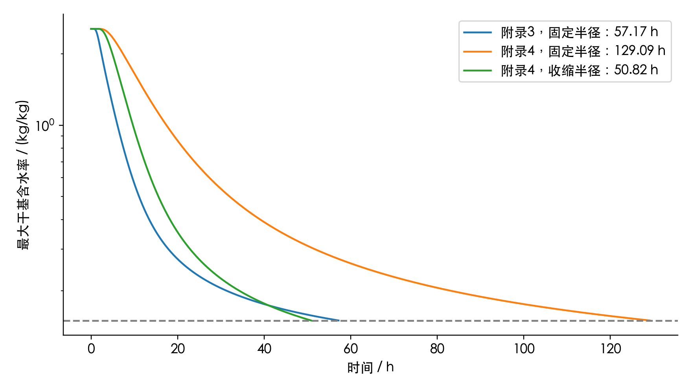
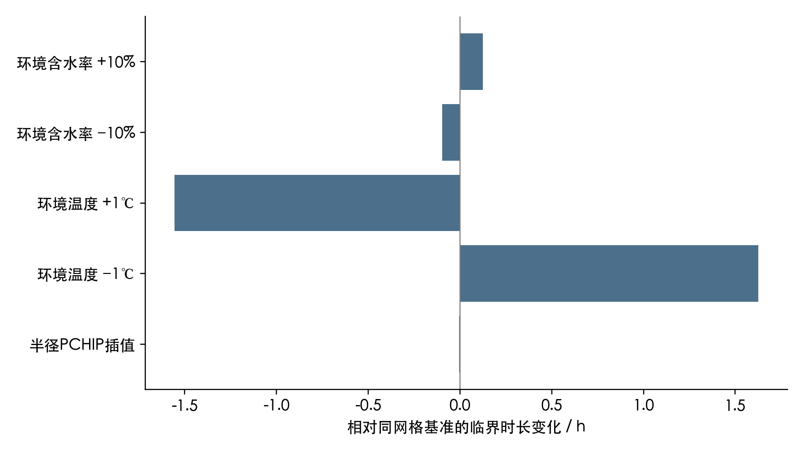

# A题第四问：尺寸收缩条件下药材烘干的数学建模与求解

## 1. 结果及其适用条件

在附录4物性、附件2半径数据、径向均匀比例收缩假设、有效Robin边界及4小时后环境保持末值的条件下，连续临界时刻为 **50.824283 h（182967.417137 s）**；此时全场最大干基含水率等于0.15。首次严格达标整分钟为 **50.8333 h，即50小时50分钟（183000 s）**。

前一分钟全场最大含水率为0.1500141679，终点为0.1499831691 kg/kg。达标判断使用完整精度数值；两者四位小数可能都显示0.1500，不能据此判断是否满足严格不等式。终点半径1.200000 cm，表面含水率0.05249533、干物质加权平均含水率0.11838833 kg/kg。

计算在附件2的72小时覆盖范围内完成，主解没有使用半径外推。没有内部温湿实测数据，因此本报告给出指定模型下的预测，不把数值误差估计称为真实预测精度。

## 2. 数据、符号和承接关系

仅使用A1-codex、A2-gpt、A3-codex的既有建模口径。几何和初值来自原题[1]：圆柱长0.25 m，初始半径0.02 m，初始温度28℃、干基含水率2.55 kg/kg。第四问从初始状态重新计算，不把第三问结果接作初值。

附件1有241个时刻，0—14400 s，按60 s间隔观测；采用线性插值，结束后固定为50.165℃、0.04986 kg/kg。附件2有145个时刻，0—259200 s，每1800 s记录半径，单调从2降至1.198 cm，采用线性插值。程序仅在计算超过72 h时启用半径末值延拓，是否启用记入算例元数据。数据不做平滑、去噪或人为调整，来源SHA-256见data/source_sha256.json。

| 符号 | 含义 | 单位 |
|---|---|---|
| C | 水质量/干物质质量 | kg/kg（干基） |
| T | 状态温度，指数中另换算开尔文 | ℃ |
| R(t), r | 当前半径、到中心的实际距离 | m |
| ξ=r/R(t) | 随固体运动的径向坐标 | 1 |
| u=rṘ/R | 固体径向收缩速度 | m/s |
| ρ_d(t) | 干物质质量/当前总体积的守恒辅助密度 | kg/m³ |
| A(C)=ρ(C)c_p(C) | 题定有效体积热容 | J/(m³·K) |

默认圆柱长度不变、轴对称、中截面径向近似，忽略端面传递、局部非均匀变形和开裂。附件2仅规定表面位置，不能唯一确定内部速度场；均匀比例收缩是额外闭合假设，不是观测结论。收缩移动边界建模有文献依据[2]，但本题直接使用实测R(t)，不照搬文献中由局部含水率预测收缩的本构关系。

## 3. 模型建立

### 3.1 附录4物性与边界

统一采用题给公式[1]：

$$\rho=760+90C,\qquad c_p=1850+2150\frac{C}{1+C},$$
$$k=0.12+0.20\frac{C}{1+C},\qquad D=4.2\times10^{-4}\exp(-0.30/C)\exp[-3850/(T+273.15)].$$

温度以℃存储，仅Arrhenius指数使用K。导热系数与扩散系数均保留在散度内部，不能直接用k∇²T、D∇²C替代。

沿用前问h=25 W/(m²·K)、h_m=8×10⁻⁷ m/s与C_e=C_a的有效气固平衡闭合。气相与固相kg/kg的质量基准不同，C_e=C_a不是实测吸附等温线。向外为正的表面条件为

$$-kT_r(R,t)=h(T_s-T_a),\qquad -DC_r(R,t)=h_m(C_s-C_a).$$

中心为T_r=C_r=0。沿用显热近似，不额外加入潜热、蒸发源项、机械功或水分焓输运；完整能量模型需要另行建立，不能只改一个边界项。

### 3.2 干基含水率守恒：为何没有压缩浓度源项

令固体干物质不流失、初始辅助干密度均匀。干物质与水分守恒为

$$\partial_t\rho_d+\frac1r\partial_r(r\rho_du)=0,$$
$$\partial_t(\rho_dC)+\frac1r\partial_r(r\rho_dCu)=-\frac1r\partial_r(rj_w),\qquad j_w=-\rho_dD C_r.$$

将第一式乘C并从第二式中消去，得到

$$\rho_d(C_t+uC_r)=\frac1r\partial_r(r\rho_dD C_r).$$

均匀比例收缩u=rṘ/R下，ρ_d(t)=ρ_d(0)[R(0)/R(t)]²为空间均匀量，因此

$$C_t+uC_r=\frac1r\partial_r(rD C_r).$$

表面真实质量通量应为j_w=ρ_d h_m(C_s−C_a)，与扩散一侧同时含ρ_d并相消。不能只在Robin右侧乘密度。C是质量比，收缩本身不会增加C；若误加−2ṘC/R项，无交换的均匀材料也会“含水率增加”，违背其定义。

辅助ρ_d用于干物质守恒，题给ρ(C)仅用于有效热容，两者不能混同。尤其不能同时强制ρ_d=ρ(C)/(1+C)、任意规定的均匀收缩速度和局部干物质守恒。本模型不声称题给热物性密度与运动学构成完全一致的多相本构模型。未知ρ_d(0)是通量和水质量的公共因子，不影响C或时长求解，故不虚构其数值。

### 3.3 材料坐标映射

取ξ=r/R(t)，记Θ(ξ,t)=T(r,t)、X(ξ,t)=C(r,t)。链式法则给出

$$C_t\big|_r=X_t-\xi\frac{\dot R}{R}X_\xi,\qquad uC_r=\xi\frac{\dot R}{R}X_\xi.$$

两项抵消，在固定计算域0≤ξ≤1上得到

$$\boxed{X_t=\frac1{R(t)^2\xi}\partial_\xi[\xi D(X,\Theta)X_\xi]},$$
$$\boxed{A(X)\Theta_t=\frac1{R(t)^2\xi}\partial_\xi[\xi k(X)\Theta_\xi]}.$$

热方程从A(T_t+uT_r)=r⁻¹∂_r(rkT_r)映射得到，是沿固体运动的有效显热近似。边界在ξ=1处变为

$$-\frac{k}{R}\Theta_\xi=h(\Theta_s-T_a),\qquad-\frac{D}{R}X_\xi=h_m(X_s-C_a).$$

因此收缩同时改变内部R⁻²扩散尺度、物理距离以及边界R⁻¹梯度尺度。仅替换固定网格方程中的一个半径参数、继续把旧节点当作固定实际距离，是不充分的。

## 4. 数值离散与终点定位

### 4.1 有限体积

按[3]的通量平衡思想取表面加密网格ξ_j=1−(1−j/N)²，单元中心为相邻面的中点，v_i=(ξ²_{i+1/2}−ξ²_{i−1/2})/2。当前实际单元体积权为R²v_i（省略公共2πL）。内部面通量为

$$Q^T_{i+1/2}=\frac{\xi_{i+1/2}\bar k}{\xi_{i+1}-\xi_i}(\Theta_i-\Theta_{i+1}),\qquad Q^C_{i+1/2}=\frac{\xi_{i+1/2}\bar D}{\xi_{i+1}-\xi_i}(X_i-X_{i+1}).$$

界面系数沿相邻温湿状态的线性路径采用三点Gauss积分。内部通量只计算一次，保证相邻单元符号相反。离散式为

$$R^2v_iA_i\dot\Theta_i=Q^T_{i-1/2}-Q^T_{i+1/2},\qquad R^2v_i\dot X_i=Q^C_{i-1/2}-Q^C_{i+1/2}.$$

中心通量为零，避免1/ξ奇点。最外单元至真实表面的距离δ=R(1−ξ_N)，通过耦合非线性求解

$$\bar k(\Theta_N-\Theta_s)=h\delta(\Theta_s-T_a),\qquad\bar D(X_N-X_s)=h_m\delta(X_s-C_a).$$

表面体积通量Q_T=Rh(Θ_s−T_a)、Q_C=Rh_m(X_s−C_a)，与R²v一致。边界迭代差小于2×10⁻¹³才接受，否则报错；不裁剪含水率、不回填通量。

### 4.2 时间积分和空间采样

主解采用800单元，BDF，rtol=10⁻¹¹、atol_T=10⁻¹²、atol_C=10⁻¹³，温湿交错排列并提供块三对角稀疏Jacobian结构[4]。前4 h最大内部步长10 s，此后300 s；环境节点和半径节点处重启。60 s是输出间隔，不是内部积分步长。

每个实际输出位置r用ξ=r/R(t)映射，中心按ξ²对称重构，内部按三点二次插值，表面由Robin方程独立求解。超过R(t)的位置为空值，绝不填0或环境含水率。另存101个固定ξ采样点用于移动域可视化和数值比较，并明确其不是0.1 cm网格。

事件函数取全单元、中心重构与真实表面的最大含水率减0.15。每分钟检查径向单调性，支持中心为最湿位置；不把离散检查称为连续空间严格证明。终点整分钟用floor(t*/60)+1再回读未舍入值验证。积分超过30天仍无交点时停止并报错。

## 5. 表6与物理解释

| 时间/h | 0 cm | 0.5 cm | 1.0 cm | 药材表面 | 表面位置/cm |
|---|---:|---:|---:|---:|---:|
| 6 | 1.7172 | 1.5357 | 1.0217 | 0.4217 | 1.3740 |
| 12 | 0.7343 | 0.6518 | 0.4069 | 0.1667 | 1.2480 |
| 18 | 0.4066 | 0.3668 | 0.2388 | 0.0889 | 1.2140 |
| 24 | 0.2837 | 0.2599 | 0.1783 | 0.0671 | 1.2040 |
| 30 | 0.2253 | 0.2085 | 0.1488 | 0.0593 | 1.2010 |
| 36 | 0.1921 | 0.1790 | 0.1312 | 0.0558 | 1.2000 |
| 42 | 0.1706 | 0.1598 | 0.1196 | 0.0539 | 1.2000 |
| 48 | 0.1556 | 0.1463 | 0.1113 | 0.0529 | 1.2000 |
| 50.8333（结束） | 0.1500 | 0.1412 | 0.1081 | 0.0525 | 1.2000 |

表面位置是补充信息。6 h时半径已经小于1.5 cm，故表6的固定距离列为0、0.5、1.0 cm，再给真实表面；表面不能强行标成1.5 cm或2 cm。完整工作簿按模板保留时间列及0—2 cm的0.1 cm固定距离列，末列为真实表面，各行域外留空。工作簿从60 s开始，共3050条记录；NPZ和CSV另保留t=0。

同为800单元、严格容差的三个算例为：

| 算例 | 连续临界时长/h |
|---|---:|
| 附录3、固定2 cm | 57.169466 |
| 附录4、固定2 cm | 129.093091 |
| 附录4、附件2收缩半径 | 50.824283 |

附录4物性在固定半径下使时长增加71.9236 h；在附录4不变时，附件2收缩使时长缩短78.2688 h（60.63%）。第四问与第三问的净差为-6.3452 h。前两项是受控算例之差，不能把净差全部归于收缩。固定半径附录4算例若超过72 h，几何仍由该对照定义为2 cm，环境继续采用末值。

随含水率降低，扩散系数减小，干燥后期仍受内部迁移限制；半径缩小缩短迁移距离，但不能直接用最终半径平方比乘第三问时长，因为物性、半径和表面阻力均随状态变化。

## 6. 验证、误差与守恒

### 6.1 收敛与回归

| 对照 | 含水率最大差/(kg/kg) | 温度最大差/℃ | 临界时间差/s |
|---|---:|---:|---:|
| 400_to_800 | 3.030e-05 | 2.136e-05 | 0.863888 |
| 800_to_1600 | 7.576e-06 | 5.347e-06 | 0.215910 |
| tolerance | 2.940e-09 | 1.298e-08 | 0.005657 |
| BDF_vs_Radau | 2.621e-09 | 1.607e-08 | 0.005041 |

比较覆盖共同60 s采样时刻的有效实际距离点、表面及101个ξ点。含水率观测空间收敛阶1.9999；采用800/1600单元原始差、容差差、BDF/Radau差相加，得到保守工程数值误差估计 **7.582e-06 kg/kg**，小于2×10⁻⁵，不额外除以3。事件时间另以网格和容差差异报告。该估计不是区间算术意义的严格上界，也不保证所有舍入临界值的末位固定。

关闭收缩、恢复附录3后，与A3-codex同时间、同实际距离输出的最大差为：温度2.605e-09℃、含水率1.646e-10 kg/kg、临界时间0.000304 s。第三问只是退化回归基准，没有用于拟合第四问结果。

均匀初场、零边界交换、收缩到72 h的独立测试最大状态变化为0.000e+00；验证了几何变化不会凭空改变干基含水率。另用独立NumPy物性与Gauss通量、Brent嵌套表面求根，核对最终状态和人工非均匀状态的离散算子。Radau复用空间算子，只是时间算法对照；独立算子检查也不是另一套完整物理实验验证。

### 6.2 移动域水分和显热诊断

干物质参考权重下M=Σv_iX_i，离散恒等式为

$$\dot M=-Q_C/R^2=-h_m(X_s-C_a)/R.$$

真实水质量是2πLρ_d(0)R(0)²M，守恒不需要指定公共因子。错误地检查R²Σv_iX_i本身，会把干基含水率当作体积浓度。

取显热诊断量E=R²Σv_iA(X_i)Θ_i，链式法则为

$$\dot E=-Q_T+R^2\sum_i v_iA'(X_i)\Theta_i\dot X_i+2\frac{\dot R}{R}E.$$

右侧后两项分别来自热容随含水率变化与几何体积变化，是诊断恒等式的修正，不是附加进温度PDE的蒸发能量。使用求解器每个实际步内三点Gauss积分独立累计边界通量和修正项，水分相对闭合误差5.020e-12、显热相对闭合误差4.100e-11。没有通过倒推或修改积分通量令残差为零。

这些检查说明所选有效方程被一致离散，不代表完整多相热力学模型已经成立。全部输入原件SHA-256复核不变。Excel由独立读库逐格核验，详细结果见verification/workbook_check.json。

## 7. 敏感性与局限

| 情景（400单元） | 临界时长/h | 相对基准变化/h |
|---|---:|---:|
| 半径PCHIP插值 | 50.8210 | -0.0035 |
| 环境温度 −1℃ | 52.4499 | +1.6254 |
| 环境温度 +1℃ | 49.2693 | -1.5553 |
| 环境含水率 −10% | 50.7272 | -0.0973 |
| 环境含水率 +10% | 50.9500 | +0.1255 |

半径PCHIP情景保留全部观测点并改变点间插值；环境扰动仅在4 h后生效。每个情景均与400单元同网格基准比较，不能拿情景网格误差冒充物理变化。这些是确定性情景，不是统计置信区间。

主要模型局限是：附件2只给表面半径、无法识别内部变形；忽略端面、轴向变化和潜热；C_e=C_a是有效闭合；4 h以后环境无实测覆盖；热物性ρ与干密度ρ_d仅分别服务于有效显热和质量方程，未建立完整状态本构一致性。即使网格误差很小，这些假设仍可影响实际烘干时长。没有内部实验数据，不报告虚构的R²、RMSE或实验验证结论。

## 8. 复现与数据接口

运行方法见README.md。solve(name,n,rtol,method,shrink,appendix,interp,scenario,recompute)在verification保存完整算例；主交付固定为tight800，所有表格与图均来自这条主轨迹。缓存仅在配置、求解源码、环境CSV与半径CSV的SHA-256一致时复用。

NPZ包含time_s、radius_m、distance_cm、T、C、xi、T_xi、C_xi、maxC、means、final_cells、x、v和metadata。T/C形状为(时间数,22)，前21列为0—2 cm固定距离，最后一列为当时真实表面；域外为NaN。xi数组为0—1无量纲坐标；内部x也是ξ而非m。means在均匀干密度假设下同时是当前体积平均与干物质质量加权平均。CSV域外留空，JSON域外为null，Excel域外为空单元格。

参考文献及逐项访问情况见[参考文献.md](参考文献.md)。

## 参考文献

[1] 2026年高教社杯全国大学生数学建模竞赛. A题：药材的烘干问题[Z]. 2026.

[2] ADROVER A, BRASIELLO A, PONSO G. A moving boundary model for food isothermal drying and shrinkage: General setting[J]. Journal of Food Engineering, 2019, 244: 178-191. DOI: [10.1016/j.jfoodeng.2018.09.018](https://doi.org/10.1016/j.jfoodeng.2018.09.018).

[3] DRONIOU J. Finite volume schemes for diffusion equations: Introduction to and review of modern methods[J]. Mathematical Models and Methods in Applied Sciences, 2014, 24(8): 1575-1619. DOI: [10.1142/S0218202514400041](https://doi.org/10.1142/S0218202514400041).

[4] SCIPY DEVELOPERS. scipy.integrate.solve_ivp: SciPy v1.16.0 Manual[EB/OL]. [2026-09-12]. [官方文档](https://docs.scipy.org/doc/scipy-1.16.0/reference/generated/scipy.integrate.solve_ivp.html).
