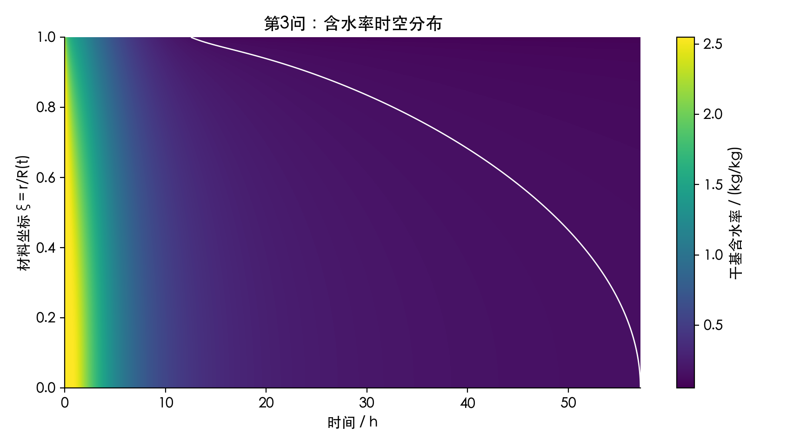
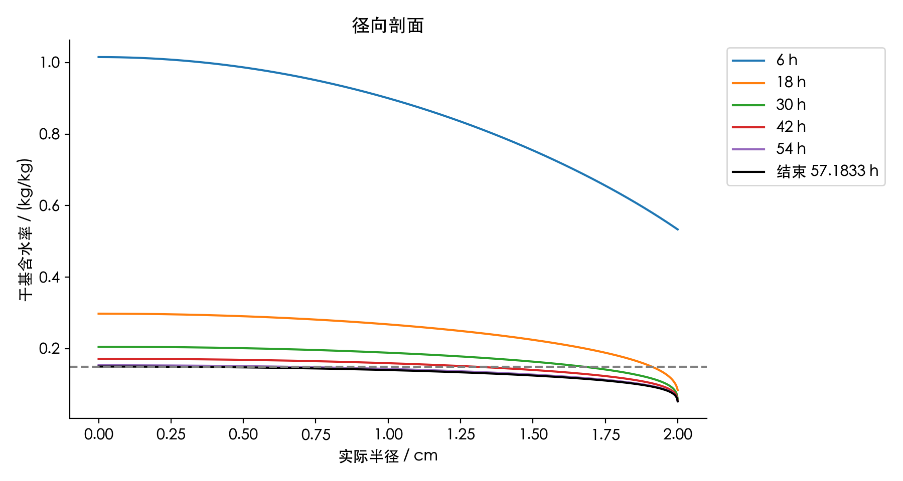
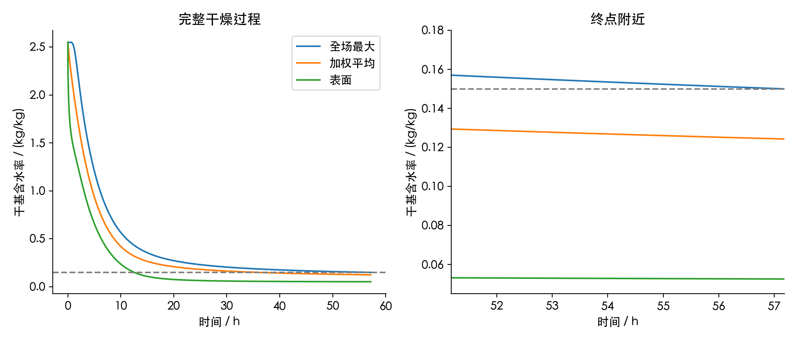
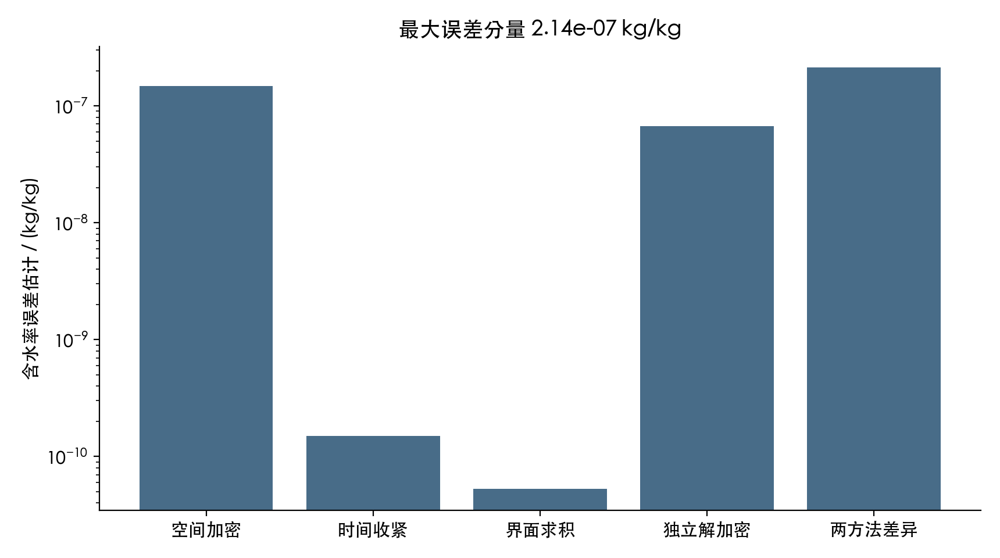
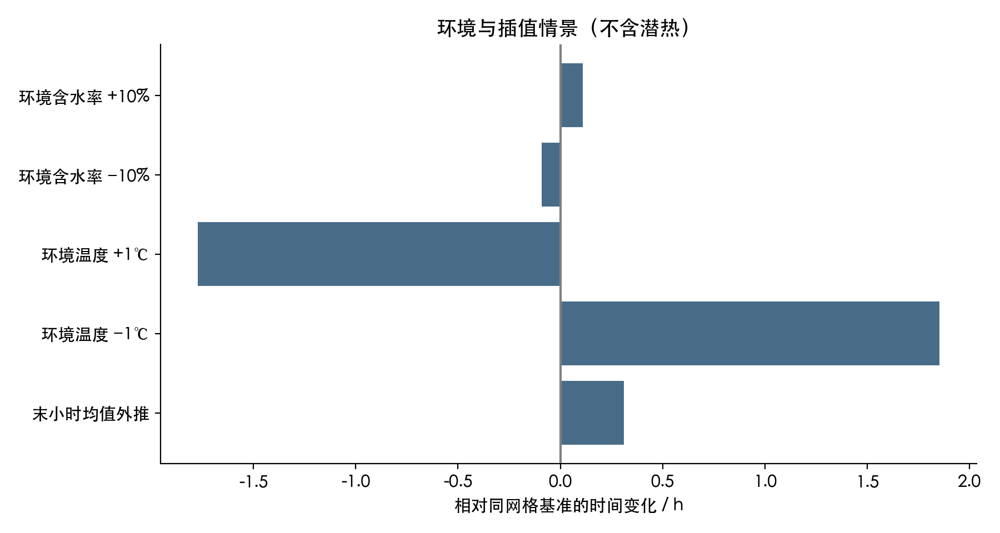

# 第3问：统一材料坐标下的高精度药材烘干模型

## 1. 结果、精度与修订范围

本次统一修订后，连续临界时刻为 **57.169383 h（205809.779243 s）**，此时最大干基含水率等于0.15。首次严格达标整分钟为 **57.1833 h，即57小时11分钟（205860 s）**。结束时间与每分钟输出采用同一轨迹。

前一分钟最大值为0.1500028661，结束时为0.1499852853 kg/kg。判定使用未舍入值；四位小数显示0.1500并不意味着两时刻状态相同。结束时表面为0.05253460，加权平均为0.12429593 kg/kg，半径为2.000000 cm。

主计算3200单元，含水率误差估计 **2.138e-07 kg/kg**，临界时间误差估计 **0.059491 s**，分别满足10⁻⁶ kg/kg和1 s目标。相对旧版连续时刻改变-0.298240 s。六位小数用于数值复核，不表示具有同等实验预测精度。

本轮两问共用同一个生产内核、同一环境输入和边界口径。第三问是第四问关闭收缩、恢复附录3后的特例。没有通过调参压小两问时长差，没有计算潜热影响。

## 2. 原始数据、假设与符号

药材初始长L=0.25 m、半径R₀=0.02 m、T₀=28℃、C₀=2.55 kg/kg（干基）。采用均质、轴对称、中截面径向近似，忽略轴向梯度与端面。第三问固定半径、采用附录3；第四问采用附录4和附件2的145个半径观测（0—72 h，每1800 s），长度不变，内部均匀比例收缩。

两问都从初始状态重算；第四问不接第三问的最终状态。附件1的241个观测覆盖0—14400 s，逐段线性插值；之后保持50.165℃、0.04986 kg/kg。第四问半径逐段线性插值。若超出72 h，半径取末值并在元数据中标记；实际第四问主结果未超过原半径数据范围。

状态T以℃存储，只有Arrhenius指数换成K。向外通量为正；h=25 W/(m²·K)、h_m=8×10⁻⁷ m/s。取有效表面平衡含水率C_e=C_a作为题给参数下的闭合假设，并不声称气相与固相kg/kg天然具有相同参照质量。

本问附录3物性为

$$\rho=650+128C,\quad c_p=1450+2736\frac{C}{1+C},\quad k=0.21+0.38\frac{C}{1+C},\quad D=2.4\times10^{-3}e^{-0.45/C}e^{-3850/(T+273.15)}.$$

ρ(C)仅用于有效体积热容A=ρc_p；守恒辅助干密度ρ_d用于说明干物质运动，两者不强行混同。本次采用显热近似，不加入潜热、机械功或水分携带焓。

## 3. 统一模型推导

设收缩速度u=rṘ/R、干物质守恒：

$$\partial_t\rho_d+\frac1r\partial_r(r\rho_du)=0,$$
$$\partial_t(\rho_dC)+\frac1r\partial_r(r\rho_dCu)=\frac1r\partial_r(r\rho_dD C_r).$$

均匀比例收缩给出ρ_d(t)=ρ_d(0)(R₀/R)²，其空间梯度为零。消去干物质守恒式得到

$$C_t+uC_r=\frac1r\partial_r(rDC_r),\qquad A(C)(T_t+uT_r)=\frac1r\partial_r(rkT_r).$$

C是水质量与干物质质量的比值，不能添加−2ṘC/R这一体积浓度压缩源项。取材料坐标ξ=r/R(t)，时间导数换算中的−ξṘ/R项与uC_r抵消，得到固定计算域0≤ξ≤1上的共同方程：

$$\boxed{C_t=\frac1{R^2\xi}\partial_\xi(\xi DC_\xi)},\qquad
\boxed{A(C)T_t=\frac1{R^2\xi}\partial_\xi(\xi kT_\xi)}.$$

此处时间导数固定ξ。第三问R≡R₀、u=0，严格退化为固定圆柱方程。变系数k、D均保留在散度内；温度影响D，水分影响ρ、c_p、k，温湿状态同时推进。

中心T_ξ=C_ξ=0；表面条件为

$$-\frac kR T_\xi=h(T_s-T_a),\qquad -\frac DR C_\xi=h_m(C_s-C_a).$$

浓度有效通量J_C=−DC_r单位m/s；真实质量通量为ρ_dJ_C。若换成真实质量通量，边界两侧同时包含ρ_d并相消，不能只把某一侧乘密度。所有边界梯度都使用物理距离，半径以米传入。

## 4. 主数值方法与独立求解器

主方法采用单元中心有限体积，网格面ξ_j=1−(1−j/N)²，v_i=(ξ²_{i+1/2}−ξ²_{i−1/2})/2。内部每个面只计算一次通量：

$$Q^T_{i+1/2}=\frac{\xi_{i+1/2}\bar k}{\xi_{i+1}-\xi_i}(T_i-T_{i+1}),\qquad
Q^C_{i+1/2}=\frac{\xi_{i+1/2}\bar D}{\xi_{i+1}-\xi_i}(C_i-C_{i+1}).$$

界面物性沿相邻温湿状态线性路径作三点Gauss积分，另以五点求积检验。离散方程为R²v_iA_iṪ_i=Q^T_{i−1/2}−Q^T_{i+1/2}、R²v_iĊ_i=Q^C_{i−1/2}−Q^C_{i+1/2}。中心面面积为零，不计算1/0。

表面物理半单元距离δ=R(1−ξ_N)，求解k̄(T_N−T_s)=hδ(T_s−T_a)、D̄(C_N−C_s)=h_mδ(C_s−C_a)。最后边界面通量为Rh(T_s−T_a)、Rh_m(C_s−C_a)，与R²v匹配。非线性边界迭代差小于2×10⁻¹³才接受，否则报错；不裁剪含水率或回填通量。

主结果使用BDF、rtol=1e-11、atol_T=1e-12℃、atol_C=1e-13。前4 h最大步长10 s，此后300 s；在环境和半径数据节点处重启。每60 s输出由稠密解采样，不等同于积分步长。

独立方法重新实现节点型有限体积：节点ξ_j=1−(1−j/N)^1.5，包含真实中心和表面，控制体面为节点中点；表面节点具有半控制体，直接施加Robin通量，不调用主方法的表面代数重构。独立物性、五点Gauss通量及Radau积分完成从t=0到终点的全轨迹，细网格为6400个区间。两方法只共用输入、时间分段和输出调度，不共用空间算子。

主方法中心按ξ²对称重构，其他位置三点二次插值；第四问实际距离通过ξ=r/R(t)映射，域外填空而不是0。每分钟同时保存1001个材料坐标验证点，检查全部单元及重构输出的最大值。事件函数包含全单元、中心与表面；加密和独立解必须得到相同的首次达标整分钟。

## 5. 题定表格与图像

| 时间/h | 0 cm | 0.5 cm | 1.0 cm | 1.5 cm | 2.0 cm |
|---|---:|---:|---:|---:|---:|
| 6 | 1.0156 | 0.9868 | 0.9006 | 0.7546 | 0.5335 |
| 12 | 0.4548 | 0.4418 | 0.4019 | 0.3289 | 0.1639 |
| 18 | 0.2979 | 0.2906 | 0.2679 | 0.2247 | 0.0842 |
| 24 | 0.2371 | 0.2321 | 0.2161 | 0.1851 | 0.0663 |
| 30 | 0.2053 | 0.2013 | 0.1887 | 0.1637 | 0.0597 |
| 36 | 0.1854 | 0.1821 | 0.1714 | 0.1500 | 0.0565 |
| 42 | 0.1717 | 0.1687 | 0.1593 | 0.1404 | 0.0547 |
| 48 | 0.1615 | 0.1588 | 0.1504 | 0.1332 | 0.0536 |
| 54 | 0.1535 | 0.1511 | 0.1433 | 0.1275 | 0.0528 |
| 57.1833（结束） | 0.1500 | 0.1477 | 0.1402 | 0.1249 | 0.0525 |

表5结束行采用首次严格达标整分钟，与result3.xlsx末行一致；中间6 h行来自同一轨迹。工作簿3431条时间记录，NPZ/CSV另保留t=0。第四问域外为空、末列为真实表面，不能把收缩后的表面硬标成某个固定距离。

## 6. 数值精度与联合验证

| 对照 | 含水率最大差/(kg/kg) | 温度最大差/℃ | 临界时间差/s |
|---|---:|---:|---:|
| 前一级空间加密 | 1.769e-06 | 3.474e-06 | 0.238326 |
| 主网格→双倍网格 | 4.422e-07 | 8.688e-07 | 0.059491 |
| 容差收紧且步长减半 | 1.504e-10 | 2.107e-09 | 0.000046 |
| 三点→五点Gauss | 5.273e-11 | 1.263e-09 | 0.000081 |
| 独立解网格加倍 | 2.020e-07 | 3.499e-08 | 0.001785 |
| 主解↔独立细网格解 | 2.138e-07 | 2.886e-07 | 0.019262 |

比较同时覆盖共同每60 s时刻的有效实际距离点、真实表面及1001个材料坐标点。空间观测阶为2.0000。生产网格和独立网格的最后一次空间差按二阶收敛换算为细网格剩余误差；时间、求积和两方法差保留原值，含水率误差取各分量最大值，避免同一截断误差被重复相加。这是有限验证轨迹上的工程估计，不是连续场严格上界，更不是实验预测误差。

第四问关闭收缩、切换附录3后，同配置回归第三问的最大含水率差为0.000e+00、温度差0.000e+00、时间差0 s，满足10⁻⁹ kg/kg与0.01 s要求。前3 h与第二问的比对另记录在第三问验证摘要；新旧网格不同导致的微小差异需与旧版误差范围一起解释。

固定域与线性收缩域制造解测试使用T=35+3sin(t/3000)+4ξ²、C=1+0.1sin(t/2000)−0.2ξ²，解析代回生成体积源和边界，仅用于测试，不进入实际题目。两套方法均在40/80/160网格上检验二阶收敛。另在零换热、零传质下验证均匀收缩不改变干基含水率。原始记录见verification/manufactured.json。

## 7. 水分收支与显热诊断

材料参考权重下M=Σv_iC_i，Ṁ=−Q_C/R²。真实水质量只需乘公共常数2πLρ_d(0)R₀²，不必虚构ρ_d(0)。显热诊断量E=R²Σv_iA(C_i)T_i满足

$$\dot E=-Q_T+R^2\sum_i v_iA'(C_i)T_i\dot C_i+2\frac{\dot R}R E.$$

最后两项来自链式法则中的变热容与几何体积变化，不是给PDE添加潜热或焓输运。本次对实际接受步内的边界通量与修正项作三点Gauss时间积分，水分相对残差7.045e-11，显热诊断相对残差2.474e-10。固定半径时几何项自动为0。没有用结果倒推通量令残差闭合。

这些检验说明所选有效方程被一致离散，不表示已经建立完整多相能量模型。

## 8. 物性、收缩与环境情景

| 受控算例 | 连续临界时间/h |
|---|---:|
| 附录3，固定2 cm | 57.169383 |
| 附录4，固定2 cm | 129.092871 |
| 附录4，附件2收缩 | 50.824204 |

物性变化和收缩效应分别通过受控算例比较，不能把第三、四问的净差全部归于收缩，也不能为了让两问数值接近而调整物性。中间固定半径附录4算例另作网格复核。

| 情景 | 临界时间/h | 相对同网格基准变化/h |
|---|---:|---:|
| 末小时均值外推 | 57.479920 | +0.310189 |
| 环境温度 −1℃ | 59.023220 | +1.853489 |
| 环境温度 +1℃ | 55.397220 | -1.772511 |
| 环境含水率 −10% | 57.078899 | -0.090832 |
| 环境含水率 +10% | 57.279149 | +0.109418 |

环境情景只在4 h后启用；半径PCHIP情景保留每个原始观测。敏感性采用400单元并与同网格基准比较，用来描述模型输入影响，不作为主结果的10⁻⁶精度证据，也不是置信区间。

## 9. 局限与后续模型改进

主模型保留显热近似、C_e=C_a、径向近似和4 h后恒定环境；第四问另假设长度不变和均匀比例收缩。题给有效热密度ρ(C)与干物质守恒辅助密度未建立完整多相本构关系。端面、内部非均匀收缩、开裂和气固平衡关系都可能影响真实结果；没有实测内部数据，不能给出实验RMSE或预测准确率。

潜热留待论文“模型改进”部分：后续需先统一真实水质量通量及干密度口径，再按蒸发发生位置选择表面热汇或内部相变源，避免重复计入。本次不计算、不估算潜热导致的时长修正。

## 10. 文件接口与复现

一键入口见README.md。两问唯一生产内核位于A3/A3-codex/code/drying_common，第四问显式导入该包。输入、配置和数学源码均纳入缓存哈希；原题附件只读。旧版交付完整归档在各自archive目录，本报告所有新数字由当前验收通过的主轨迹生成。

兼容数据字段time_s、T、C、maxC、means、final_cells继续保留。第三问x、v仍为物理m与m²；第四问x、v仍为无量纲ξ与∫ξdξ。新增xi_cells、v_xi明确共同计算网格，新增xi_validation、T_validation、C_validation保存1001点验证数据；原xi/T_xi/C_xi维持101点可视化接口。第四问C/T前21列为实际0—2 cm，末列为真实表面；域外NaN、CSV/Excel为空。温度℃，含水率kg/kg，半径radius_m为m。

输入来源为原题第三、四问及附录3、4、附件1、2与结果模板；数值接口参考[SciPy solve_ivp官方文档](https://docs.scipy.org/doc/scipy/reference/generated/scipy.integrate.solve_ivp.html)。已有物理背景参考文献保留在第四问参考文献.md；本轮未引入新的材料经验系数。完整验收、制造解、场误差、终点和工作簿回读证据见verification。
